# 豊かになると子どもは減るのか？ 世界 217 の国と、日本の所得階層を同じ物差しで見てみた

> note 用記事ドラフト（2026-10-05）。図はリポジトリの `themes/growth-fertility/reports/figures/summary/` にある PNG を使用。数値はすべて同テーマの分析レポート（H1・H2・H3・H3b・H4・H5）とその総括レポートに由来する。

---

## 1. 背景・分析論点の概要

「豊かになると子どもが減る」。これはよく聞く話で、実際、豊かな国ほど出生率が低い傾向は昔から知られています。

でも、ここで素朴な疑問が湧きます。**同じことが、どのレベルでも成り立つのでしょうか？**

- 国と国を比べたとき（豊かな国 vs 貧しい国）
- 同じ国を時間で追ったとき（その国が豊かになる過程）
- 1 つの国の中で人と人を比べたとき（所得の高い人 vs 低い人）

もし 3 つのレベルすべてで「豊かなほど子どもが少ない」なら、それは拡大しても縮小しても同じ模様が見える「フラクタル」のような関係です。逆に、国の間では右下がりなのに国の中では右上がりなら、「豊かさ → 少子化」という一枚の絵では説明できないことになります。

この記事では、次の 3 つの問いに公開データで答えを探しました。

1. **国の間では、豊かな国ほど出生率が低いのか。「豊かすぎると戻る」という J 字の反転はあるのか。**
2. **景気の良し悪し（不況）は、出生率を短期的に揺らすのか。**
3. **日本の中では、所得が高い人ほど結婚・子どもが多いのか、少ないのか。国の間と同じ向きか。**
4. **（追加）国の間と国の中で向きが逆なら、国の間の「豊かな国ほど少ない」は本当に豊かさのせいなのか。それとも、国の成熟の段階（人口転換）が本当の構造で、豊かさはそれに付随しているだけなのか。**
5. **（追加）「国の中では所得が高いほど結婚」は日本特有なのか。韓国・欧州ではどうか。そして、手厚い家族政策で知られる北欧で出生率が回復しないのはなぜか。**

結論を先に言うと、国の間では「豊かなほど少ない」がはっきり成り立つ一方、同じ国の中の変化や景気はほとんど関係せず、日本の中では「所得が高いほど結婚・子どもが多い」という **逆向き** の関係が見つかりました。つまり「フラクタル」ではありませんでした。そして追加の問い 4 を追うと、国の間の「豊かなほど少ない」は、子どもの死亡率や女子教育といった**人口転換の段階**の違いとほぼ重なっていて、段階をそろえると傾きは 5 分の 1 に縮みました。一方、途上国の中を見ると「豊かな層ほど子どもが少ない」が成り立っていて、日本のような正の向きは転換が終わった国でしか見つかっていません。問い 5 では、欧州でも「男性は階層が上ほど結婚している」が大半の国で成り立つこと、北欧の出生率低下は政策の後退では説明できず、第 1 子だけでなく第 2 子・第 3 子にも及んでいることが分かりました。ただし根本原因は、公開の集計データでは特定できませんでした。

---

## 2. サマリ（分析結果の要点）

- **国と国を比べると、豊かな国ほど子どもが少ない。** この関係は 1990 年から 2024 年まで一貫して強く、むしろ最近ほど強まっています。
- **「豊かになりすぎると出生率が戻る」という J 字の反転は見えない。** 豊かな国だけを並べても、右上がりにはなりません。
- **同じ国の中の変化は、出生率をほとんど動かしていない。** 国が豊かになっても、その国の出生率が下がるとは限りません。所得水準も成長率も、国の中の出生率の変動の 1% 未満しか説明できませんでした。
- **不況でも出生率はほとんど動かない。** リーマンショックやコロナ不況の年の下がり方は平年並みで、推定された差は年に 0.01 人未満でした。
- **日本の中では、所得が高い人ほど結婚していて、子どもがいる。** 働く男性のうち配偶者がいる割合は、本人の年間所得が 100〜150 万円で 47%、500〜600 万円で 72%、1,000 万円以上で 90%。この傾向は 2012 年から 2024 年まで変わっていません。
- **これは「年齢のせい」ではない。** 年齢をそろえても、すべての年齢層で右上がりでした。
- **国の間と日本の中で、向きが逆。** 「フラクタル」ではありませんでした。
- **国の間の「豊かな国ほど少ない」は、人口転換の段階の違いとほぼ重なる。** 子どもの死亡率・女子教育・寿命をそろえると、国の間の傾きは −0.94 から −0.18 に縮み、同じ国の中では所得の向きが +0.32 と正になりました。
- **途上国の中では、豊かな層ほど子どもが少ない。** 75 か国・310 調査のうち 309 で、最富裕 20% の出生率は最貧 20% より低い（差は平均 2.7 人）。日本の「所得が高いほど多い」は、途上国の延長では見つかりません。
- **欧州でも、男性は学歴が高いほど結婚している。** 2021 年センサスの 31 か国中 23 で正、逆向きの国はゼロ。女性は北欧で正、南欧で負。
- **北欧の出生率低下は「政策の後退」では説明できない。** 家族支出と出生率の国内での関連は小さく（GDP 比 1 ポイントあたり +0.02）、北欧はそもそも支出を変えていません。手厚い国ほど持ちこたえたという関係もありません。ただし「政策は効かない」とも言えません。
- **北欧の低下は第 1 子だけではない。** 第 1 子の寄与は 33〜45% で、第 2 子・第 3 子も落ちています。
- **どの結果も「関連」であって「因果」ではありません。** 「所得が上がれば結婚する」とは言えません。

---

## 3. 利用したデータ

### 世界: World Bank の国別データ

| 項目 | 内容 |
|---|---|
| 出典 | World Bank「World Development Indicators」（CC BY 4.0） |
| 対象 | 217 の国・地域、1960〜2025 年 |
| 指標 | 合計特殊出生率（TFR）、一人当たり GDP（購買力平価）、GDP 成長率、人口。追加分析では人口転換の段階を表す 5 指標（5 歳未満死亡率、女子中等就学率、都市人口比率、女性労働参加率、平均余命） |

**TFR（合計特殊出生率）** は「女性 1 人が生涯に産む子どもの数」の目安です。2.1 前後なら人口がほぼ一定に保たれます。2024 年は日本 1.15、韓国 0.75、ナイジェリア 4.38 でした。

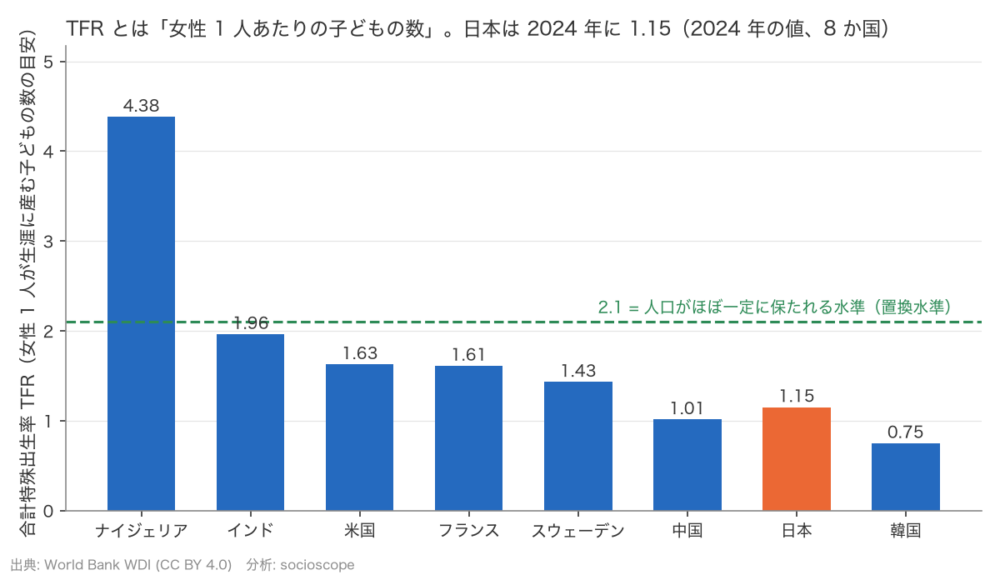
*図 1: TFR は「女性 1 人あたりの子どもの数」。2024 年、8 か国。緑の破線が人口維持の目安 2.1。*

**一人当たり GDP（購買力平価）** は、国の経済規模を人口で割り、物価の違いを調整した「平均的な豊かさ」です。グラフの横軸は「1,000 → 10,000 → 100,000」のような等比の目盛（対数軸）にしています。こうすると「2 倍になる」ことが常に同じ幅になり、貧しい国どうしの差と豊かな国どうしの差を同じ重さで扱えます。

### 日本: 政府統計（e-Stat）の集計表

| 調査 | 分かること | 時期 |
|---|---|---|
| 国民生活基礎調査（厚生労働省） | 働いている人の「配偶者がいる割合」（本人の所得階級別・男女別）、「18 歳未満の子どもがいる世帯の割合」（世帯所得の階級別） | 2013〜2025 年の 5 回の調査 |
| 就業構造基本調査（総務省） | 働いている人の「結婚経験のある割合」（年齢 5 歳階級 × 所得階級 × 男女） | 2022 年の 1 回 |

### 欧州・韓国・政策: Eurostat、OECD、韓国の新婚夫婦統計

| 項目 | 内容 |
|---|---|
| OECD SOCX | 家族関連の公的支出（児童手当・育休給付などの現金給付と、保育などの現物給付）の GDP 比。1980〜2021 年、38 か国 |
| Eurostat 2021 年センサス | 31 か国の、性 × 年齢 × 学歴別の「法律婚している割合」。欧州には所得階層別の公開表がないため、学歴を階層の物差しにした |
| Eurostat 出生統計 | 第 1 子・第 2 子・第 3 子・第 4 子以上に分けた TFR。13 か国、2005〜2024 年 |
| 韓国 国家データ処 新婚夫婦統計 | 婚姻 5 年以内の初婚夫婦の、夫婦合算所得 6 区間別の「子どもがいる割合」。報道資料の PDF から読み取り（公共ヌリ第 1 類型） |

### 途上国の中: DHS（人口保健調査）の集計 API

| 項目 | 内容 |
|---|---|
| 出典 | The DHS Program Indicator Data API（ICF。利用は無料、引用が条件） |
| 対象 | 途上国を中心に 75 か国、1990〜2025 年の 310 調査 |
| 指標 | 各調査の「富裕五分位」（家計の資産から作った国内の 20% 刻みの階層）ごとの TFR |

「富裕五分位」は所得の金額ではなく、**その国の中での相対的な豊かさの順位**です。日本の所得階級（金額）とは定義が違うことに注意してください。

### データの注意点

- 日本では「所得階層別の出生率」そのものは公表されていません。そのため「結婚しているか」「子どもがいるか」を代理の指標にしています。
- 日本の 2 つの調査は **15 歳以上で働いている人** だけが対象です。働いていない人は含まれません。
- 217 の国・地域すべてに毎年のデータがあるわけではありません。一人当たり GDP は 1990 年以降しかなく、分析ではその年に両方の値がある国だけを使うため、実際に使った国数は分析によって 199〜214 か国になります。
- World Bank の出生率は、出生登録が整っていない国では国連の推計値を含み、年ごとの細かな動きが滑らかに見えすぎる可能性があります。
- 欠けているデータは埋めていません。2020 年の国民生活基礎調査は中止されたため、その年は欠けたままです。
- 人口転換の 5 指標（特に女子就学率）は欠けが多く、5 つすべてがそろう行に絞ると国と年の組み合わせは 6,792 → 3,622 行に半減します。欠けは途上国と最近の年に偏っています。
- DHS の対象は低・中所得国で、一人当たり GDP が約 2.4 万ドルを超える国は含まれません。日本との間には観測の空白があります。
- 欧州のセンサスは法律婚だけを数えるので、同棲の多い北欧では「結婚している割合」が低めに出ます。日本（所得）と欧州（学歴）では階層の物差しが違います。
- 韓国には所得階層別の「結婚している割合」の公開表がなく、結婚した後の新婚夫婦の表しかありません。
- 学歴別の出生率を北欧で計算しようとしましたが、分母にした労働力調査が 2021 年に方法を変えていて、使える系列になりませんでした。

---

## 4. 分析方法の概要

（分析はすべて公開データと公開コードで行い、手順と数値は GitHub の [socioscope リポジトリ](https://github.com/TakuNabe/socioscope) で再現できます。）

### 「結果を見る前に仮説を固定する」

この分析では、データを見る **前に** 3 つの仮説を文書に書いて固定しました（「事前登録」）。結果を見てから都合のよい指標を選ぶことを防ぐためです。

- **H1**: 国の間では、所得水準が高いほど出生率が低い。ただし高所得国では近年 J 字の反転の兆しがある。
- **H2**: 経済成長「率」と出生率の関係は所得「水準」より弱く、景気後退への短期の反応として現れる。
- **H3**: 日本の中では、所得が高い層ほど結婚・子どもが多い（国の間と逆）。つまりフラクタルではない。

さらに H3 については、「所得が高い人は年齢も高いだけでは？」という疑問に答えるため、年齢をそろえて確かめる手順（H3b）も結果を見る前に決めておきました。

4 つ目（H4）と 5 つ目（H5）の問いは、H1〜H3b の結果を見てから立てた仮説です。その代わり、どのデータをどう使い、何をもって「支持」「不支持」と判定するかは、新しいデータを見る前に文書で固定しました。H5 では事前に決めた基準のうち 2 つ（男性の勾配が正の国が 25 か国以上、北欧の第 1 子寄与率が 50% 以上）が境界で未達となりましたが、基準を後から緩めてはいません。

### 「国の間」と「国の中」を分ける

この記事の肝になる考え方です。

- **国の間（between）**: 「豊かな国 vs 貧しい国」を比べる
- **国の中（within）**: 「同じ国が、平均より豊かだった年と貧しかった年」を比べる

後者は、その国に固有の文化や制度、世界共通の年ごとの流れを取り除いてから比べます（統計では「国と年の固定効果」と呼びます）。同じデータでも、この 2 つで答えが変わることがあります。

### 3 段のはしご: 記述 → 関連 → 因果

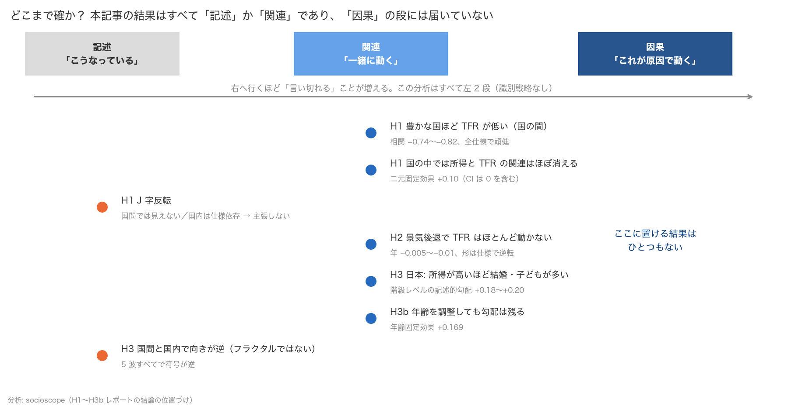
*図 2: 「記述」「関連」「因果」の 3 段のうち、この記事の結果がどこに置けるか。因果の段に届く結果はひとつもない。*

1. まず **記述**: 散布図と各国の軌跡で、形を目で確かめる
2. 次に **関連の強さ**: 国の間の傾きと国の中の傾きを分けて推定する。不況の前後の変化も同じ枠組みで見る
3. 最後に **レベル間の比較**: 日本の所得階級レベルの傾きの向きを、国レベルの向きと並べる

どの段階でも「因果」とは書きません。因果を主張するための手法（自然実験など）は使っていないからです。

### 「信頼区間」の読み方

結果には「+0.10 [−0.09, +0.30]」のような表記が出てきます。角かっこの中は推定値の「ぶれ幅」（95% 信頼区間）で、区間が 0 をまたいでいれば「上向きとも下向きとも言い切れない」と読みます。

---

## 5. 分析結果

### 結果 1: 「豊かな国ほど子どもが少ない」は国の間では強いが、国の中では消える

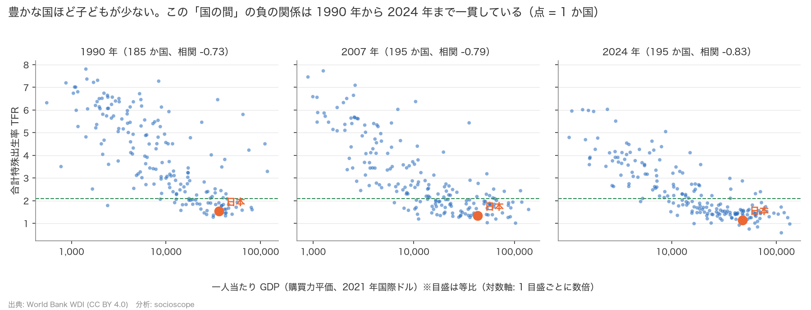
*図 3: 横軸は一人当たり GDP（対数軸）、縦軸は TFR。1990・2007・2024 年。日本はオレンジ。*

国と国を比べると、豊かな国ほど TFR が低い右下がりの形がはっきりしています。関係の強さを表す相関係数（−1 から +1 の値をとり、−1 に近いほど「一方が増えると他方が減る」関係がきれいに成り立つ）は、1990 年 −0.73、2007 年 −0.79、2024 年 −0.83 と、むしろ最近ほど強くなっています。

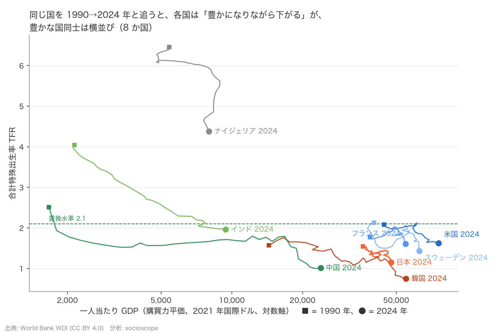
*図 4: 8 か国を 1990 年（■）から 2024 年（●）まで追った軌跡。*

ところが、同じ国を時間で追うと話が変わります。インドや中国は豊かになりながら TFR を下げてきましたが、日本・アメリカ・フランス・スウェーデンのように 2 万ドルを超えた国々は、豊かさが大きく違っても TFR は 1〜2 の帯に横並びで、豊かさとの対応はほぼ見えません。例外は韓国で、豊かになりながら 1.6 から 0.75 へ急落しています。つまり、豊かな国の中では「豊かさ」以外の何かが出生率を分けています。

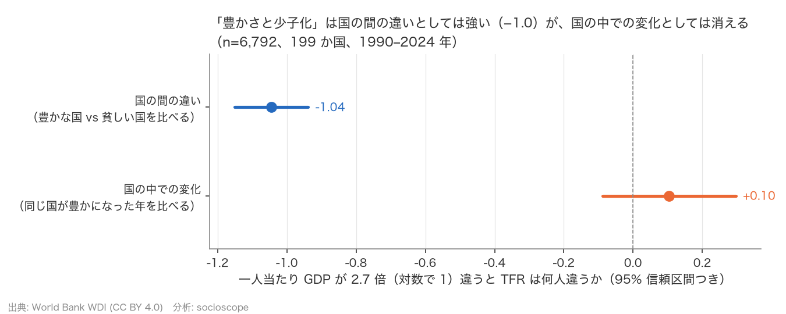
*図 5: 一人当たり GDP が 2.7 倍違うと TFR は何人違うか。上: 国の間、下: 国の中。横線は信頼区間。*

これを数字にしたのが図 5 です。国の間の傾きは **−1.04**、つまり一人当たり GDP が 2.7 倍の国では TFR が約 1 人少ない（2.7 倍という半端な数字は、対数で 1 だけ違う、という計算上の区切りです）。しかし国の中の傾きは **+0.10 [−0.09, +0.30]** で、信頼区間が 0 をまたぎ、上向きとも下向きとも言えません。

「豊かさと少子化」の強い関係は、**国どうしの水準の違い** として存在していて、同じ国が豊かになる過程では現れていないのです。

### 結果 2: J 字の反転は見えない

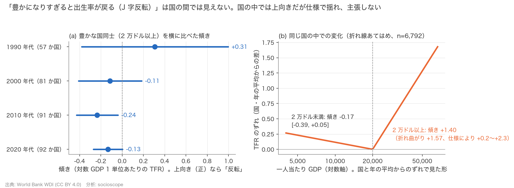
*図 6: 左: 一人当たり GDP 2 万ドル以上の国だけを横に比べた傾き（年代別）。右: 全サンプルで国の中の変化を折れ線であてはめた形。*

「豊かすぎる国では出生率が戻る」なら、豊かな国だけを横に並べたとき右上がりになるはずです。実際は 2010 年代 −0.24、2020 年代 −0.13 と、弱い右下がりか横ばいで、上向きの反転はありません（1990 年代だけは上向きに見えますが、豊かな国が 57 か国と少なく、ぶれ幅が大きすぎて判断できません）。

一方、国の中の変化を折れ線であてはめると、2 万ドルを境に傾きが上向きに折れ曲がります（図 6 右）。これは「反転の兆し」に見えますが、産油国（油価で所得が大きく揺れる国）や人口 100 万人未満の小国を除くと傾きが縮んで信頼区間が 0 を含むこと、そして「出生率が下がると一人当たり GDP が上がる」という逆向きの経路でも説明できることから、**主張は保留** しました。

### 結果 3: 不況でも出生率はほとんど動かない

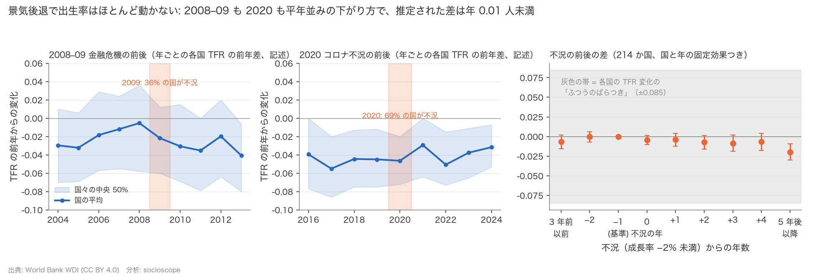
*図 7: 左 2 枚: 各年の各国 TFR の前年差（平均と中央 50% の帯）。右: 不況の年を 0 として、前後の年の TFR 変化の差。灰色の帯は各国の TFR の前年差がふつうに取りうる範囲（標準偏差 ±0.085）。推定された差はその帯の中に収まっている。*

2008〜09 年の金融危機では、各国の TFR の前年差の平均は 2008 年 −0.005 → 2009 年 −0.022 → 2010 年 −0.031 と下がりましたが、これは危機前の 2004〜05 年と同じ水準で、国ごとのばらつきより小さい動きです。2020 年のコロナ不況では −0.046 と前年（−0.045）とほぼ同じで、2021 年はむしろ減速が緩みました。

不況の前後を 214 か国・1964〜2024 年でまとめて推定すると（図 7 右）、不況の年から 4 年後までの差は **−0.004〜−0.009** で、どれも信頼区間が 0 を含みます。短期の反応は **あっても年 0.005〜0.01 人程度** で、各国の TFR 変化のふつうのばらつき（0.085）の 1 割ほど。形も分析の仕様によって変わるため、「不況で出生率が下がる」とは言えません。

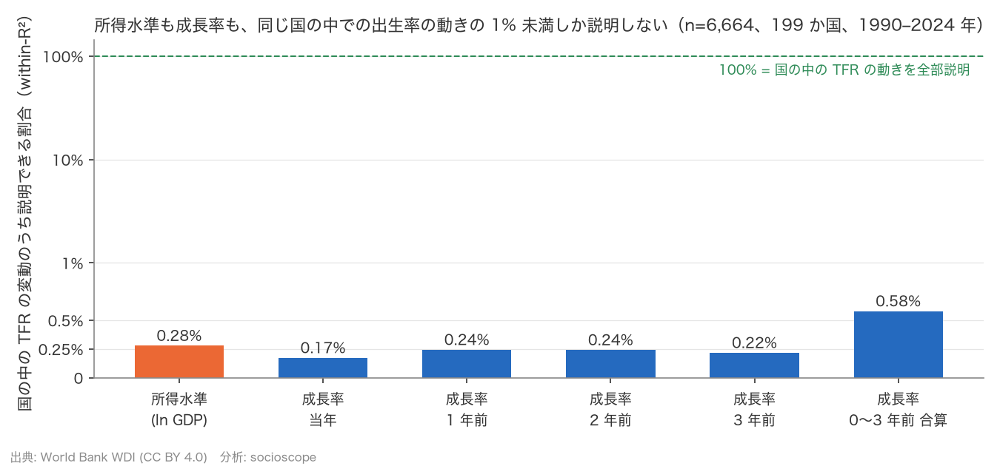
*図 8: 同じ国の中での TFR の変動のうち、所得水準・成長率が説明できる割合。*

「成長率は水準より弱い」という仮説 H2 の前半はどうか。同じ国の中で比べると、所得水準の説明力は 0.28%、成長率は 0.17〜0.24%、合算しても 0.58% と、**どちらも 1% 未満** でした。「成長率の方が弱い」とは言えず、「国の中では水準も成長率もほとんど効いていない」が正直な読みです。

### 結果 4: 日本の中では、所得が高いほど結婚・子どもが多い

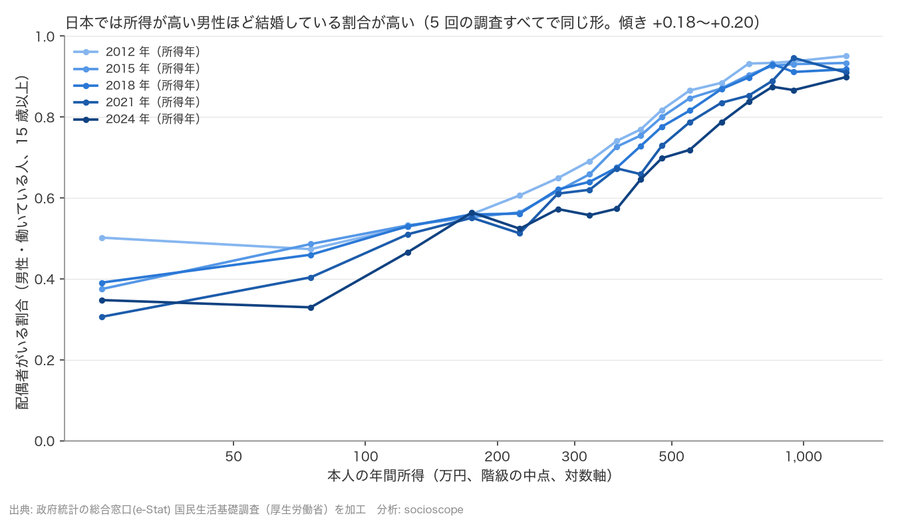
*図 9: 働いている男性（15 歳以上）のうち配偶者がいる割合を、本人の年間所得の階級別に。5 回の調査（所得年 2012〜2024）。*

日本の国民生活基礎調査では、働いている男性の「配偶者がいる割合」は所得が高い階級ほど高く、2024 年（所得年）では **100〜150 万円で 47%、500〜600 万円で 72%、1,000 万円以上で 90%** です。この右上がりの傾きは 5 回の調査すべてでほぼ同じで、2012 年から 2024 年にかけて変わっていません。一方、図 9 の線が年を追うごとに下にずれているとおり、割合そのものは全体に下がっており、特に 50 万円未満の階級では 50% から 35% へ落ちています。「傾きは同じまま、全体が下がった」というのが 12 年間の変化です。

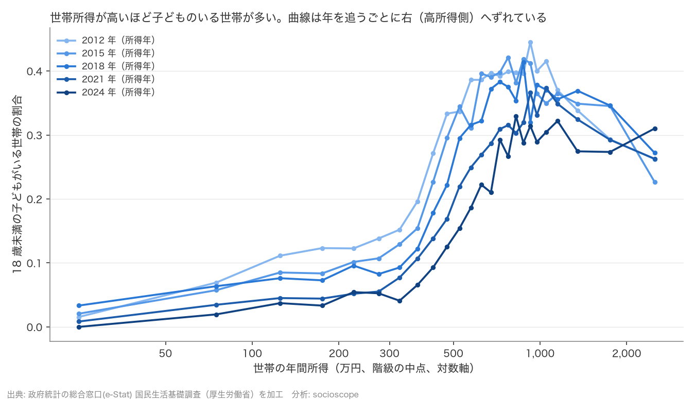
*図 10: 18 歳未満の子どもがいる世帯の割合を、世帯の年間所得の階級別に。*

世帯所得で見ても、子どものいる世帯の割合は 300 万円未満で 0〜10%、300〜800 万円で急に上がり、800 万円以上で 30〜40% と、右上がりの S 字です。曲線が年々右にずれているのは、子育て世帯の所得が名目で上がった（共稼ぎ化を含む）ことと、全世帯に高齢の単身世帯が増えたことの両方で起こりえます。

なお、働いている **女性** の有配偶率は所得と U 字型で、低所得帯で高くなります。これは配偶者のいる女性がパートで働くことを映しており、所得と結婚の関係というより結婚と働き方の関係なので、判定には使っていません。

### 結果 5: 年齢のせいではない

結果 4 の最大の疑問は「所得が高い人は年齢も高いだけでは？」でした。所得は年齢とともに上がり、結婚も年齢とともに増えるからです。

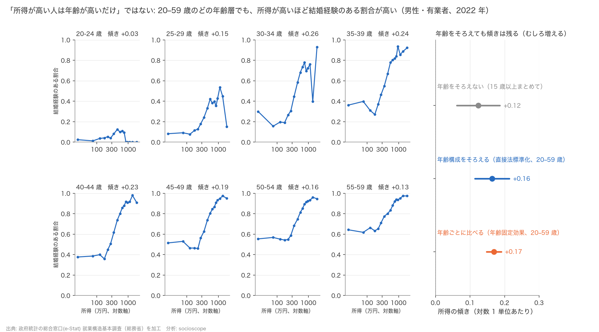
*図 11: 働いている男性の「結婚経験のある割合」を、年齢 5 歳階級ごとに所得階級別に描いた小図（左）と、年齢をそろえる前後の傾き（右）。2022 年就業構造基本調査。*

年齢 × 所得 × 配偶関係の表で確かめると、20〜59 歳の 8 つの年齢階級 **すべて** で右上がりで、8 階級とも信頼区間が 0 を含みません。年齢をそろえた傾きは **+0.17** で、年齢をそろえない +0.12 より **むしろ大きく** なりました。年齢を混ぜると、既婚率がほぼ 100% で所得の低い 60 歳以上の働く人が低所得側を押し上げ、傾きが平らに見えていたのです。

結果 4 の右上がりは、年齢構成の産物ではありません。

### 結果 6: 国の間と日本の中で向きが逆。「フラクタル」ではない

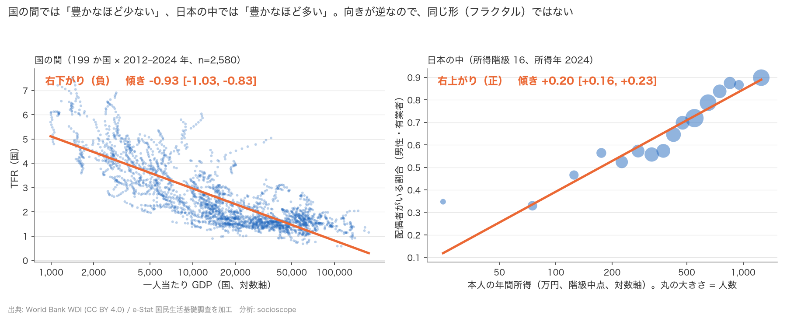
*図 12: 左: 国の間（2012〜2024 年、199 か国）の一人当たり GDP と TFR。右: 日本の中（所得年 2024）の本人所得と男性の有配偶率。丸の大きさは人数。*

同じ 2012〜2024 年で、国の間の傾きは **−0.93**（右下がり。一人当たり GDP が 2.7 倍の国では TFR が約 0.9 人少ない）、日本の中の男性の傾きは **+0.20**（右上がり。本人所得が 2.7 倍の階級では配偶者がいる割合が 20 ポイント高い）。5 回の調査すべてで符号が逆でした。

したがって、**この 2 つのレベル・この 2 つの指標で比べる限り**、「国の間と国の中で同じ形」というフラクタルの見方は支持されません。国の間の右下がりは「豊かな個人ほど子どもが少ない」を意味せず、日本の中の右上がりは「所得が上がれば結婚する」を意味しない。それぞれ別のレベルの、別の現象を見ています。

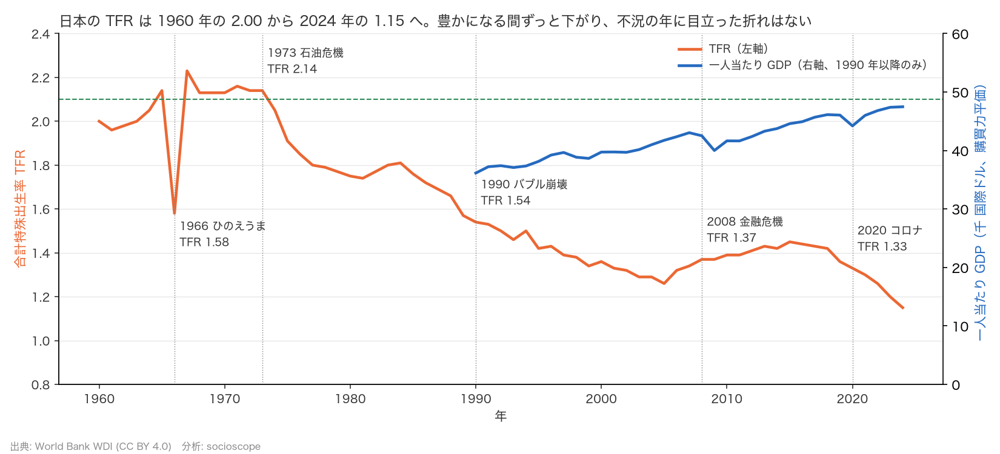
*図 13: 日本の TFR（1960〜2024）と一人当たり GDP（1990 年以降）。1966 年のひのえうま、1973 年の石油危機、1990 年のバブル崩壊、2008 年の金融危機、2020 年のコロナを示す。*

日本の 60 年を眺めても、同じ構図が見えます。TFR は 1960 年の 2.00 から 2024 年の 1.15 まで、豊かになる間ほぼ一方向に下がりました。不況の年（1990・2008・2020）に目立った折れはなく、1966 年の急落は景気ではなく、干支の「丙午（ひのえうま）」の年に生まれた女性は気性が激しいという迷信から出産が避けられたためです。経済以外の要因が出生率を一時的に大きく動かした例として知られています。

---

### 結果 7: 向きが逆な理由を追う。国の間の「豊かさ → 少子化」は、人口転換の段階の違いとほぼ重なる

結果 1 と結果 4 の「向きが逆」は、なぜ起きるのでしょうか。

一つの考え方はこうです。「豊かさ」が本当の原因ではなく、国が **人口転換**（子どもの死亡率が下がり、教育が広がり、やがて出生率も下がる過程）のどの段階にいるかが出生率を決めていて、豊かさはその段階と一緒に動いているだけ。もしそうなら、段階をそろえて比べれば「豊かな国ほど少ない」は薄れ、残った所得の向きは、子育ての経済的な余裕を考えれば正になるはずです。

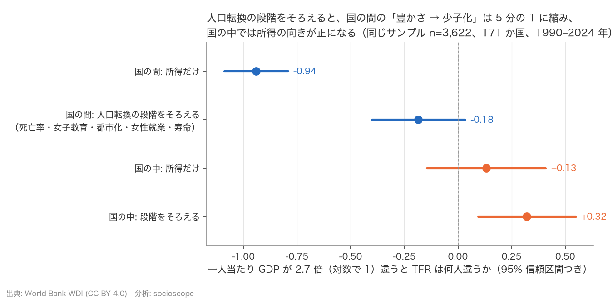
*図 14: 一人当たり GDP が 2.7 倍違うと TFR は何人違うか。上 2 本は国の間、下 2 本は国の中。それぞれ「所得だけ」と「人口転換の段階（子どもの死亡率・女子教育・都市化・女性就業・寿命）をそろえた後」。同じ 3,622 行・171 か国。*

図 14 がその検証です。段階をそろえると、国の間の傾きは **−0.94 → −0.18 [−0.40, +0.03]** と 5 分の 1 に縮み、信頼区間が 0 をまたぎます。縮小を担っているのは子どもの死亡率・女子教育・寿命で、都市化や女性就業を入れても傾きは動きません。同じ国の中では、段階をそろえた所得の傾きが **+0.32 [+0.09, +0.55]** と正になりました（産油国を除く、または 2020 年以降を除くと、区間は 0 を含みます）。

ただし 2 つ注意があります。第一に、段階指標は「豊かさの結果」でもあります（豊かになると教育が広がる）。だからこの縮小は「豊かさは無関係」を意味しません。第二に、死亡率で国をグループ分けしてグループの中だけで比べると、転換が終わったグループ（死亡率 10/千未満）では傾きがゼロになる一方、途中のグループには −0.3〜−0.5 の傾きが残りました。「段階だけで全部説明できる」とまでは言えません。

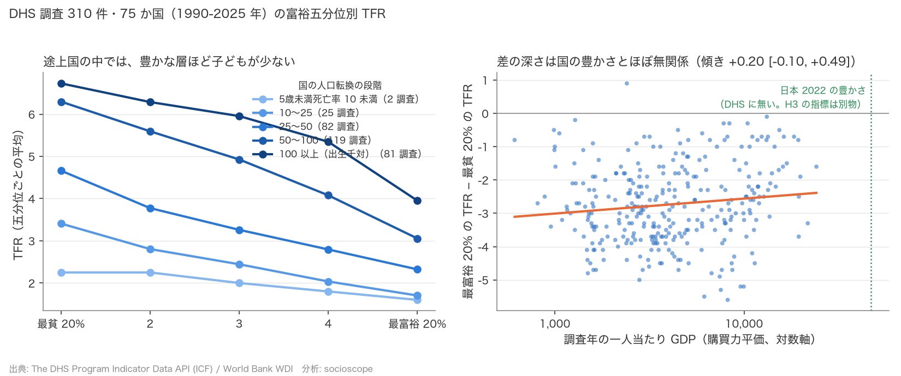
*図 15: 左: 途上国の調査ごとに、資産の五分位（最貧 20% → 最富裕 20%）別の TFR の平均。線の色は国の人口転換の段階（子どもの死亡率）。右: 「最富裕 20% − 最貧 20%」の差を、調査年の国の豊かさに対して。緑の点線は日本の豊かさの位置。*

では、国の中の「所得が高いほど子どもが多い」は、どの国でも成り立つのでしょうか。途上国を中心に 75 か国・310 調査の家計調査で資産五分位別の TFR を見ると、答えは **逆** でした。310 調査中 309 で、最富裕 20% の TFR は最貧 20% より低く、差は平均 2.7 人です（図 15 左）。この差の深さは国の豊かさとほぼ無関係で（図 15 右）、同じ国が豊かになる過程で浅くなる兆しが弱くあるだけでした。

つまり「国の中では所得が高いほど子どもが多い」は、転換が終わり、DHS のどの国よりも豊かな日本で見えた現象で、途上国の中では向きが逆です。日本とつなぐ「反転」がどこで起きるかは、このデータの範囲外です。指標も違います（DHS は女性の TFR、日本は男性の有配偶率・児童世帯の割合）。

---

### 結果 8: 欧州でも男性は学歴が高いほど結婚している。北欧の低下は「政策の後退」では説明できない

「手厚い家族政策で知られるフィンランドが、2010 年以降に出生率を大きく落とした」。政策で少子化を止められるのか、という問いを突きつける事実です。

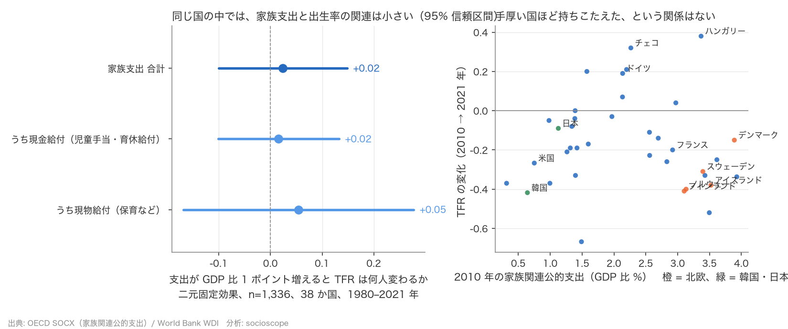
*図 16: 左: 同じ国の中で、家族関連の公的支出が GDP 比 1 ポイント増えると TFR は何人変わるか（95% 信頼区間）。右: 2010 年の支出水準と、2010 → 2021 年の TFR の変化。橙が北欧、緑が韓国・日本。*

OECD 38 か国・1980〜2021 年で、同じ国の中の支出の増減と TFR の関係を見ると、GDP 比 1 ポイントあたり **+0.02 [−0.10, +0.15]** と小さく、信頼区間は 0 をまたぎます（図 16 左）。2010 年に支出が多かった国ほど持ちこたえた、という関係もありません（図 16 右）。北欧 4 か国は支出が GDP 比 3〜4% と最上位にありながら、−0.15〜−0.41 と、支出 1% 前後の韓国・日本と同じ帯で落ちています。

ここで言えるのは「北欧の低下は政策の後退のせいではない」ことまでです。北欧は 2010 年以降、支出をほとんど変えていない（フィンランドは −0.01 ポイント）ので、支出の変化で低下を説明しようがありません。一方「政策は効かない」とも言えません。信頼区間の上限は大きな関連を否定できる精度ではなく、保育や育児休業が出生率を上げるという因果の証拠は、個別の自然実験の研究で示されています。コロナ前の 2010〜2019 年に限ると、現金給付が手厚く増えた国ほど低下が小さい、という関連も見られました。

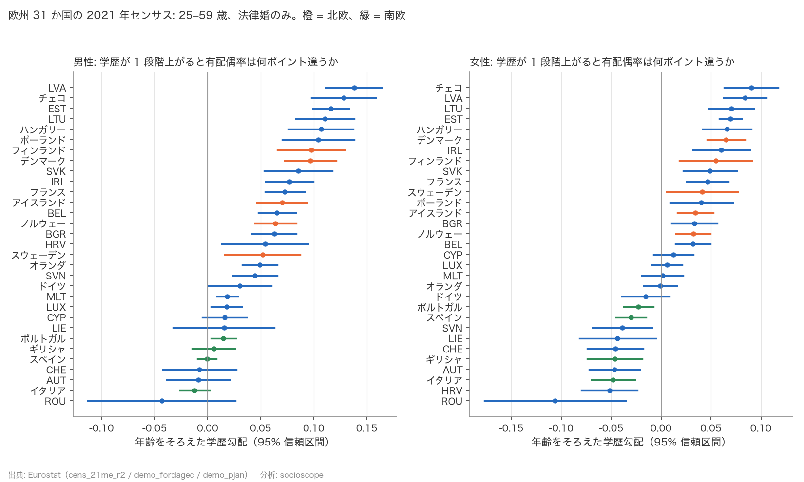
*図 17: 欧州 31 か国の 2021 年センサス。25〜59 歳で、学歴が 1 段階（基礎 → 中等 → 高等）上がると「法律婚している割合」は何ポイント違うか。年齢をそろえた推定。橙 = 北欧、緑 = 南欧。*

結果 4 の「日本の中では所得が高い男性ほど結婚している」は、日本だけの話でしょうか。欧州には所得階層別の公開表がないので、学歴を階層の物差しにして 2021 年センサスで確かめました。男性は **31 か国中 23 で学歴が高いほど結婚しており、逆向きの国は 1 つもありません**（残り 8 か国は差がはっきりしない）。北欧・バルト・中東欧で差が大きく、南欧とドイツ語圏でほぼゼロです。女性は北欧 5 か国すべてで正、南欧 4 か国すべてで負と、地域で向きが分かれました。「男性は階層が上ほど結婚」は日本特有ではありません。

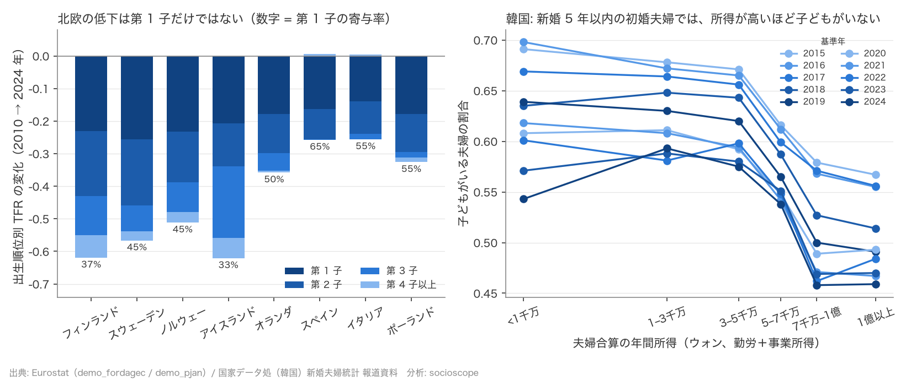
*図 18: 左: 第 1 子・第 2 子・第 3 子・第 4 子以上に分けた TFR の 2010 → 2024 年の変化。数字は第 1 子の寄与率。右: 韓国の新婚 5 年以内の初婚夫婦のうち子どもがいる割合を、夫婦合算の年間所得 6 区間別に。*

北欧の低下の中身を出生順位で分けると、第 1 子の減少が最大ですが、過半ではありません（フィンランド 37%、スウェーデン・ノルウェー 45%、アイスランド 33%）。第 2 子・第 3 子も落ちていて、第 1 子に集中する南欧・ポーランド（55〜65%）とは形が違います。「子どもを持たない人が増えた」だけでは説明できず、すでに子どもがいる夫婦の次の出産も減っています。

韓国は、結婚した後の「新婚 5 年以内の夫婦」の表しかありません。そこでは夫婦の所得が高いほど子どもがいる割合が **低く**（図 18 右）、日本の結果 4 と逆に見えます。ただしこれは結婚の勾配を含まないうえ、共稼ぎ夫婦ほど所得が高く子どもが少ないという交絡を含むため、「所得が高いと産まない」とは読めません。

では北欧の根本原因は何か。この分析で確かめられたのは「所得水準（結果 1・7）、景気（結果 3）、政策支出の変化（結果 8）では説明できない」ところまでで、集計データでは原因を特定できませんでした。研究者の間では「将来への不確実性の感じ方」「理想の子ども数の低下（フィンランドの若い世代で『子どもゼロが理想』が 5% から 20% 超へ）」が残差の説明として挙げられていますが、それを確かめるには意識調査の集計が必要です。

---

## 6. 総括

### 言えること

- 国と国を比べると、豊かな国ほど出生率が低い。この関係は強く、最近ほど強まっている。
- 「豊かすぎると出生率が戻る」J 字の反転は、国の間では見えない。
- 同じ国の中では、所得水準も成長率も出生率の変動をほとんど説明しない。不況の影響も、あっても年 0.01 人未満。
- 日本の中では、所得が高い男性ほど結婚しており、所得が高い世帯ほど子どもがいる。年齢をそろえても変わらない。
- 国の間と日本の中で、向きが逆。「フラクタル」ではない。
- 国の間の「豊かな国ほど少ない」は、人口転換の段階（子どもの死亡率・女子教育・寿命）の違いとほぼ重なる。段階をそろえると傾きは 5 分の 1 に縮み、同じ国の中では所得の向きが正になる。
- 途上国の中では、豊かな層ほど子どもが少ない。日本のような正の向きは、転換が終わった国でしか見つかっていない。
- 欧州でも男性は学歴が高いほど結婚しており、逆向きの国はない。女性は北欧で正、南欧で負。
- 北欧の出生率低下は政策の後退では説明できず、第 1 子だけでなく第 2 子・第 3 子にも及ぶ。根本原因は集計データでは特定できない。

### 言えないこと

- **因果は言えない。** どの分析も「一緒に動くか」を見ただけで、「所得が原因だ」とは言えません。結婚が男性の昇進や所得を後押しする経路（婚姻プレミアム）、子どもがいることで配偶者の働き方が変わる経路は、分離できていません。
- **個人の話ではない。** 国レベルの関係を個人に、所得階級レベルの関係を個人に、読み替えてはいけません。「フラクタルではない」は、集計レベルの比較に限った結論です。
- **日本のデータは働いている人だけ。** 働いていない人は入っていません。
- **年齢以外の要因は未調整。** 学歴・健康・親の資産など、所得と結婚の両方に関わる要因は考慮していません。
- **指標が違う。** TFR と「配偶者がいる割合」「子どもがいる世帯の割合」は別物で、国の間と日本の中で比べたのは **向きだけ** です。
- **段階は原因か結果か。** 段階をそろえると国の間の傾きが縮むのは、段階が豊かさの代わりに効いている場合も、豊かさが段階を通じて効いている場合も起こります。この 2 つは区別できません。
- **途上国と日本の間は空白。** 国の中の向きが「どこで」反転するかは、データの範囲外です。
- **政策の効果は検定していない。** 家族支出は出生率の変化に反応して決まるので、推定した関連は因果効果ではありません。「政策は効かない」とは言えません。
- **欧州の物差しは学歴、韓国は新婚夫婦のみ。** 日本の所得階層と同じ現象を測っているわけではありません。

### この分析から学べること

「豊かになると子どもが減る」は、国と国を比べたときの話としては正しい。しかし、それは「豊かな人ほど子どもを持たない」という個人の話でも、「国が豊かになれば出生率が下がる」という時間の話でもありませんでした。日本の中ではむしろ逆で、所得の高い人ほど結婚しており、所得の高い世帯ほど子どもがいます。ただし、これが「所得が高いから結婚できた」のか「結婚したから所得が上がった」のかは、このデータでは分かりません。

そして「国の間」の右下がりの正体を追うと、それは豊かさそのものというより、子どもが死ななくなり、女の子が学校に行くようになった、という人口転換の段階の違いでした。途上国の中では豊かな層ほど子どもが少なく、日本の中では多い。同じ「所得と子ども」でも、国の間・途上国の中・日本の中で、それぞれ別のことが起きていると考えるのが、今のデータに最も素直な読み方です（これは観察に合う仮説で、検証したわけではありません）。

そして、手厚い政策の北欧でも出生率は落ちました。それは政策をやめたからではなく、第 1 子だけの話でもありません。何が原因かは、この分析の公開データでは答えられませんでした。「政策で止められるか」という問いに正直に答えるなら、「政策の後退は原因ではないが、政策で埋められる大きさかどうかも、このデータでは分からない」です。

少子化を「豊かさの代償」として諦める前に、どのレベルの話をしているのかを区別すること。それがこの分析から言える、いちばん大事なことだと思います。

### 今後

- 国の中の関連を見るなら、所得水準より女性の就業・教育・住宅費など「国ごとに変化する要因」を加える必要がある。
- 日本の中の因果に近づくには、個票データか、所得が外から変わる出来事（制度変更など）が必要。
- 欧州の男性では「階層が上ほど結婚」が確かめられた。次は、意識調査（理想の子ども数、不確実性の感じ方）の国別集計を取り込み、北欧の低下の残差に迫る。
- 韓国の結婚の所得勾配は公開表がなく未検証。登録ベースの学歴別出生率（各国統計局の公表値）も API 外のため、別途取り込みを検討する。

---

### 出典とライセンス

- World Bank, World Development Indicators（取得 2026-10-05）: CC BY 4.0。
- OECD, Social Expenditure Database (SOCX)（取得 2026-10-06）: 出典表示で利用可。
- Eurostat（2021 年センサス、出生統計、人口統計。取得 2026-10-06）: 出典表示で再利用可。
- 국가데이터처（韓国 国家データ処）, 신혼부부통계 보도자료 2015〜2024 年基準（公共ヌリ第 1 類型）。
- The DHS Program Indicator Data API, The Demographic and Health Surveys (DHS) Program. ICF. Originally funded by the United States Agency for International Development (USAID). Available from api.dhsprogram.com. [Accessed 10-05-2026]
- 出典: 政府統計の総合窓口(e-Stat)、国民生活基礎調査（厚生労働省）および就業構造基本調査（総務省）を加工して作成。政府標準利用規約（第 2.0 版）。
- 分析コードと詳細レポートは GitHub の socioscope リポジトリで公開しています（コードは MIT ライセンス）: https://github.com/TakuNabe/socioscope
- この記事のもとになった総括レポート（数値の出所と再現手順つき）: https://github.com/TakuNabe/socioscope/blob/main/themes/growth-fertility/reports/2026-10-05-summary-growth-fertility.md図を転載する場合は上記の出典表記を付けてください。
