# 「金持ちはますます金持ちに」は本当か？ 46 か国・75 年分のデータで数えてみた

> note 用記事ドラフト（2026-10-05）。図はリポジトリの `themes/wealth-population-distribution/reports/figures/summary/` にある PNG を使用。数値はすべて同テーマの分析レポート（H1・H1b・H1c・H2）とその総括レポートに由来する。

---

## 1. 背景・分析論点の概要

「資本主義が進むと、お金持ちはますますお金持ちになり、格差は広がり続ける」。経済学者トマ・ピケティの『21 世紀の資本』以来、よく聞く話です。ピケティらが示したのは、「上位 1% の人が持つ富の割合は、20 世紀前半に大きく下がり、1980 年ごろを底にして再び上がっている」という **U 字型** のグラフでした。特にアメリカのグラフは有名で、「格差は U 字に戻ってきた」というイメージを広めました。

でも、この U 字は本当に「多くの国に共通する」現象なのでしょうか。それとも、アメリカやフランスのような、たまたま長い記録が残っている国だけの話なのでしょうか。そして日本は、世界の中でどのあたりにいるのでしょうか。

この記事では、次の 3 つの問いに、公開データを使って答えを探しました。

1. **上位 1%（および 10%）の富の割合が U 字型に再上昇している国は、多数派か？**
2. **上昇の度合いが国によって違うのは、税制や社会保障（福祉）で説明できるか？**
3. **日本の富の集中は、他の国と比べて穏やかか？**

結論を先に言うと、「U 字型が多数派」とは言えませんでした。ただし「1980 年以降に上がった」という弱い言い方なら 4 分の 3 以上の国に当てはまります。そして、分析を進めるうちに最も大事だと分かったのは、「資産の統計は推計の塊で、U 字かどうかを本当は判定しきれない」ということでした。

---

## 2. サマリ（分析結果の要点）

- **U 字型は多数派ではない。** 事前に決めた基準で数えると、上位 1% の資産シェアが U 字を描く国は 46 か国中 12 か国（26%）。所得シェアでも 22 か国（48%）で、半数に届きません。
- **ただし「1980 年以降に上がった」なら多数派。** 上位 1% 資産シェアは 46 か国中 35 か国（76%）、所得シェアは 37 か国（80%）で上昇しました。上昇幅は国によって大きく異なり、ロシアやインドは +30 ポイント近く、オランダは −11 ポイントです。
- **日本の上位 1% の上昇は、他国より穏やか。** 1980 年以降、所得シェアは +2.2 ポイント（他国の中央値 +3.5）、資産シェアは +1.9 ポイント（同 +3.8）。46 か国中の順位は所得で 13 位 → 22 位、資産で 23 位 → 29 位と下がりました。ただし上位 10% の所得シェアは例外で、他国より大きく上がっています。
- **資産データは推計が大半で、U 字の判定には限界がある。** データベースが「実際に観測した」と明示している年は、資産についてはゼロでした。品質の低い年を除くと、判定できる国は 46 か国から 5〜8 か国に減ります。
- **税制や社会保障では、上昇幅の違いをほとんど説明できなかった。** 社会支出の増加と上位 1% シェアの上昇に関連が見えた期間もありますが、起点の年を変えると消えてしまう程度の弱いものでした。
- **上位 1% の上昇が「超富裕層」に集中したのは、資産では多数派、所得では半数。** 日本の所得は逆向きで、上位 0.1% のシェアはむしろ下がり（−0.3 ポイント）、上昇は上位 1% の下のほうと「次の 9%」で起きました。日本の中間 40% のシェアは −5.8 ポイントと、46 か国で 10 番目に大きい低下です。
- **どの結果も「関連」であって「因果」ではありません。** 「税制が格差を動かした」とも「動かさなかった」とも言えません。

---

## 3. 利用したデータ

### WID.world（世界不平等データベース）

主役のデータは **WID.world（World Inequality Database）** です。ピケティらを含む世界の研究者が、各国の所得と資産の分布を推計して公開しているデータベースで、研究・非商用目的で自由に使えます（ライセンス CC BY-NC-SA 4.0）。

- **対象国**: OECD 加盟 38 か国 ＋ 非加盟の G20 8 か国（アルゼンチン、ブラジル、中国、インド、インドネシア、ロシア、サウジアラビア、南アフリカ）の **46 か国**
- **期間**: 1950〜2024 年（国によっては 1900 年以前から）
- **指標**: 上位 1%・上位 10% の **所得シェア** と **資産シェア**

### 「上位 1% シェア」とは

国の大人全員を所得（または資産）の多い順に並べ、上から 1% の人たちが全体の何 % を持っているかを示す割合です。下の図は 2024 年の日本。100 人のうちトップの 1 人が所得全体の 12.7% を、下半分の 50 人が合わせて 18.2% を受け取っています。

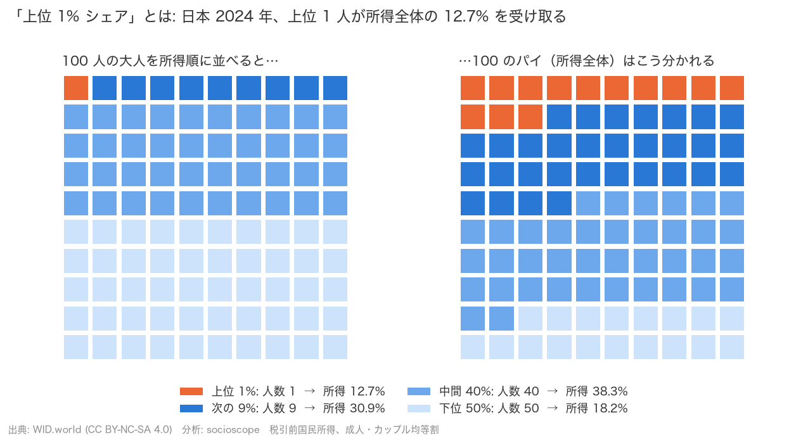
*図 1: 左は 100 人の大人、右は所得全体を 100 のマスに分けたもの。オレンジの 1 人分が、右では 13 マスを占める。*

### 「所得」と「資産」の違い

- **所得**: 1 年間に入ってくるお金（給料、事業収入、利子・配当など。税引き前）
- **資産**: ある時点で持っている財産（預金、株、不動産など）から借金を引いたもの

資産のほうが偏りは大きく、推計も難しくなります。この記事では両方を別々に見ます。

### OECD の制度データ

問い 2（税制・社会保障で説明できるか）のために、OECD が公開する「最高所得税率」「公的社会支出の対 GDP 比」「総税収の対 GDP 比」を使いました。こちらは OECD 加盟 38 か国だけが対象です。

### データはどこまで信頼できるか

ここが重要です。WID の数値は「誰かが数えた値」ではなく、税務統計・家計調査・国民経済計算などをつなぎ合わせた **推計値** です。特に資産は、国によって元資料も方法も違い、1980 年より前は 10 年刻みの点しかない国が多く、18 か国は 1980 年以降しかデータがありません。この記事では、欠けている部分を埋めたり補ったりせず、あるデータだけで数えています。

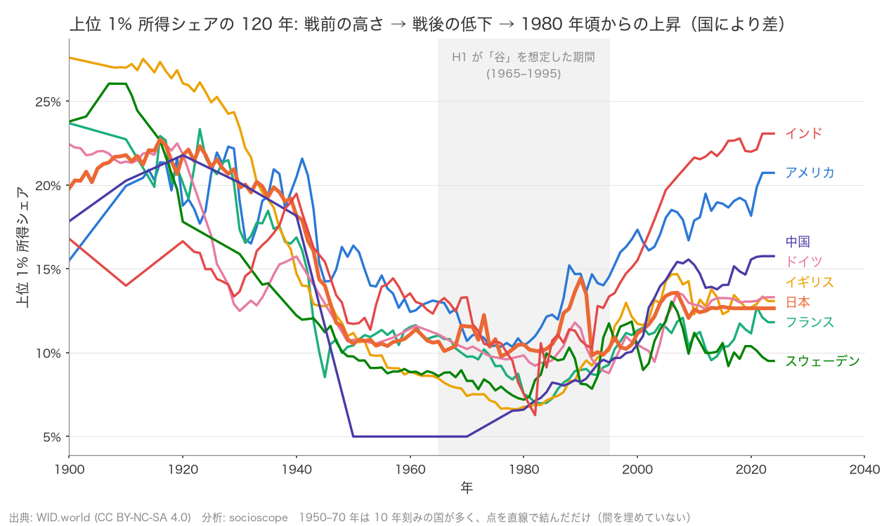
*図 2: 代表的な 8 か国の上位 1% 所得シェア（1900〜2024 年）。アメリカとインドは再上昇が大きく、フランスとスウェーデンは小さい。*

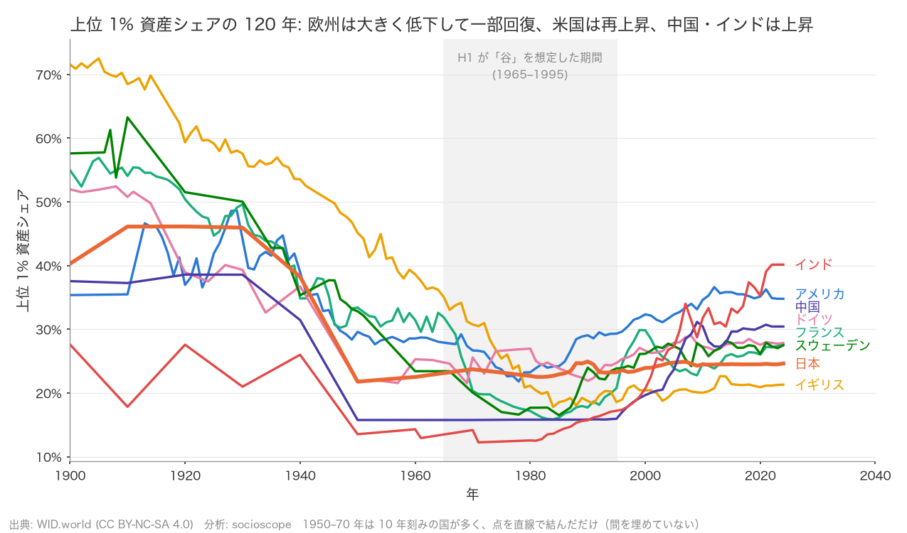
*図 3: 同じく上位 1% 資産シェア。ヨーロッパは戦前の 50〜70% から大きく下がり、1980 年以降の回復は国によって差がある。1950〜70 年は 10 年刻みの点を直線で結んでいる。*

---

## 4. 分析方法の概要

### 「結果を見る前に基準を決める」

「U 字かどうか」を見た目で判断すると、人によって答えが変わります。そこでこの分析では、**データを見る前に** 仮説と判定基準を文書に書いて固定しました（「事前登録」と呼びます）。結果を見てから都合のよい基準に変えることを防ぐためです。

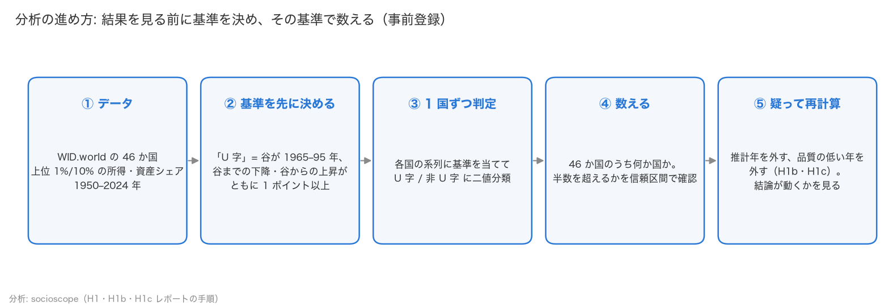
*図 4: 分析の流れ。「基準を先に決めて数える」「疑って再計算する」の 2 段構え。*

### U 字の判定基準

各国のグラフについて、次の 3 つをすべて満たせば「U 字」と判定します。

1. 1950〜2024 年のあいだで値が最も低かった年（谷）が、1965〜1995 年にある
2. 最初の年から谷までの下がり幅が 1 ポイント以上
3. 谷から最後の年までの上がり幅も 1 ポイント以上

そのうえで、U 字の国が 46 か国の半数を超えるかを調べます。あわせて「1980 年から最新年にかけて上がったか」という弱い基準も、補助的な指標として事前に決めておきました。

### 「信頼区間」について

結果には「26%（信頼区間 16〜40%）」のような表記が出てきます。これは「同じ調べ方を何度も繰り返したら、本当の割合はだいたいこの範囲に収まるだろう」という幅です。幅が 50% をまたいでいれば「多数派とも少数派とも言い切れない」と読みます。

### 「ポイント」という単位

この記事では「+2.2 ポイント」のような表記が出てきます。シェアは「%」で表される割合なので、たとえば 10% から 12.2% に上がったとき、「2.2% 上がった」と書くと「10% の 2.2% 分」と誤解されかねません。そこで割合どうしの差は「ポイント」と呼びます。

### 「相関」と「因果」

「社会支出が増えた国ほど上位 1% シェアも上がっていた」のように、2 つのものが一緒に動くことを **相関（関連）** といいます。片方がもう片方を **引き起こした** という **因果** とは別物です。この記事の分析はすべて「関連があるか」を見たもので、「原因か」は検証していません。

---

## 5. 分析結果

### 結果 1: U 字型は多数派ではなかった

事前の基準で数えると、**上位 1% 資産シェアで U 字は 46 か国中 12 か国（26%、信頼区間 16〜40%）**、上位 10% 資産で 11 か国（24%）でした。所得では **上位 1% で 22 か国（48%、信頼区間 34〜62%）**、上位 10% で 21 か国（46%）と半数近くですが、「多数派」とは言えません。

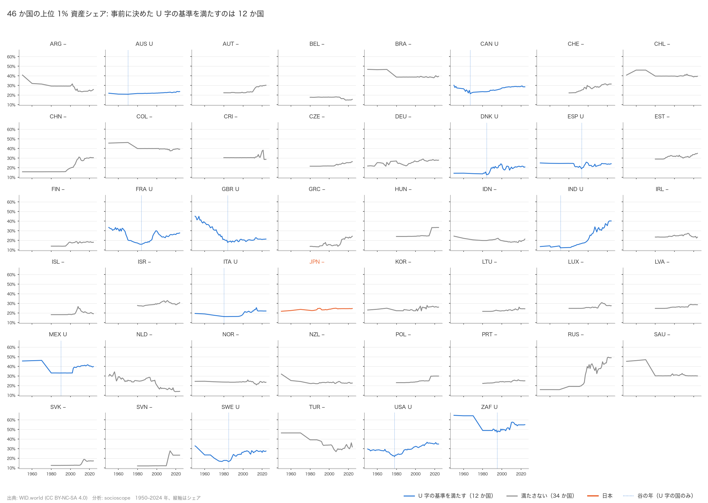
*図 5: 46 か国の上位 1% 資産シェア。青が U 字の基準を満たす 12 か国、灰色は満たさない国、オレンジは日本。点線は谷の年。*

U 字にならない国には 3 つのタイプがあります。

- **データが 1980 年から始まる国**（オーストリア、スイス、チェコなど 18 か国の資産データ）。「谷までの下降」をそもそも観測できません。
- **ずっと下がり続けている国**（アルゼンチン、ブラジル、オランダ、トルコなど）。谷が 2000 年以降にあります。
- **ずっと上がり続けている国**（中国、ロシア）。下降がありません。

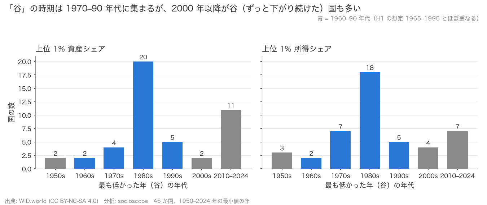
*図 6: 各国の「最も低かった年」の分布。1980 年代の山と、2010 年以降（下がり続けた国）の山がある。*

谷がある国では、谷の時期は 1980 年代に集中しています（中央値は資産 1985 年、所得 1983 年）。「1980 年前後が底」という部分はおおむね当てはまっていました。

なお、1960 年以前からデータがある国に限ると、U 字は資産で 27 か国中 12（44%）、所得で 33 か国中 21（64%）に上がります。つまり U 字が少数派になる一因は観測期間の短さです。ただしこの分け方は後から決めたもので、長期データがある国はもともとピケティらの研究対象国（フランス、イギリス、アメリカなど）に偏っています。

### 結果 2: ただし「1980 年以降の上昇」は多数派

弱いほうの基準「1980 年 → 最新年で上がったか」では、**資産上位 1% で 35/46（76%、信頼区間 62〜86%）、所得上位 1% で 37/46（80%、67〜89%）** と、はっきり多数派です。

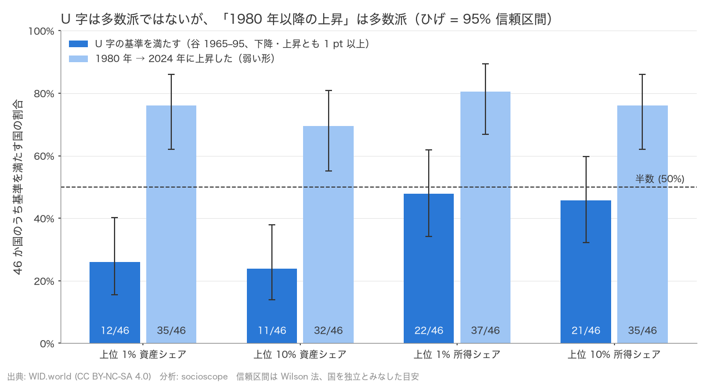
*図 7: 濃い青が「U 字」、薄い青が「1980 年以降に上昇」。ひげは信頼区間。薄い青は 4 つの指標すべてで 50% の線を上回る。*

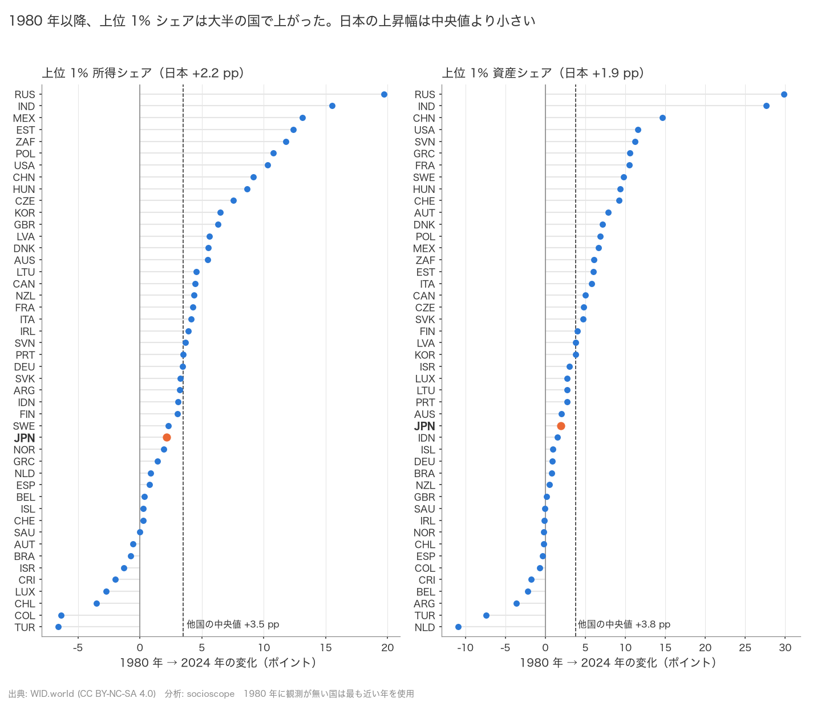
*図 8: 国ごとの 1980 → 2024 年の変化。右に行くほど上昇。ロシア・インド・中国・アメリカが大きく、トルコ・オランダ・コロンビアなどは低下。日本はオレンジ。*

まとめると、「戦後に下がって、1980 年ごろに底を打ち、再び上がる」というきれいな U 字は少数派ですが、「1980 年以降は上がった」という部分だけなら 4 分の 3 以上の国に当てはまります。そして国ごとの差が非常に大きい。ロシア（資産 +30 ポイント）やインド（+28 ポイント）のように急上昇した国と、オランダ（−11 ポイント）のように下がった国が同居しています。

### 結果 3: 日本の位置

日本の上位 1% 所得シェアは、1976 年の底（9.8%）から 2024 年の 12.7% へ上がりました。しかし 1980 年比では **+2.2 ポイント** で、他国の中央値（+3.5 ポイント）より小さい。46 か国中の順位（1 位が最も偏りが大きい）は **1980 年 13 位 → 2024 年 22 位** と下がりました。上位 1% 資産シェアも +1.9 ポイント（他国中央値 +3.8）で、順位は 23 位 → 29 位です。

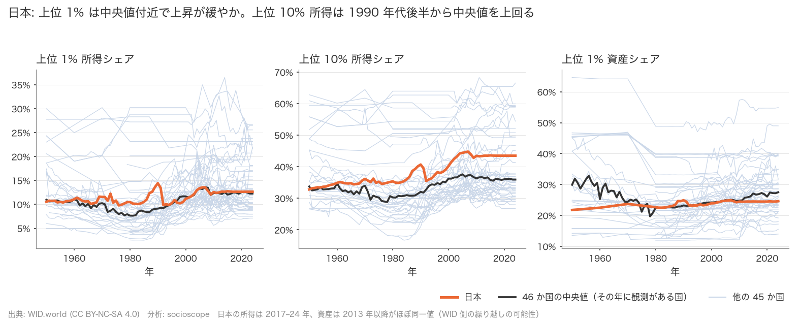
*図 9: オレンジが日本、黒が 46 か国の中央値、薄い線が他国。上位 1% は中央値に近く、上位 10% 所得は 1990 年代後半から中央値を上回る。*

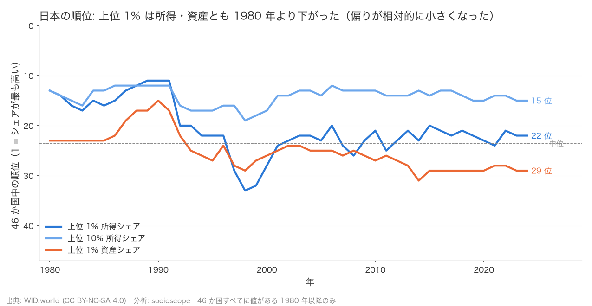
*図 10: 日本の順位の推移。上位 1% は所得・資産とも順位を下げた。*

「日本は所得集中の上昇が穏やか」という見方は、**上位 1% については当てはまります**。ただし **上位 10% の所得シェアは例外** で、1980 年比 +8.1 ポイントと他国中央値（+5.3）より大きく上がっています。つまり日本は「トップ 1% の突出」より「上位 1 割とそれ以外の差」が広がったように見えます。

注意点を 2 つ。図 9 で日本の線が近年まっすぐ横に伸びているのは、データが動いていないからです。日本の所得シェアは 2017〜2024 年の 8 年間が同じ値で、資産も 2013 年以降ほぼ一定です。データベース側で更新が止まっているか、最後の値を繰り越している可能性が高く、「2024 年の値」は実質的に 2016 年ごろの値です。また、これは国どうしの比較であって、日本国内の個人や世帯のあいだで何が起きたかを直接示すものではありません。

### 結果 4: 「データの質」を見直すと何が変わるか

この分析で最も伝えたい点です。WID の各年の値が「観測」なのか「推計」なのかを、WID が公開している説明文と品質スコア（0〜5）から調べ直しました。

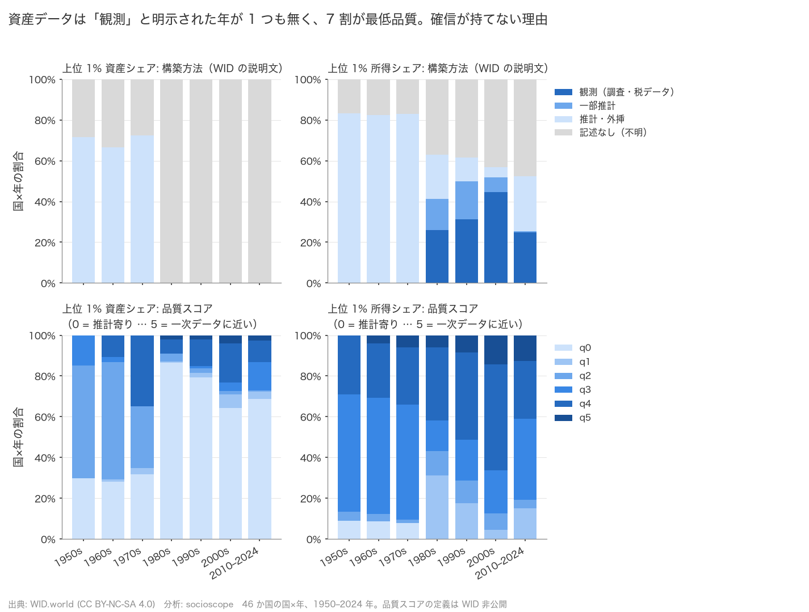
*図 11: 上段は説明文から分類した「どう作られた値か」、下段は品質スコア。資産（左）は観測年がゼロで、1980 年以降は 7 割以上が最低スコア。*

分かったことは次のとおりです。

- **資産の上位 1% シェアには、「観測」と明示された年が 1 つもありません。** 46 か国・2,281 個の「国×年」の値のうち、「観測」と書かれたものは 0、「推計」と書かれたものが 148、残りの 93.5% は作り方の記述そのものがありません。観測年だけで U 字を判定しようとすると、全 46 か国が判定不能になります。
- **所得は 26 か国に年別の説明があり**、観測と明示された年は早くても 1980 年。観測年だけでは「谷までの下降」が原理的に見えず、U 字は 15 か国中 1 か国になります。一方「1980 年以降の上昇」は観測年だけでも **15 か国中 14（93%）** で、こちらの結論は揺らぎません。
- **品質スコアで絞ると**、資産は国×年の 70% が最低スコアで、判定できる国が 46 → 8 か国に減ります。残った 8 か国では U 字が 5 か国と過半ですが、国数が少なく、長期の記録がある欧米諸国に偏っています。「1980 年以降の上昇」は高品質の年に限るほど強く出て、最も厳しい条件では **21 か国中 21** でした。
- **日本の資産データは全年が最低スコア** で、どの条件でも判定できません。

要するに、**「資産の U 字は少数派」という結果 1 は、データの質を考えると「判定できない」に近い**。一方で「1980 年以降に上がった」という結果 2 は、観測年・高品質年に絞っても変わりませんでした。

### 結果 5: 税制・社会保障で説明できるか

上昇幅の国ごとの差が制度で説明できるかを、OECD 加盟 38 か国について調べました。やり方は「1980 年（または 2000 年）から 2022 年までの変化どうしの関連を見る」という単純なものです。

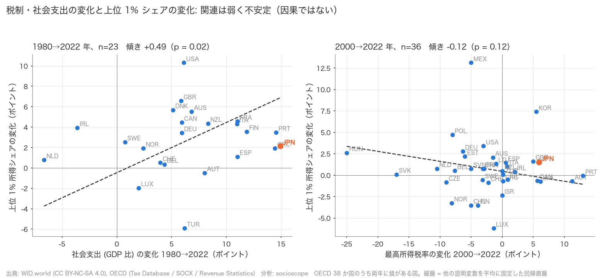
*図 12: 左は社会支出の変化（1980→2022、23 か国）、右は最高所得税率の変化（2000→2022、36 か国）と、上位 1% 所得シェアの変化。点のばらつきが大きい。*

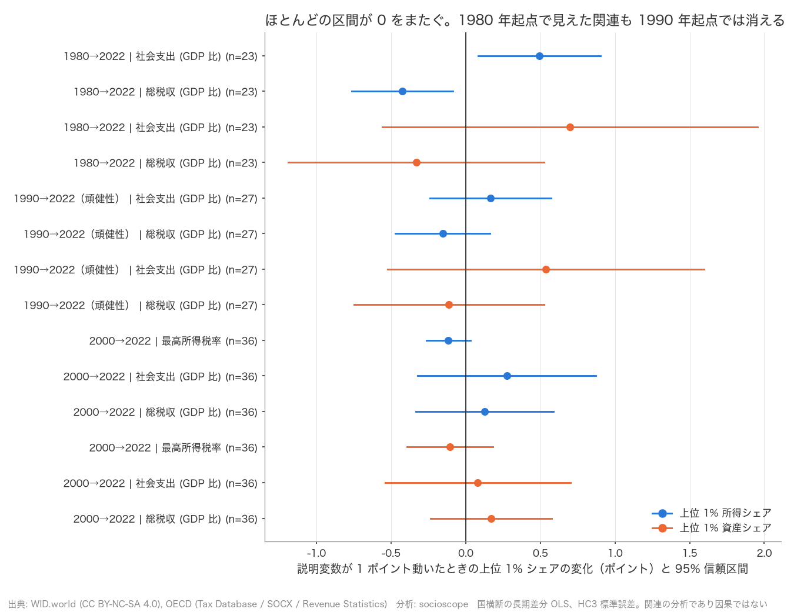
*図 13: 各要因の関連の強さと信頼区間。区間が 0 の線をまたいでいれば「関連があるとは言えない」。*

- 1980 → 2022 年（23 か国）では、社会支出の増加が大きい国ほど上位 1% 所得シェアの上昇が大きく、税収の増加が大きい国ほど小さい、という関連が見えました。ただし、国ごとの上昇幅の違いのうちこの 2 つで説明できるのは 24% にとどまり（残りの 76% は別の理由）、**起点を 1980 年から 1990 年に変えると関連は消えます**。10 年ずらしただけで消える関連は、確かなものとは言えません。
- 最高所得税率を含められる 2000 → 2022 年（36 か国）では、どの制度変数もはっきりした関連を示しませんでした。
- 日本は 2000 → 2022 年に最高税率 +5.9 ポイント、社会支出 +9.8 ポイント、税収 +9.2 ポイントと「格差を抑える」方向に大きく動いた国ですが、上位 1% 所得シェアは +1.5 ポイント上がっており、36 か国の中央値（+0.49）より大きい。制度の変化と結果が素直に対応していない一例です。

**結論として、「制度で説明できる部分がある」という仮説は、この変数・この期間・この国数では支持されませんでした。** ただしこれは「税制は効かない」という意味ではありません。国数が少なく小さな関連を検出する力がないこと、最高税率のデータが 2000 年以降しかなく 1980 年前後の大きな税制転換を含められないこと、そして何より、政策は格差に反応して変わるので（逆の因果）、この種の分析では因果の向きが決められないことが理由です。

### 結果 6: 超富裕層と「真ん中」はどう動いたか

「上位 1% が増えた」といっても、増えたのは上位 1% の中のさらに上（上位 0.1%、1,000 人に 1 人）なのでしょうか。そして上位 1% 以外の層はどう動いたのでしょうか。上位 0.1%・0.01% のシェアと、分布全体を 127 区間に分けたデータを追加して調べました（仮説と判定基準は分析前に登録）。

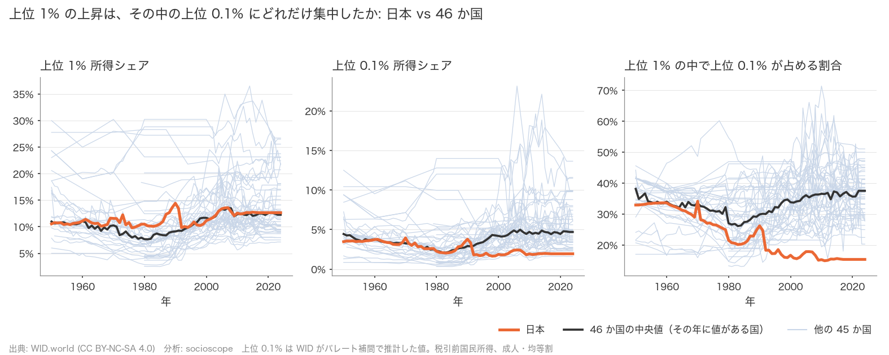
*図 14: 左から上位 1% シェア、上位 0.1% シェア、「上位 1% の中で上位 0.1% が占める割合」。日本（オレンジ）は上位 0.1% が下がり、46 か国の中央値と逆向き。*

- **資産では「上位 1% の上昇の半分以上が上位 0.1% によるもの」という国が多数派**（上位 1% が上がった 35 か国中 30、86%）。**所得では半数**（37 か国中 18、49%）で、多数派とは言えません。ただし「上位 1% に占める上位 0.1% の割合」が上がった国は 46 か国中 35 と、向き自体は共通です。
- **日本は逆向き**。所得の上位 1% は +2.2 ポイント上がったのに、上位 0.1% は −0.3 ポイント。上位 1% に占める上位 0.1% の割合は 0.215 → 0.153 に下がり、46 か国中 43 位（他国の中央値は +0.075 の上昇）。日本の上位 1% の上昇は「超富裕層」ではなく、上位 1% の下のほうで起きていました。

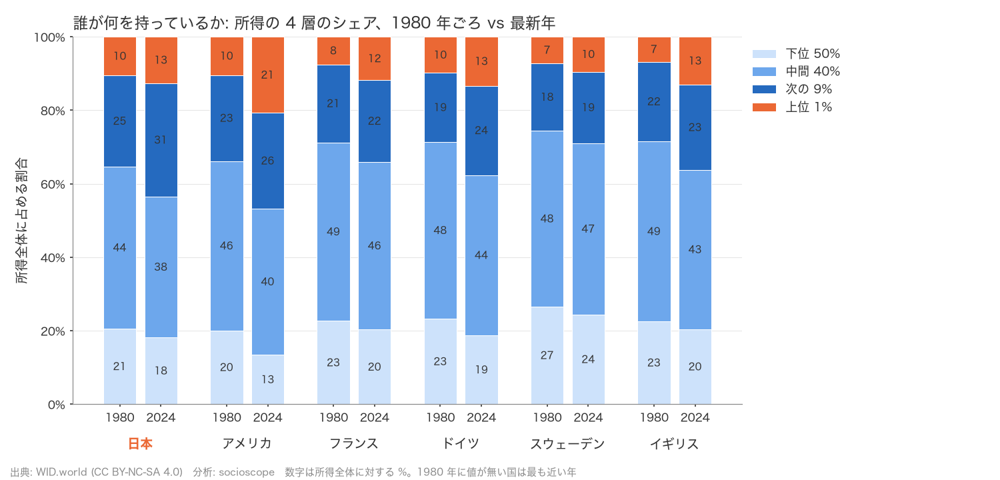
*図 15: 所得全体を「上位 1%」「次の 9%」「中間 40%」「下位 50%」に分けたシェア、1980 年と 2024 年。日本は次の 9% が 25% → 31% に増え、中間 40% が 44% → 38% に減った。アメリカは上位 1% が 10% → 21%。*

- **日本の格差拡大は「上位 1 割と真ん中」の差として現れました**。上位 10% シェアは +8.1 ポイント上がりましたが、そのうち上位 1% は +2.2 だけで、残りの「次の 9%」が +6.0。中間 40% は −5.8 ポイントと、46 か国で 10 番目に大きい低下です。下位 50% は −2.4 ポイントで、他国の中央値（−2.2）とほぼ同じ。
- ただし「上位 10% の上昇 ＞ 上位 1% の上昇、かつ下位 50% の低下」というパターンそのものは 46 か国中 32 か国に当てはまり、日本だけではありません。多くの国では上位 10% の上昇の大半を上位 1% が占めるのに対し、日本では「次の 9%」が 4 分の 3 を占める——この配分が日本の特徴です。

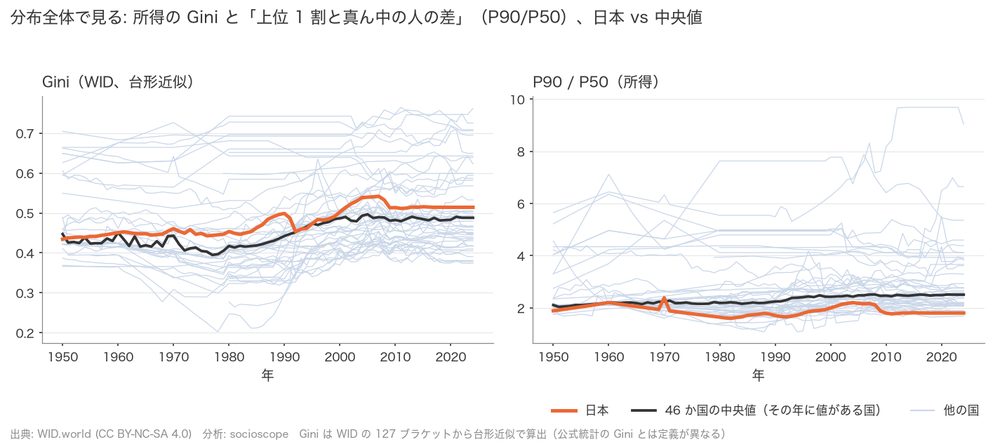
*図 16: 所得の Gini 係数（左）と、上位 1 割の人の所得が真ん中の人の何倍かを示す P90/P50（右）。日本の Gini は 1990 年代後半に中央値を追い越したが、P90/P50 は中央値より低く横ばい。*

- 分布全体を 1 つの数字にまとめた Gini 係数の変化（+0.06）は、日本も 46 か国の中央値（+0.06）とほぼ同じでした。「上位 1% の突出は小さいが、分布全体の偏りの拡大は人並み」というのが、データから言える日本の姿です。
- 注意点。上位 0.1% や 0.01% の値は、データベース側がパレート分布という数式で補間した推計です。また、ここでの Gini は税引前・大人 1 人あたりの値で、厚生労働省などが公表する世帯ベース・可処分所得の Gini とは水準を比較できません。

---

## 6. 総括

### 言えること

- 事前に決めた基準では、「U 字型」は 46 か国の多数派ではない（資産 26%、所得 48%）。
- 「1980 年以降に上位 1% シェアが上がった」は 4 分の 3 以上の国に当てはまり、データの質で絞っても変わらない。
- 国ごとの上昇幅の差は非常に大きい（−11 から +30 ポイント）。
- 日本の上位 1% は所得・資産とも上昇が他国より穏やかで順位を下げたが、上位 10% の所得シェアは他国より大きく上がった。

### 言えないこと

- **因果**: 税制や社会支出が格差を「動かした」とも「動かさなかった」とも言えません。
- **資産の U 字の有無**: 資産データの観測年が確認できず、品質で絞ると判定できる国が 5〜8 か国しか残りません。「U 字は少数派」は「判定不能」と読むべきです。
- **46 か国以外**: OECD と G20 の国だけで、途上国・小国は含みません。
- **個人・世帯レベル**: すべて国単位の集計値の話で、「日本で誰が得をしたか」は分かりません。

### この分析から学べること

「格差は U 字型に拡大している」という有名な図は、長い記録が残る一部の国では確かに成り立ちます。しかし 46 か国に広げて同じ基準で数えると、きれいな U 字は少数派で、「1980 年以降に上がった」という緩い言い方に落ち着きます。そして何より、資産の統計は推計の積み重ねで、「本当に U 字か」を確かめられるだけの観測データが、まだ世界にはありません。

格差の議論では、グラフの形そのものより「そのグラフがどう作られたか」を疑うことが、最初の一歩になりそうです。

### 今後

- 日本の国内統計（国民生活基礎調査・全国家計構造調査・国税庁統計）を取り込み、WID の日本の値（特に 2017 年以降の繰り越し）を照合する。
- 金融資産の世代間・階層間の偏りに使えるデータを探す。
- 1980 年前後の税制転換を含められる制度データの代替を探す。

---

### 出典とライセンス

- **WID.world（World Inequality Database）**: CC BY-NC-SA 4.0。本記事と図はその派生物であり、同じ条件（出典表示・非商用・同一ライセンスでの再配布）に従います。
- **OECD**（Tax Database、SOCX、Revenue Statistics）: OECD Terms & Conditions（2024 年 7 月改定）。出典表記「OECD (2026), <dataset>, https://sdmx.oecd.org (accessed on 2026-10-04)」。
- 分析コードと詳細レポートは GitHub の socioscope リポジトリ（コードは MIT ライセンス）で公開しています。
