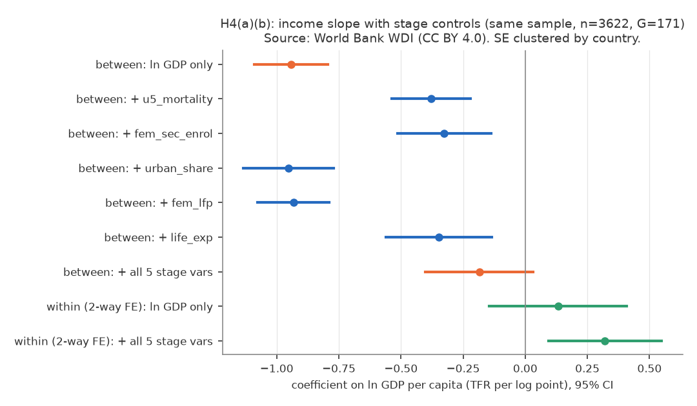
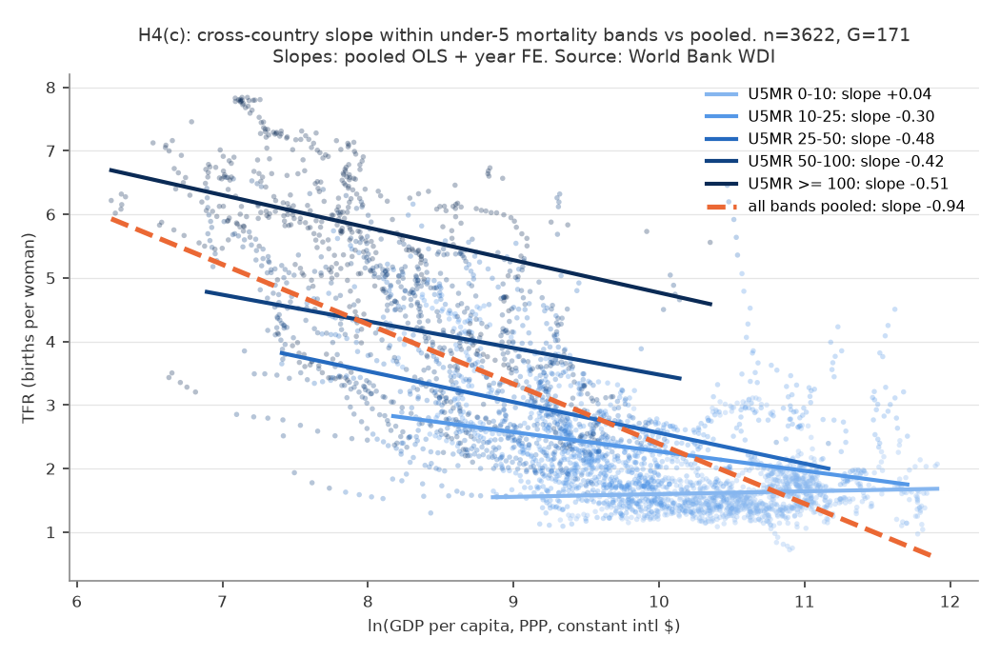
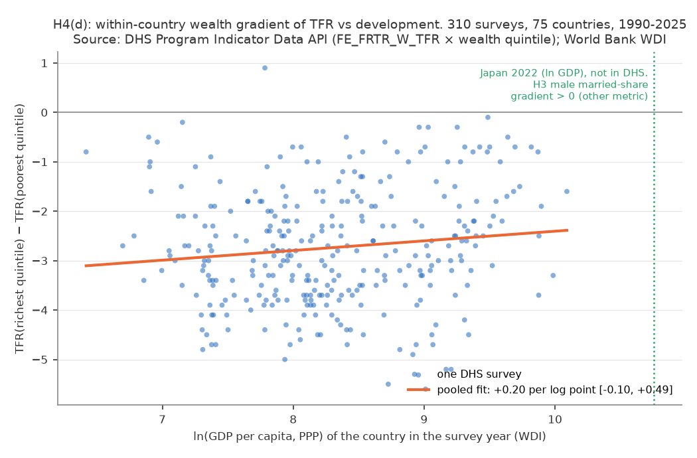
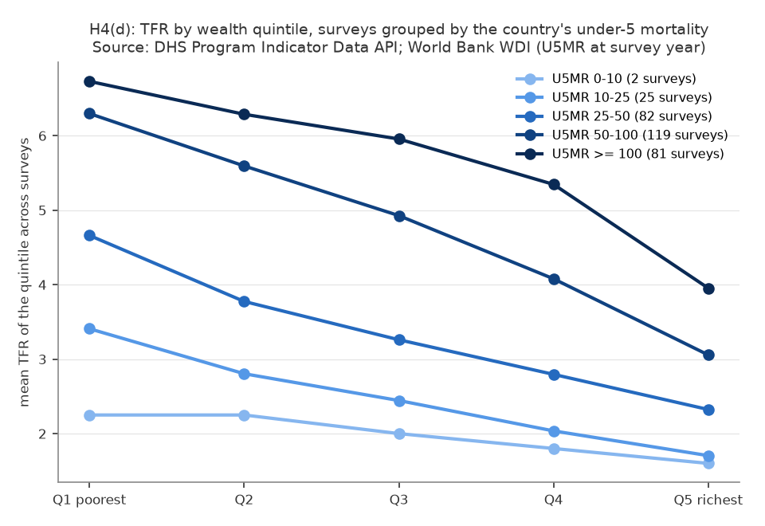

# H4: 国間の「豊かな国ほど出生率が低い」は、人口転換の段階が作る見かけの関係か（2026-10-05, theme: growth-fertility）

## 要約（5 行）
- **動機**: H1 で国間の ln GDP pc × TFR は −1.04、同じ国の中（within）では ≈ 0。H3/H3b で日本国内の所得階層勾配は正。「所得 → 出生率」が一枚の因果なら符号が揃うはずで、揃わないのは国間では**所得と相関する別の構造（人口転換の段階）**が TFR を決めているからではないか、という仮説（ユーザー提案）を、結果を見る前に固定した 4 つの検定で確かめた。
- **(a) 減衰: 整合的。** 同一サンプル（1990–2024、171 か国、n = 3,622）で、段階指標 5 本（5 歳未満死亡率・女子中等就学率・都市化率・女性労働参加率・平均余命）を揃えると、国間の ln GDP 係数は **−0.94 → −0.18 [−0.40, +0.03]**（比 0.20）。減衰を担うのは死亡率・就学率・平均余命で、都市化率・女性就業は寄与しない。頑健性 4 仕様すべてで比 0.15–0.35。
- **(b) 段階を固定した所得係数: 整合的（主仕様）。** 二元固定効果に段階指標を加えると、同じ国の中の ln GDP 係数は **+0.32 [+0.09, +0.55]** と正になる（段階なし +0.13 [−0.14, +0.41]）。ただし産油国除外・2020–24 年除外では CI が 0 を含む（点推定は +0.21〜+0.23 で正）。
- **(c) 段階層別の国間勾配: 事前基準では不支持、方向は整合的。** 5 歳未満死亡率で層別すると、全体 −0.94 に対し層内は 0–10/千で **+0.04**（≈ 0）、10–25 で −0.30、25–100+ で −0.42〜−0.51。最も転換が進んだ層では所得勾配が消えるが、転換途上の層では半分程度残り、「全層で半分以下」という事前基準には届かない（4 指標版サンプルでは基準を満たす）。
- **(d) 国内の富裕五分位勾配（DHS、75 か国 310 調査）: 部分的。** 低・中所得国では **310 調査中 309（99.7%）で最富裕層の TFR が最貧層より低い**（平均差 −2.7 人）。この勾配の深さは国の所得水準と**国間ではほぼ無関係**（+0.20 [−0.10, +0.49] /log point）で、同一国の時間変化では浅くなる弱い兆候がある（国 FE +0.73 [+0.02, +1.43]。DHS タイプのみでは CI が 0 を含み、人口加重では +1.09 [+0.42, +1.76]）。DHS の範囲（一人当たり GDP ≤ 約 2.4 万ドル）では国内勾配は負のままで、日本（H3: 男性有配偶率・児童世帯割合が所得と正、TFR ではない）との間に観測の空白がある。勾配がどの段階で反転するかは本データでは特定できない。
- どの結果も**関連**であり因果ではない（識別戦略なし）。段階指標が所得の媒介か交絡かは区別できない。本文の「所得効果」は経済学の用語（所得が増えたときの需要の変化）として使い、因果効果の推定を意味しない。

## 問いと仮説
`design/themes/growth-fertility.md` の H4（2026-10-05 追加）。H1〜H3b の結果を見た**後**に立てた仮説だが、推定量・サンプル・判定基準は追加データ（WDI 段階指標 5 本、DHS 五分位別 TFR）を見る前に固定した（到達性確認で DHS の Afghanistan 2015・Albania 2008 の 10 行だけ目視）。本レポートは H4 (a)〜(e) のみを扱う。

仮説の論理（ユーザー提案を整理）:
1. 所得が高いほど子育ての経済的負荷に耐えられるなら、「所得 → 出生率」は正（所得効果）のはず。日本国内の正の勾配（H3）はこれと整合的。
2. しかし国間では負。一枚の因果ではない。
3. 真の構造は「国の成熟度ライフサイクル＝人口転換の段階」であり、GDP はその一部と相関しているだけ。段階を揃えれば負の勾配は消え、所得効果（≥ 0）が残るはず。
4. 系: 国内の所得階層勾配は、国の段階が進むほど負 → 0 → 正に向かう（勾配自体が段階に依存し、フラクタルではない）。

経済学の文脈: Becker の数量–質トレードオフと時間の機会費用（所得効果 vs 代替効果）、Galor–Weil の統一成長理論、Doepke–Hannusch–Kindermann–Tertilt (2023, Handbook of the Economics of the Family) が整理した「高所得国で所得–出生率の関係が負から正へ転じた」観察。本レポートはこれらを検証するものではなく、背景として挙げる。

## データ
| 変数 | 出典 | 定義・単位 | 期間・国 | 備考 |
|---|---|---|---|---|
| `tfr` | WDI `SP.DYN.TFRT.IN` | TFR（女性 1 人あたり） | 1960–2024、217 経済 | 多くの途上国は推計系列（平滑） |
| `gdp_pcap_ppp` | WDI `NY.GDP.PCAP.PP.KD` | 一人当たり GDP、PPP、2021 年国際ドル。ln で使用 | 1990– | |
| `u5_mortality` | WDI `SH.DYN.MORT` | 5 歳未満死亡率、出生千対 | 1960– | 人口転換の標準マーカー |
| `fem_sec_enrol` | WDI `SE.SEC.ENRR.FE` | 女子中等教育総就学率 % | 欠損多（H1 フレーム 6,792 行中 3,979） | 100% 超あり |
| `urban_share` | WDI `SP.URB.TOTL.IN.ZS` | 都市人口 % | 全行 | |
| `fem_lfp` | WDI `SL.TLF.CACT.FE.ZS` | 女性（15+）労働参加率 %、ILO 推計 | 1990– | |
| `life_exp` | WDI `SP.DYN.LE00.IN` | 出生時平均余命 | 全行 | |
| DHS `value` | DHS Program Indicator Data API `FE_FRTR_W_TFR` × `Wealth quintile` | 調査前 3 年の TFR（15–49 歳）、資産指数による国内五分位（Lowest…Highest） | 1990–2025、77 か国 313 調査（DHS 264 / MIS 41 / AIS 5、WDI と結合後 310） | **資産ベースの国内相対順位**。所得額ではない。CI・分母は API 上この指標では空 |

mart: `data/marts/growth_fertility_panel.parquet`（14,322 行 × 14 列）、`data/marts/dhs_tfr_by_wealth_quintile.parquet`（1,565 行）。生成: `uv run socioscope run growth-fertility fetch && … stage && … mart`（取得 2026-10-05）。LLM 構造化は使っていない。

サンプル: (a)(b)(c) は H1 のフレーム（1990–2024、tfr・gdp 観測、n = 6,792、199 か国）を段階指標 5 本で listwise に絞った **n = 3,622、171 か国**（主に就学率の欠損で半減。4 指標版は n = 5,995、173 か国）。(d) は 5 五分位の揃う 313 調査（全調査が揃う）のうち調査年の ln GDP が WDI にある 310 調査、75 か国。

## 方法
識別戦略: **なし**。すべて関連。
- (a) 国間: `tfr ~ ln_gdp + C(year)`（pooled OLS ＋ 年 FE、国クラスタ SE。純粋な between 推定量ではなく、年内の国間変動を使う）に段階指標を 1 本ずつ・全部加え、ln GDP 係数の比（調整後/調整前）を見る。判定 ≤ 0.5 整合的 / 0.5–0.8 部分的 / > 0.8 不支持。
- (b) 同じ国の中: `tfr ~ ln_gdp + 段階指標 + C(iso3) + C(year)`。判定: ln GDP の 95% CI 下限 ≥ 0 整合的 / 0 を含む 判定不能 / 上限 < 0 不支持。
- (c) 5 歳未満死亡率の層（< 10, 10–25, 25–50, 50–100, ≥ 100 /千。事前固定。**TFR で層別しない**）内で国間勾配を推定し、全体勾配と比較。判定: 全層で |層内| ≤ |全体|/2。
- (d) 調査ごとに `gap = TFR(Q5) − TFR(Q1)`（主）、`slope`（五分位順位への OLS 傾き）、`ratio = Q5/Q1`。調査年の WDI を iso3×year で結合（補完なし）。`gap ~ ln_gdp`（pooled、国クラスタ SE）、`+ survey_year`、`+ C(iso3)`（2 回以上調査のある 62 か国）。予測 ∂gap/∂ln_gdp > 0。判定: pooled と国 FE の両方で CI 下限 > 0 整合的 / 片方 部分的 / それ以外 不支持。段階代理を `u5_mortality`（負を予測）、`fem_sec_enrol` に替えた版。
- (e) 日本は記述のみ（図に ln GDP の位置を示す。外挿しない）。

## 結果
### (a)(b) 段階を揃えると国間の所得勾配は 1/5 になり、同じ国の中では所得係数が正になる

*図 1: ln GDP pc の係数（TFR / log point、95% CI）。同一サンプル n = 3,622、171 か国。橙＝国間（段階なし／5 本あり）、青＝段階指標を 1 本ずつ、緑＝二元 FE。*

| 仕様（国間、年 FE） | ln GDP 係数 [95% CI] | 比 | R² |
|---|---|---|---|
| A0 段階なし | −0.941 [−1.089, −0.793] | 1.00 | 0.625 |
| + 5 歳未満死亡率 | −0.379 [−0.538, −0.221] | 0.40 | 0.764 |
| + 女子中等就学率 | −0.327 [−0.515, −0.138] | 0.35 | 0.728 |
| + 都市化率 | −0.953 [−1.135, −0.772] | 1.01 | 0.625 |
| + 女性労働参加率 | −0.933 [−1.077, −0.789] | 0.99 | 0.628 |
| + 平均余命 | −0.347 [−0.561, −0.134] | 0.37 | 0.718 |
| **A_all 5 本すべて** | **−0.185 [−0.401, +0.032]** | **0.20** | 0.796 |
| 段階指標のみ（ln GDP なし） | — | — | 0.792 |

段階指標だけで国間の TFR 分散の 79% を説明し、ln GDP を足しても 0.4 ポイントしか増えない。標準化係数（1 SD あたり）では 5 歳未満死亡率 +0.67、女子就学率 −0.53 が大きく、都市化・女性就業・平均余命は小さい（stdout `[M std]`）。**判定 (a): 整合的（比 0.20）。**

| 仕様（二元 FE） | ln GDP 係数 [95% CI] |
|---|---|
| B0 段階なし | +0.132 [−0.145, +0.408] |
| **B_all 5 本あり** | **+0.321 [+0.093, +0.548]** |

同じ国の中では、段階指標を揃えると ln GDP の係数は正で CI が 0 を含まない。段階指標の within 係数は女子就学率 −0.009/pt、都市化率 −0.019/pt が負で有意、死亡率は ≈ 0（記述）。**判定 (b): 整合的（主仕様）。**

### (c) 転換が終わった層では所得勾配が消えるが、途上の層では半分残る

*図 2: 5 歳未満死亡率の層ごとの国間勾配（実線）と全体（破線）。同一サンプル。*

| 層（U5MR /千） | n | 国 | 層内 ln GDP 勾配 [95% CI] |
|---|---|---|---|
| 全体 | 3,622 | 171 | −0.941 [−1.089, −0.793] |
| 0–10 | 1,111 | 66 | **+0.044 [−0.087, +0.174]** |
| 10–25 | 991 | 79 | −0.304 [−0.623, +0.014] |
| 25–50 | 585 | 74 | −0.484 [−0.903, −0.066] |
| 50–100 | 540 | 68 | −0.419 [−0.750, −0.089] |
| ≥ 100 | 395 | 44 | −0.512 [−0.974, −0.049] |

Simpson 型の構図は部分的にしか成り立たない。層内の勾配は −0.3〜−0.5 と全体の −0.94 より浅いが消えてはおらず、残りは層の**間**の違い（死亡率が低い層ほど TFR 水準が低い）に対応する（記述的な読みで、分散分解として計算した数値ではない）。転換が完了した層（U5MR < 10、日本・欧米・韓国など）では勾配がゼロ。**判定 (c): 事前基準（全層 ≤ 0.47）では不支持**（25–50 と ≥ 100 の層がわずかに超える）。死亡率だけで絞った大サンプル（n = 6,485）でも同じ形（0–10: −0.00、その他 −0.28〜−0.53）、4 指標版サンプル（n = 5,995）では基準を満たす。

### (d) 低・中所得国の国内では、ほぼ例外なく富裕層ほど子どもが少ない。この勾配は国の所得とほぼ無関係

*図 3: 調査ごとの gap = TFR(最富裕五分位) − TFR(最貧五分位) を、調査年の国の ln GDP pc に対して。310 調査、75 か国。緑の点線は日本 2022 年の ln GDP（DHS 範囲外、参考）。*


*図 4: 五分位別 TFR の平均プロファイル。調査を国の 5 歳未満死亡率で群分け（凡例に調査数。U5MR 0–10 は 2 調査のみ）。*

- gap の分布: 平均 −2.74、中央値 −2.8、四分位 [−3.6, −1.9]、範囲 [−5.6, +0.9]。**gap < 0 が 309/310**。唯一の例外は Chad 2004（Q1 5.1 → Q5 6.0）。
- `gap ~ ln_gdp`: pooled **+0.195 [−0.103, +0.493]**（R² 0.016）、年トレンド付き +0.192 [−0.109, +0.493]、国 FE（62 か国、297 調査）**+0.728 [+0.022, +1.435]**。**判定 (d): 部分的**。同一国が豊かになる過程で勾配が浅くなる弱い兆候はあるが（DHS のみに絞ると CI が 0 を含む）、国間では所得水準と勾配の深さはほぼ無関係。人口加重（事前リスト）では pooled +0.65 [+0.29, +1.01]、国 FE +1.09 [+0.42, +1.76] と強くなる（人口の大きい国に重みを寄せると係数が大きくなる。人口との交互作用は推定していない）。
- 段階代理を替えると: 5 歳未満死亡率 −0.003 [−0.008, +0.002]（予測どおり負だが 0 を含む）、女子就学率 pooled +0.008 [−0.001, +0.017]、国 FE +0.017 [+0.006, +0.028]（就学率が上がると勾配が浅くなる。この代理では国 FE が明確）。
- 図 4 は、死亡率の高い群ほど五分位プロファイルが急で（≥ 100: 6.7 → 3.9）、転換が進むほど全体が下がりつつ平らになる（10–25: 3.4 → 1.7）ことを示す。ただし最も進んだ群（0–10）は 2 調査しかない。
- 日本の ln GDP（10.75）は DHS の最大値（10.09、約 2.4 万ドル）の外にある。DHS の範囲内で勾配が正になる調査は事実上なく、日本の正の勾配（H3: 男性有配偶率、児童世帯割合）は**この延長上に外挿して得られるものではない**。指標も違う（TFR vs 有配偶率）。反転がどの段階で起きるかは本データでは分からない。

## 頑健性（事前リスト、全部）
| 仕様 | (a) 比 | (b) within ln GDP [CI] | (c) 層内勾配（0–10 / 10–25 / 25–50 / 50–100 / ≥100） | (c) 判定 |
|---|---|---|---|---|
| 主（5 指標、n = 3,622） | 0.20 | +0.32 [+0.09, +0.55] | +0.04 / −0.30 / −0.48 / −0.42 / −0.51 | 不支持 |
| 産油国除外（n = 3,295） | 0.35 | +0.23 [−0.03, +0.48] | −0.01 / −0.95 / −0.62 / −0.56 / −0.77 | 不支持 |
| 人口 100 万未満除外（n = 3,099） | 0.15 | +0.37 [+0.08, +0.65] | +0.09 / −0.11 / −0.22 / −0.40 / −0.57 | 不支持 |
| 2020–24 除外（n = 3,046） | 0.17 | +0.21 [−0.03, +0.46] | +0.11 / −0.26 / −0.45 / −0.43 / −0.51 | 不支持 |
| 4 指標（就学率なし、n = 5,995） | 0.33 | +0.23 [+0.05, +0.40] | +0.04 / −0.23 / −0.41 / −0.39 / −0.50 | **整合的** |

(a) は全仕様で ≤ 0.5。(b) は点推定が全仕様で正だが、CI が 0 を含む仕様が 2 つ。(c) は「転換完了層でゼロ、途上層で −0.2〜−0.6」が共通で、産油国を除くと途上層の勾配はむしろ深くなる（産油国は高所得・高 TFR で勾配を薄めていた）。

| (d) 仕様 | pooled ln GDP [CI] | 国 FE ln GDP [CI] | 判定 |
|---|---|---|---|
| 主（gap、全タイプ、310） | +0.20 [−0.10, +0.49] | +0.73 [+0.02, +1.43] | 部分的 |
| DHS タイプのみ（264） | +0.21 [−0.09, +0.50] | +0.70 [−0.04, +1.44] | 不支持 |
| 1 国 1 調査（最新、75） | +0.29 [−0.06, +0.64] | — | 不支持 |
| slope（順位傾き） | +0.03 [−0.05, +0.10] | +0.12 [−0.06, +0.31] | — |
| ratio（Q5/Q1） | **−0.04 [−0.08, −0.00]** | +0.02 [−0.07, +0.10] | — |
| 人口加重 WLS（gap、重み = 調査年の人口） | **+0.65 [+0.29, +1.01]** | **+1.09 [+0.42, +1.76]** | 整合的 |

ratio が負なのは、豊かな国ほど TFR 水準が低く、差（gap）が同じでも比は小さくなるため（床効果）。gap の国 FE 係数は DHS のみに絞ると CI が 0 をわずかに含む。非加重（主）では「同じ国の中で浅くなる」は弱い証拠に留まり、人口加重では明確になる。加重は人口の大きい数か国（インド・ナイジェリア・バングラデシュ等）に推定を寄せるため、主仕様の判定は変えない。

## 解釈: 仮説はどこまで支持されたか
- **「GDP は段階の代理」は国間の関連として整合的**（(a)）。国間の負の勾配の 8 割は、死亡率・女子教育・平均余命が説明する部分と重なる。「人口転換が TFR を下げ、所得はそれに付随している」はこの減衰と整合的な解釈の一つだが、媒介（所得 → 教育・死亡率 → 出生率）でも同じ減衰が起きるので、本データでは区別できず、「所得は無関係」とも言えない。
- **「段階を固定すれば所得係数 ≥ 0」は主仕様で整合的**（(b)）。同じ国の中で段階指標を揃えた所得係数 +0.32 は、「所得が高いほど産める」という所得効果の予測と符号が合う。ただし大きさは小さく（GDP 2.7 倍で TFR +0.3）、景気循環（H2）や逆の因果と切り分けられておらず、段階指標が所得の媒介なら bad control（後述）の問題もある。
- **「国内勾配は段階とともに負 → 正へ」は、観測できる範囲では部分的にしか支持されない**（(d)）。途上国の国内ではほぼ例外なく（309/310）富裕層が少産で、その深さは国の所得水準とほぼ無関係。同一国の時間変化では浅くなる兆候がある（非加重では弱く、人口加重では明確）。日本の正の勾配は DHS 範囲の外にあり、指標も違うため、本データでは反転として観測できない。Doepke らが整理した「高所得国でのみ関係が正に転じた」観察と矛盾はしないが、本レポートがそれを確認したわけではない。
- したがって、ユーザーの仮説のうち「国間の負の相関は段階との相関による見かけ」は**整合的**、「段階を固定すれば所得係数は正」は**主仕様で整合的**、「国内勾配は段階に沿って滑らかに反転する」は**途上国の範囲では支持されない（勾配は負のまま）**。国間・途上国の国内・日本の国内で別々の機構（人口転換、数量–質トレードオフ、結婚市場と子育て費用の固定費）が働いているという説明は、これらの観察と整合的な**未検証の仮説**であり、本レポートはどの機構も検定していない。

## 限界・言えないこと
- **因果ではない。** 識別戦略なし。(a) の減衰は交絡と媒介を区別できず、「所得の因果効果はゼロ」を意味しない。(b) の正の係数には測定誤差と省略変数（住宅費・政策・宗教構成の変化）が含まれる。逆の因果（出生率が下がると一人当たり GDP が上がる）は負方向のバイアスなので、正の推定値を過小にしうるが、大きさは評価していない。
- **Bad control の可能性。** (b) で統制した段階指標（教育・死亡率・都市化・女性就業）は所得の結果（媒介）でもありうる。post-treatment 変数を統制した係数は「段階を固定した所得の直接部分」に相当し、所得の総関連とは異なり、選択バイアスも入りうる。(b) の判定は事前登録どおりだが、この意味で読む。
- **エコロジカルな誤謬。** 国レベル・五分位レベルの関連を個人に読み替えない。「富裕層ほど少産」は五分位集計の性質である。
- **DHS の富裕五分位は資産順位**で、日本の個人所得階級（H3）・世帯所得階級とは定義が異なる。TFR（女性）と有配偶率（男性）も別物。(e) の比較は図示のみで、推定に入れていない。
- **サンプルの偏り。** 段階指標 5 本の listwise で H1 サンプルが半減し、就学率の欠損は非ランダム（途上国・近年ほど欠損）。4 指標版で結論が変わらないことは確認した。DHS は低・中所得国のみで、ln GDP > 10.1 の国内勾配は観測できない。U5MR < 10 の DHS 調査は 2 件のみ。
- **TFR の推計系列。** 多くの途上国の WDI TFR は推計で平滑なため、within 推定は原理的に鈍い。
- **多重比較。** 事前登録した判定は 4 つだが、頑健性で多数の推定を出している。判定は主仕様で行い、頑健性は方向の一貫性で読んだ。
- **判定基準の硬さ。** (c) の「全層で半分以下」は事前に決めたもので、結果は 0.45〜0.54 と境界上にある。基準をわずかに緩めれば整合的になるが、事後に緩めない。

## 再現手順
```bash
make sync
uv run socioscope run growth-fertility fetch && uv run socioscope run growth-fertility stage && uv run socioscope run growth-fertility mart
uv run python themes/growth-fertility/src/theme_growth_fertility/analysis/a20261005_h4_stage_vs_gdp.py \
  > themes/growth-fertility/reports/2026-10-05-h4-stage-vs-gdp.stdout.txt
uv run pytest themes/growth-fertility/tests/test_analysis_h4.py
```
2 回実行で図 4 枚の sha256 と標準出力が一致することを確認済み（乱数不使用。人口加重版を追加した後も再確認）。

## 出典
- World Bank, World Development Indicators（`SP.DYN.TFRT.IN`, `NY.GDP.PCAP.PP.KD`, `SP.POP.TOTL`, `SH.DYN.MORT`, `SE.SEC.ENRR.FE`, `SP.URB.TOTL.IN.ZS`, `SL.TLF.CACT.FE.ZS`, `SP.DYN.LE00.IN`、取得 2026-10-05）: CC BY 4.0。
- The DHS Program Indicator Data API, The Demographic and Health Surveys (DHS) Program. ICF. Originally funded by the United States Agency for International Development (USAID). Available from api.dhsprogram.com. [Accessed 10-05-2026]

## チェックリスト回答
- **A-1** H4 は `design/themes/growth-fertility.md` に推定量・サンプル・判定基準つきで事前登録（H1〜H3b の結果を見た後に立てた仮説であることを明記）。事後の変更なし。
- **A-2** 推定量は (a) 係数比、(b) FE 係数の CI、(c) 層内勾配、(d) gap の ln GDP 係数。判定基準は事前固定。
- **B-1** 出典・指標コード・取得日・mart 行数を記載。manifest に残る。
- **B-2** 就学率の非ランダム欠損、TFR 推計系列、DHS の資産順位という定義、CI 欠落を列挙。補完なし。
- **B-3** listwise による半減と 4 指標版の対照を示した。DHS の結合落ち 3 調査（調査年の GDP 欠損）を記載。
- **C-1** 識別戦略: なし。全結果を「関連」「整合的」と書いた。
- **C-2** 因果の仮定は置いていない。媒介/交絡の区別不能を明記。
- **C-3** 逆の因果・省略変数・測定誤差・床効果を「限界」に列挙。
- **C-4** 国・五分位レベルの関連を個人に読み替えないこと、日本との比較が指標・集団の異なる図示に留まることを明記。
- **D-1** SE は国クラスタ。DHS の調査レベル CI は API に無いことを記載。
- **D-2** 事前リストの頑健性（(a)(b)(c) 4 仕様、(d) タイプ・最新調査・slope・ratio・人口加重）を全部表にした。
- **D-3** (c) が境界上で事前基準を満たさないこと、(d) が仕様により判定が変わることをそのまま書き、基準を事後に緩めていない。
- **E-1** 結果は「関連」「整合的」「支持」で書いた。「所得効果」は経済学の用語として用い、因果効果の推定を意味しないことを要約で注記した。機構の説明は未検証の仮説と明記した。
- **E-2** 図は軸・単位・出典・n を記載。
- **E-3** 「限界・言えないこと」節あり。
- **E-4** 再現コマンド・決定性の確認を記載。LLM 構造化なし。
