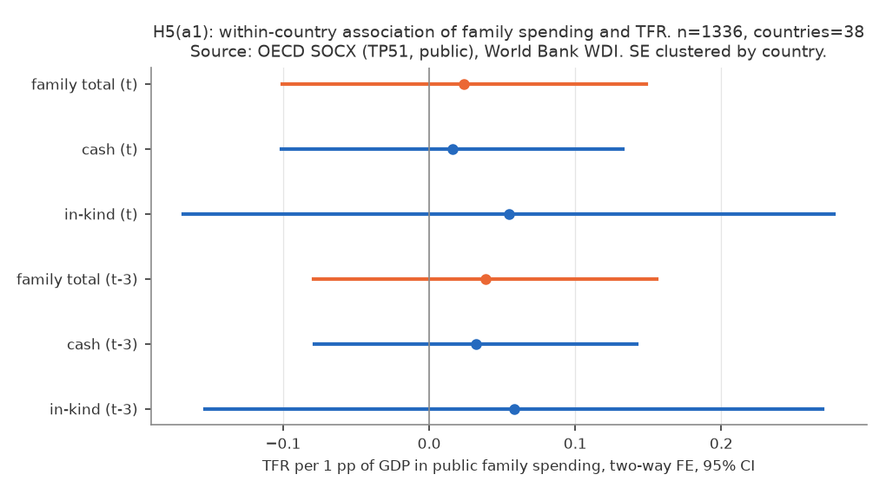
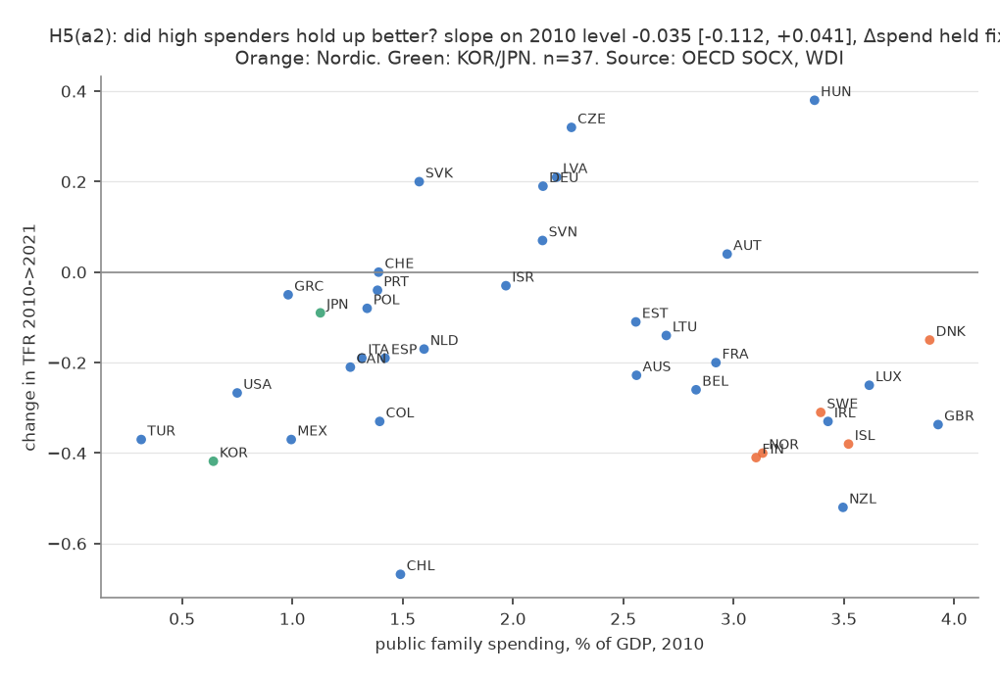
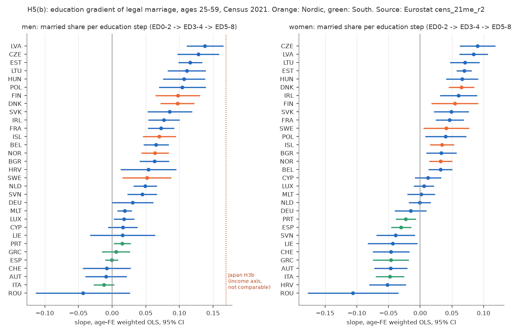
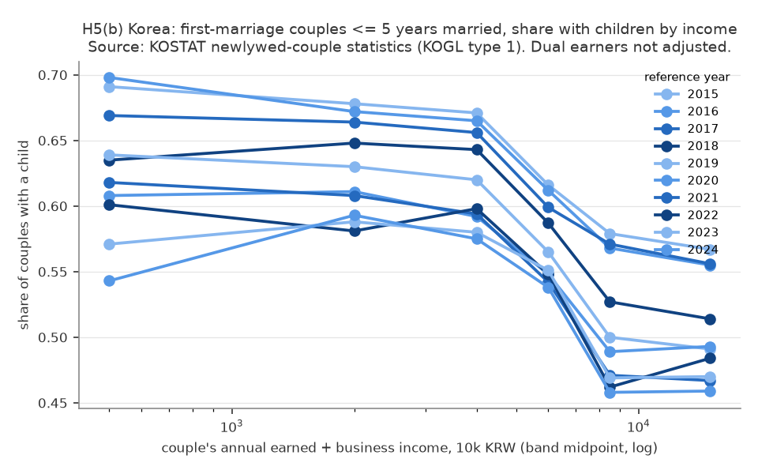
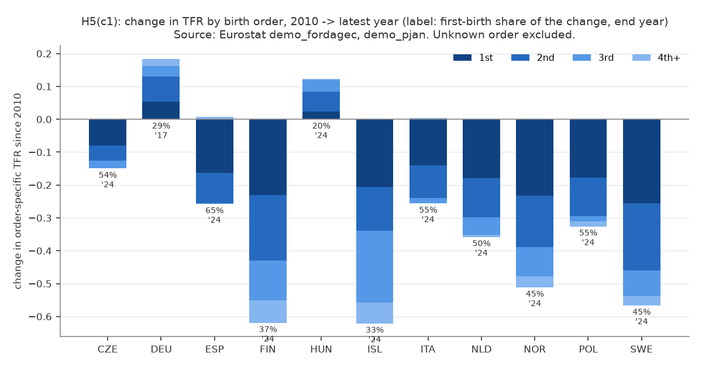
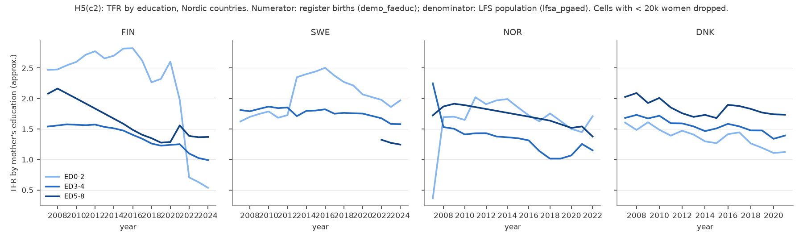

# H5: 韓国・欧州の国内階層勾配と「手厚い政策でも回復しない北欧」（2026-10-06, theme: growth-fertility）

## 要約（5 行）
- **問い**: 「国の中では所得が高いほど結婚・出産」は日本特有か（韓国・欧州で確かめる）。フィンランドなど北欧は手厚い家族政策にもかかわらず 2010 年以降 TFR が急落した。根本的な因果構造は何か。**先に断る**: 公開集計データでは因果構造は識別できない。文献が示す説明のうち集計データで反証できる命題を事前に固定し、整合・不整合を記述した。
- **(a) 政策 × TFR: 事前基準では整合的だが、検定力は弱い。** OECD 38 か国・1980–2021 の二元固定効果で、家族関連公的支出 1% GDP あたり TFR **+0.02 [−0.10, +0.15]**（現金・現物に分けても、3 年ラグでも点推定は +0.02〜+0.06 で CI は 0 を含む）。この係数と各国の支出変化を掛けた「政策で説明できる ΔTFR」は、2010→2021 の北欧 4 か国の低下（−0.15〜−0.41）の **0〜12%**。ただし北欧は支出をほとんど変えていない（FIN −0.01 pp）ので、この分解は係数の大きさによらず 0 に近くなり、「政策が効かない」ことの検定にはなっていない。2010 年の支出水準が高い国ほど TFR が持ちこたえた横断の関係は無い（−0.04 [−0.11, +0.04]）が、2010→2019 に限ると現金給付の水準・増加が大きい国ほど低下が小さい（+0.09 [+0.01, +0.18]、+0.16 [+0.02, +0.30]）。
- **(b) 欧州の国内階層勾配（2021 センサス、学歴軸）: 男性は 31 か国中 23 で正、負は 0。** 事前基準（25 か国以上）には届かず「不支持」だが、負の国は一つも無く、ゼロの 8 か国は南欧・独語圏・ルーマニア。女性は北欧 5 か国すべてで正、南欧 4 か国すべてで負。「男性は所得・学歴が高いほど結婚」は日本（H3b、所得軸）だけでなく欧州の大半で成り立ち、「女性の勾配は北欧で正・南欧で負」という文献の整理とも一致する。**韓国**は結婚した後の段階を見る表しかなく、新婚 5 年以内の初婚夫婦では夫婦所得が高いほど有子率が**低い**（ln 所得あたり −0.04〜−0.06、2015–2024 の全年で負。共稼ぎ夫婦ほど所得が高く子どもが少ない交絡を含む）。
- **(c1) 北欧の低下の中身: 第 1 子が最大の寄与だが過半ではない。** 出生順位別 TFR の 2010→2024 の変化は、フィンランド −0.62 のうち第 1 子 −0.23（37%）、第 2 子 −0.20、第 3 子以上 −0.19。スウェーデン・ノルウェー 45%、アイスランド 33%。事前基準（北欧 5 か国すべて ≥ 50%）は不支持（デンマークは 2010 年欠損で評価不能、他 4 か国はすべて 0.5 未満）。第 2 子・第 3 子以上の寄与の大きさは国で違い（フィンランド・アイスランドでは第 3 子以上も大きく、スウェーデン・ノルウェーは第 2 子まで）、南欧・ポーランドでは第 1 子の寄与が 55–65% と大きい。
- **(c2) 学歴別 TFR: 測定が成立せず判定不能。** 出生届（学歴あり）÷ LFS 標本人口で近似した学歴別 TFR は、2021 年の EU-LFS の方法変更で分母が断絶し、低学歴群で 2.6 → 0.5 のような非現実的な動きが出た。中・高学歴群はフィンランド・ノルウェー・デンマークで低下しているが、この近似では「全層で低下」を検証できない（Statistics Finland の登録ベースの公表値は全層低下を示す。文献節）。

## 問いと仮説
`design/themes/growth-fertility.md` の H5（2026-10-06 追加）。文献調査とデータ調査の後、データを見る前に推定量と判定基準を固定した。本レポートは H5 (a)(b)(c) のみを扱う。

### 文献の暫定像（2026-10-06 調査、実在確認済みのもののみ）
- 北欧の 2010 年以降の低下は「遅らせているだけ」ではなく、コーホート完結出生率が 2.0 → 1.8 程度へ下がる局面で、第 1 子の減少（無子化）が主因（Hellstrand, Nisén, Miranda, Fallesen, Dommermuth & Myrskylä 2021, *Demography* 58(4); フィンランドでは低下の 75% が第 1 子）。第 1 子減少の約 7 割はカップル内の出生率低下で、パートナー形成の減少は約 3 割（Hellstrand, Nisén & Myrskylä 2022, *EJP* 38）。
- 低下は全学歴層で起き、不安定雇用・低所得分野で急（Comolli et al. 2021, *EJP* 37; Hellstrand, Nisén & Myrskylä 2024, *ESR* 40(5); Statistics Finland 2024: 2023 年の学歴別 TFR 修士 1.59 / 後期中等 1.04 / 基礎 0.94）。
- 北欧の男性は学歴が高いほど完結出生率が高く無子率が低い。女性の伝統的な負の勾配は消え、デンマーク・ノルウェー・スウェーデンでは低学歴女性の無子率が最も高い（Jalovaara et al. 2019, *EJP* 35）。
- 家族政策の因果効果: 保育拡充・有給育休は完結出生率を上げる（準）実験的証拠があるが（Rindfuss et al. 2010 *PDR*: 保育供給 10 pt で +0.1 人）、現金給付はタイミング効果に留まり、効果量は 2010 年代の低下幅より一桁小さい（Bergsvik, Fauske & Hart 2021, *PDR* 47(4) の系統的レビュー; Milligan 2005 *REStat*）。
- 残差の説明: 知覚された不確実性と将来ナラティブ（Vignoli et al. 2020 *Genus*）、理想子ども数の低下と「子どもゼロが理想」の増加（Golovina et al. 2024 *ESR* 40(2): フィンランドで 1985 年以降生まれの無子者の 20% 超）、米国でも経済・政策要因では説明できない「優先順位の変化」（Kearney, Levine & Pardue 2022 *JEP* 36(1)）。経済学の「両立」モデル（Doepke, Hannusch, Kindermann & Tertilt 2023, *Handbook of the Economics of the Family*）は、両立条件が最良の北欧が落ちたことを説明しきれない。
- 韓国: 教育競争（地位外部性）が無ければ出生率は 28% 高いという構造推定（Kim, Tertilt & Yum 2024 *AER* 114(6)）、「教育熱」仮説（Anderson & Kohler 2013）。

本レポートが集計データで確かめるのは、このうち (a) 支出変化で説明できる分が低下幅に対して小さいこと、(b) 階層勾配の符号、(c) 第 1 子寄与と全層低下である。

## データ
| データ | 出典 | 定義・単位 | 期間・国 | 備考 |
|---|---|---|---|---|
| 家族関連公的支出 | OECD SOCX `DF_SOCX_AGG`（`TP51` Family、`ES10` 公的、`_T`/`C`/`K`） | %GDP。現金（児童手当・育休給付等）と現物（保育等） | 1980–2021、OECD 38 | 2022 以降は国が欠けるため事前登録どおり 2021 まで |
| TFR | WDI `SP.DYN.TFRT.IN` | 既存 mart | 同上 | |
| 欧州の配偶関係 × 学歴 | Eurostat `cens_21me_r2`（2021 センサス） | 性 × 5 歳階級（25–59）× ISCED 3 群の「法律婚＋登録パートナー ÷（総数 − 不詳）」 | 2021、EU27＋EFTA 31 か国 | **同棲を含まない**（北欧で過小評価） |
| 出生順位別出生 | Eurostat `demo_fordagec` ＋ `demo_pjan`（女性 1 歳刻み人口） | 順位別 TFR = Σ_age 出生/女性（15–49） | 2005–2024、13 か国（FI SE NO DK IS DE FR IT ES NL HU CZ PL） | DNK 2006–2011、FRA 2010 欠損、DEU 2018 以降欠損 |
| 学歴別出生 | Eurostat `demo_faeduc` ＋ `lfsa_pgaed`（LFS 女性人口、千人） | 学歴別 TFR ≈ 5 × Σ 出生/LFS 人口 | 2007–2024、FI SE NO DK（AT BE は一部年） | **分母が標本。2021 年に LFS 断絶** |
| 韓国 新婚夫婦統計 | 国家データ処 報道資料 PDF（KOGL 第 1 類型、2015–2024 年基準の 10 本） | 婚姻 5 年以内・婚姻継続中の初婚夫婦の、夫婦合算勤労・事業所得 6 区間別 有子率・平均子ども数・組数 | 基準年 2015–2024（2015 年基準は賃金勤労者のみの別系列） | 共稼ぎと所得が同時決定。所得は財産・移転所得を含まない |

mart: `data/marts/oecd_family_spending.parquet`（4,108 行）、`eu_census_marital_by_education.parquet`（1,302 行）、`eu_tfr_by_birth_order.parquet`（1,433 行）、`eu_tfr_by_education.parquet`（304 行）、`kr_newlywed_income_children.parquet`（462 行）、`growth_fertility_panel.parquet`。取得 2026-10-06。LLM 構造化は使っていない。

## 方法
識別戦略: **なし**。すべて関連・記述。
- (a1) `tfr ~ 支出 + C(iso3) + C(year)`（国クラスタ SE）。同時と 3 年ラグ（ラグ行が無ければ落とす）。(a2) 国ごとの ΔTFR(2010→2021) を 2010 年の支出水準と Δ支出に回帰（n = 37、OLS）。(a3) (a1) の係数 × 各国の Δ支出 を「政策で説明できる分」として実際の ΔTFR と比較。判定: 北欧 4 か国すべてで < 1/4 整合的、いずれか ≥ 1/2 不支持。
- (b) 国 × 性ごとに、年齢階級 FE 付き加重 OLS（重み = 群人数）で有配偶率を学歴順位（0, 1, 2）に回帰。判定: 男性で正（CI が 0 を含まない）が 31 か国中 25 以上。
- (c1) 順位別 TFR の 2010 → 最新年（4 順位がそろう最新年）の変化。第 1 子寄与率 = Δ1 / Σ_known Δ（UNK 除外）。判定: 北欧 5 か国すべてで ≥ 0.5。(c2) 学歴別 TFR の 2010 → 最新年の変化（群人口 20 千人未満のセル除外）。判定: 3 群すべて低下。

## 結果
### (a) 家族支出と TFR の関連は小さく、北欧の低下を説明しない

*図 1: 公的家族支出 1% GDP あたりの TFR（二元固定効果、95% CI）。n = 1,336、38 か国、1980–2021。*

| 仕様（二元 FE） | 係数 [95% CI] | n |
|---|---|---|
| 合計（同時） | +0.024 [−0.101, +0.148] | 1,336 |
| 現金 / 現物（同時） | +0.016 [−0.101, +0.133] / +0.054 [−0.168, +0.277] | 1,336 |
| 合計（3 年ラグ） | +0.038 [−0.079, +0.156] | 1,219 |
| 現金 / 現物（3 年ラグ） | +0.032 [−0.079, +0.142] / +0.058 [−0.153, +0.269] | 1,219 |

点推定はすべて正だが小さく、CI は 0 を含む。CI の上限は +0.15/pp（北欧除外 +0.16、人口加重 +0.28）で、支出が 3〜4% GDP の北欧では「大きな関連」を否定できる精度はない。頑健性（1995 年以降、北欧 5 除外、韓国・日本除外、人口加重）でも合計の係数は −0.001〜+0.09 の範囲で、CI はすべて 0 を含む（現物のみ北欧除外で +0.15〜+0.16。stdout）。


*図 2: 横軸 2010 年の家族支出（%GDP）、縦軸 TFR の 2010→2021 変化。n = 37（OECD、両年あり）。橙 = 北欧、緑 = 韓国・日本。出典: OECD SOCX、World Bank WDI。*

2010 年に支出が高かった国ほど TFR が持ちこたえた、という関係はない（Δ支出を固定した傾き −0.035 [−0.112, +0.041]、水準のみ −0.007 [−0.076, +0.062]）。北欧 4 か国は支出 3.1〜3.9% と最上位にありながら −0.15〜−0.41 と、支出 0.6〜1.1% の韓国・日本（−0.42、−0.09）と同じ帯にいる。現金・現物に分けると、2010 年の**現物**支出が高い国ほど低下が大きい（−0.145 [−0.254, −0.037]）が、これは北欧が現物中心であることの裏返しで、因果ではない。コロナ前（2010→2019）に限ると、現金給付の水準と増加が大きい国ほど低下が小さく（+0.094 [+0.012, +0.176]、+0.159 [+0.017, +0.302]）、n = 37 の横断でも「現金給付と TFR の動きは無関係」とは言えない（頑健性表）。

| 国 | ΔTFR 2010→21 | Δ支出 (pp GDP) | 係数 × Δ支出 | 説明割合 |
|---|---|---|---|---|
| FIN | −0.41 | −0.01 | −0.000 | 0% |
| SWE | −0.31 | −0.08 | −0.002 | 1% |
| NOR | −0.40 | −0.35 | −0.008 | 2% |
| DNK | −0.15 | −0.74 | −0.018 | 12% |
| KOR | −0.42 | +0.97 | +0.023 | −6%（逆向き） |
| JPN | −0.09 | +1.11 | +0.027 | −29%（逆向き） |

**判定 (a3): 事前基準では整合的。** 3 年ラグ係数でも 0〜19%、2010→2019 でも 0〜8%。ただしこの分解は「北欧は支出をほぼ変えていない」という事実の言い換えに近く、係数が CI 上限（+0.15）でも説明割合は FIN ≈0%・DNK 74% 程度にしかならない（DNK は支出が −0.74 pp と例外的に減っている）。韓国・日本は支出を 1 pp 近く増やしながら TFR が下がっており、政策変数は低下と逆向きに動いている。

### (b) 欧州でも男性の学歴勾配は正（負の国は無い）。女性は北欧で正、南欧で負

*図 3: 学歴 1 段階（ED0-2 → ED3-4 → ED5-8）あたりの有配偶率の差、25–59 歳、年齢 FE 付き加重 OLS、95% CI。橙 = 北欧、緑 = 南欧。左の点線は日本 H3b の男性所得勾配（+0.17、軸が違うため符号のみ）。*

| | 正 | ゼロ（CI が 0 を含む） | 負 |
|---|---|---|---|
| 男性（主仕様 25–59、3 群） | **23** | 8（ROU ITA AUT CHE ESP GRC LIE CYP） | **0** |
| 男性（30–49） | 22 | 9 | 0 |
| 男性（2 群: ED5-8 vs 以下） | 21 | 9 | 1（ROU） |
| 女性（主仕様） | 16 | 5（DEU NLD MLT LUX CYP） | 10（ROU HRV ITA AUT GRC CHE LIE SVN ESP PRT） |

男性の勾配は北欧 5 か国（+0.05〜+0.10）、バルト・中東欧（+0.09〜+0.14）、フランス・アイルランド・ベルギー（+0.07〜+0.08）で大きく、南欧・独語圏でゼロ。**判定 (b): 事前基準（25 か国）には届かず「不支持」。** 事前登録の「正」を「点推定が正かつ CI が 0 を含まない」と読んだ（保守的な読み）。点推定の符号だけなら 26/31（GRC・LIE・CYP が正）で基準を満たすが、事後に読み替えない。負の国が 0 であることから「基準が厳しすぎた」というのは事後の評価である。女性は予測どおり北欧 5 か国すべて正（+0.03〜+0.07）、南欧 4 か国すべて負（−0.02〜−0.05）。日本の H3b（男性、所得軸、+0.17）と同じ符号だが、軸（学歴 vs 所得）・母集団（全人口 vs 有業者）・配偶関係の定義（法律婚のみ vs 配偶者あり）が違うため大きさは比べない。

#### 韓国: 新婚夫婦の中では夫婦所得が高いほど子どもがいない（共稼ぎ交絡つき）

*図 3b: 婚姻 5 年以内の初婚夫婦のうち子どもがいる割合を、夫婦合算の年間勤労・事業所得 6 区間別に（横軸は区間中点、対数）。基準年 2015–2024。出典: 国家データ処（韓国）新婚夫婦統計 報道資料。*

| 基準年 | 有子率（全体） | <1 千万 | 1–3 千万 | 3–5 千万 | 5–7 千万 | 7 千万–1 億 | 1 億以上 | ln 所得勾配 [95% CI] |
|---|---|---|---|---|---|---|---|---|
| 2016 | 0.637 | 0.698 | 0.672 | 0.665 | 0.612 | 0.568 | 0.555 | −0.045 [−0.080, −0.009] |
| 2021 | 0.542 | 0.618 | 0.608 | 0.594 | 0.542 | 0.471 | 0.467 | −0.057 [−0.106, −0.007] |
| 2024 | 0.512 | 0.543 | 0.593 | 0.575 | 0.538 | 0.458 | 0.459 | −0.044 [−0.102, +0.015] |

勾配（組数で加重した WLS）は 2015–2024 の全 10 年で点推定が負（−0.039〜−0.057）だが、CI が 0 を含む年がある（2018、2022–2024、および 2015 年の賃金勤労者系列）。平均子ども数でも負（−0.06〜−0.08）。有子率は 3 千万ウォン未満の帯で最高、7 千万ウォン以上で最低と**単調に近い右下がり**（2021 年以降は 1–3 千万が最高の逆 U 字）で、日本の H3（世帯所得と児童世帯割合が正の S 字）とは向きが逆に見える。ただし母集団が「結婚して 5 年以内の夫婦」に限られるため、これは**結婚の所得勾配（日本 H3b や欧州 (b) で見た正の勾配）を含まない**。表の所得は夫婦合算で、共稼ぎ夫婦は所得が高く有子率が低い（2024 年: 共稼ぎ 49.1% vs 片働き 55.2%。この数値は報道資料の記載で、本レポートの mart には取り込んでいない）ので、「所得が高いと産まない」ではなく「子どもがいないと妻が働き続け、夫婦所得が高く見える」逆向きの経路を含む。判定には使わない（事前登録どおり記述のみ）。

### (c1) 北欧では第 1 子の寄与が最大だが過半ではなく、第 2 子以降の寄与は国で違う

*図 4: 順位別 TFR の 2010 → 最新年の変化の積み上げ。ラベルは第 1 子の寄与率と終点年。*

| 国 | ΔTFR（既知順位計） | Δ第 1 子 | Δ第 2 子 | Δ第 3 子 | Δ第 4 子以上 | 第 1 子寄与率 |
|---|---|---|---|---|---|---|
| FIN 2010→24 | −0.62（1.88 →） | −0.23 | −0.20 | −0.12 | −0.07 | 0.37 |
| SWE 2010→24 | −0.57（1.99 →） | −0.26 | −0.20 | −0.08 | −0.03 | 0.45 |
| NOR 2010→24 | −0.51（1.96 →） | −0.23 | −0.16 | −0.09 | −0.03 | 0.45 |
| ISL 2010→24 | −0.62（2.19 →） | −0.21 | −0.13 | −0.22 | −0.06 | 0.33 |
| DNK | 2010 欠損（探索的 2012→24: −0.23、寄与率 0.59） | | | | | |
| NLD 2010→24 | −0.36 | −0.18 | −0.12 | −0.05 | −0.01 | 0.50 |
| ESP / ITA / POL / CZE 2010→24 | −0.25 / −0.25 / −0.33 / −0.15 | | | | | 0.65 / 0.55 / 0.55 / 0.54 |
| HUN 2010→24 | +0.12 | +0.02 | +0.06 | +0.04 | +0.01 | 0.20 |

**判定 (c1): 不支持**（事前基準は北欧 5 か国すべて ≥ 0.5。DNK は 2010 欠損で評価不能だが、他 4 か国がすべて < 0.5 なので基準は満たしえない）。頑健性: 2008 起点 0.37–0.50、2019 終点 0.10–0.61（ISL は 2019 時点で第 1 子がほぼ落ちていない）。文献（Hellstrand et al. 2021）の「第 1 子が 75%」はコーホート完結出生率の予測値で、本レポートの期間・順位別 TFR とは指標が違う。期間指標では、北欧の低下は第 1 子に集中せず、第 2 子（SWE −0.20、NOR −0.16）や第 3 子以上（FIN −0.19、ISL −0.28）にも広がっている。その配分は国で異なり、第 1 子に集中する南欧・ポーランドと対照的である。

### (c2) 学歴別 TFR は近似が成立せず、判定不能

*図 5: 出生届の学歴別出生数 ÷ LFS 標本の学歴別女性人口。群人口 20 千人未満は除外。*

| 国 | ED0-2 | ED3-4 | ED5-8 | 終点 |
|---|---|---|---|---|
| FIN 2010→ | 2.60 → 0.54（−2.06） | 1.57 → 0.99（−0.58） | 2.00 → 1.37（−0.63） | 2024 |
| NOR 2010→ | 1.65 → 1.71（+0.06） | 1.41 → 1.15（−0.26） | 1.89 → 1.38（−0.51） | 2022 |
| DNK 2010→ | 1.49 → 1.12（−0.36） | 1.72 → 1.39（−0.33） | 2.01 → 1.73（−0.27） | 2021 |
| SWE | 2010 の 3 群がそろわず（ED5-8 の分母欠損） | | | |

フィンランドの ED0-2 が 2.6 から 0.5 へ落ちるのは、2021 年の EU-LFS の方法変更（新規則による調査設計の変更）で分母が不連続になったためで、出生率の変化ではない。ED3-4・ED5-8 は 3 か国で低下し、ED0-2 はノルウェーで +0.06 と上がっているが、分母が標本である以上、水準も変化幅も信頼できない（表の数値は参考値）。**判定 (c2): 判定不能（測定の失敗）。** 登録ベースの学歴別 TFR（Statistics Finland 2024: 2010 年代に全学歴で低下、基礎教育層が最大）は公表値の引用に留める。

## 頑健性（事前リスト、全部）
| 項目 | 仕様 | 結果 |
|---|---|---|
| (a1) | 1995 年以降 | 合計 −0.001 [−0.093, +0.091]、ラグ +0.001 [−0.084, +0.086]、現金 +0.009 / 現物 −0.037 |
| (a1) | 北欧 5 除外 | +0.016 [−0.129, +0.161]、現金 −0.012 / 現物 +0.152 [−0.174, +0.478] |
| (a1) | 韓国・日本除外 | +0.031 [−0.100, +0.161]、ラグ +0.044 |
| (a1) | 人口加重 | +0.087 [−0.107, +0.280] |
| (a2)(a3) | 2010→2019 | 合計の水準 −0.022 [−0.090, +0.045]、Δ合計 +0.037 [−0.079, +0.153]; 現金・現物に分けると **現金水準 +0.094 [+0.012, +0.176]、Δ現金 +0.159 [+0.017, +0.302]**、現物水準 −0.151 [−0.244, −0.058]、Δ現物 −0.145 [−0.443, +0.153]; 説明割合 FIN 1% SWE −1% NOR 0% DNK 8% |
| (b) | 30–49 歳 | 男性 正 22 / 負 0 |
| (b) | 2 群 | 男性 正 21 / 負 1（ROU） |
| (c1) | 2008 起点 / 2019 終点 | 第 1 子寄与率 0.37–0.50 / 0.10–0.61 |
| (c1) | 探索的 2012 起点（事後、DNK のため） | FIN 0.34 SWE 0.42 NOR 0.40 DNK 0.59 ISL 0.35 |
| (b) 韓国 | 2015 年基準の賃金勤労者系列 / 勤労＋事業所得系列 | −0.045 [−0.102, +0.011] / −0.039 [−0.075, −0.003] |

## 解釈: 「根本的な因果構造」について言えること・言えないこと
- **政策支出の変化は、北欧の 2010 年以降の低下を説明しない。** これは「政策が効かない」ではない。保育・育休の因果効果は個別の準実験で確認されている（文献節）。本データが示すのは、(1) 二元 FE の関連の点推定が小さい（+0.02〜0.06/pp。ただし CI 上限 +0.15/pp で、大きな関連を否定できる精度はない）こと、(2) 北欧は 2010→2021 に支出をほとんど変えていない（FIN −0.01 pp、SWE −0.08 pp）ので、FIN・SWE・NOR では CI 内のどの係数でも支出変化で −0.31〜−0.41（WDI、2010→2021）の低下を説明できないこと（DNK は支出が −0.74 pp と減っており、CI 上限なら大半が説明されうる例外）、の 2 点である。(2) は政策の効果の検定ではなく、「低下の原因は政策の後退ではない」という消去にすぎない。横断では、コロナ前に限ると現金給付が手厚く増えた国ほど低下が小さいという関連もあった。韓国・日本は支出を 1 pp 近く増やしながら低下した。
- **北欧の低下は、期間指標で見るかぎり「第 1 子だけ」の話ではない。** 男性・女性とも学歴が高いほど結婚しているという構造は 2021 年時点で健在で（1 時点のみ。変化は見ていない）、低下は第 1 子が最大だが過半ではなく、第 2 子以降への広がり方は国で違う。文献の「無子化が主」はコーホート指標での知見で、本レポートの期間指標（晩産化の影響を含む）とは整合させて読む必要がある。
- **「根本的な因果構造」は本レポートでは特定できない。** 本テーマの分析（H1・H2・H4・H5a）はいずれも関連が小さいか CI が広いか記述であり、「これらで説明できない残差が大きい」とも言えない（消去法が成り立つ精度がない）。文献は残差を「不確実性の知覚」「理想子ども数の低下」「優先順位の変化」に求めているが、それらは本テーマの公開集計データでは測れない（Eurobarometer・GGS 等の意識調査の集計が必要）。
- 韓国との対比: 韓国の超低出生率には教育競争・住宅費という「子どもの質コスト」経路が構造推定で示されている（Kim, Tertilt & Yum 2024）。北欧で同じ経路が働いているかどうかは、本データでは検定していない。

## 限界・言えないこと
- **識別戦略なし。** 家族支出は内生（出生率が下がると子ども 1 人あたりの支出比率が変わる、%GDP は景気で動く、政策は出生率低下への反応として増える）。(a1) の係数は因果効果ではない。
- **学歴は所得ではない。** 欧州の勾配は学歴軸で、日本の所得軸（H3/H3b）と同じ現象を測っていない。
- **センサスの配偶関係は法律婚のみ。** 北欧では同棲が多く、有配偶率は過小評価。学歴と同棲の関係が学歴と法律婚の関係と違えば勾配はずれる。1 時点（2021）のみで、時間変化は見ていない。
- **期間 TFR の順位分解は晩産化（テンポ効果）を含む。** 第 1 子の遅れは期間第 1 子 TFR を押し下げ、後に回復しうる。コーホート指標とは一致しない。
- **(c2) の分母は標本（LFS）で、2021 年に断絶。** 学歴別 TFR の近似は使えなかった。登録ベースの学歴別出生率は各国統計局の公表値（API 外）にしかない。
- **韓国の表は新婚 5 年以内の初婚夫婦に限られ、共稼ぎと所得が同時決定。** 男性有配偶率は得られないので、日本・欧州で見た「結婚の所得・学歴勾配」とは比較できない。2015 年基準は賃金勤労者のみで断絶。
- **多重比較・基準の硬さ。** (b) の 25 か国、(c1) の 0.5 は事前に決めた基準で、いずれも境界で「不支持」になった。事後に緩めない。
- **文献の要約は本レポートの分析ではない。** 著者・年・誌名は確認したが、各論文の推定値を再現していない。

## 再現手順
```bash
make sync
uv run socioscope run growth-fertility fetch && uv run socioscope run growth-fertility stage && uv run socioscope run growth-fertility mart
uv run python themes/growth-fertility/src/theme_growth_fertility/analysis/a20261006_h5_europe_korea_policy.py \
  > themes/growth-fertility/reports/2026-10-06-h5-europe-korea-policy.stdout.txt
uv run pytest themes/growth-fertility/tests/test_analysis_h5.py
```

## 出典
- OECD (2026), Social Expenditure Database (SOCX), `DSD_SOCX_AGG@DF_SOCX_AGG`, https://sdmx.oecd.org（取得 2026-10-06）。OECD Terms & Conditions（出典表示で利用可）。
- Eurostat, `cens_21me_r2`, `demo_fordagec`, `demo_pjan`, `demo_faeduc`, `lfsa_pgaed`（取得 2026-10-06）。Eurostat copyright notice（出典表示で再利用可）。
- World Bank, World Development Indicators（取得 2026-10-05）: CC BY 4.0。
- 국가데이터처（国家データ処）, 「행정자료를 활용한 신혼부부통계 결과」 보도자료 2015–2024 年基準（mods.go.kr、公共ヌリ（KOGL）第 1 類型、取得 2026-10-06）。

## チェックリスト回答
- **A-1** H5 は文献・データ調査の後、データを見る前に推定量・判定基準つきで事前登録。探索的な追加（c1 の 2012 起点）は本文で明記。
- **A-2** 推定量は (a1) FE 係数、(a2) 横断傾き、(a3) 説明割合、(b) 年齢 FE 付き学歴勾配、(c1) 順位別 ΔTFR の寄与率、(c2) 学歴別 ΔTFR。
- **B-1** 出典・dataset ID・取得日・mart 行数を記載。
- **B-2** DNK/FRA/DEU の欠損年、LFS の 2021 年断絶、センサスの法律婚定義を列挙。補完なし。
- **B-3** 1980–2021 の窓、25–59 歳、13 か国の事前固定を記載。
- **C-1** 識別戦略: なし。「関連」「整合的」「説明しない」で書いた。
- **C-2** 因果の仮定は置いていない。
- **C-3** 支出の内生性、テンポ効果、同棲、分母の断絶を「限界」に列挙。
- **C-4** 国レベル・学歴群レベルの関連を個人に読み替えないこと、日本との比較が符号のみであることを明記。
- **D-1** SE は国クラスタ（a1）、OLS（a2）、群単位の加重 OLS（b）。(c) は区間を出していない（人口データ）。
- **D-2** 事前リストの頑健性を全部表にした。
- **D-3** (b)(c1) が境界で事前基準を満たさないこと、(c2) が測定として失敗したことをそのまま書いた。
- **E-1** 「効果」は文献の因果研究を指す場合のみ使い、本レポートの推定は「関連」「説明割合」と書いた。(a3) が政策効果の検定になっていないことを明記した。
- **E-2** 図は軸・単位・出典・n を記載。
- **E-3** 「限界・言えないこと」節あり。
- **E-4** 再現コマンドを記載。LLM 構造化なし。
