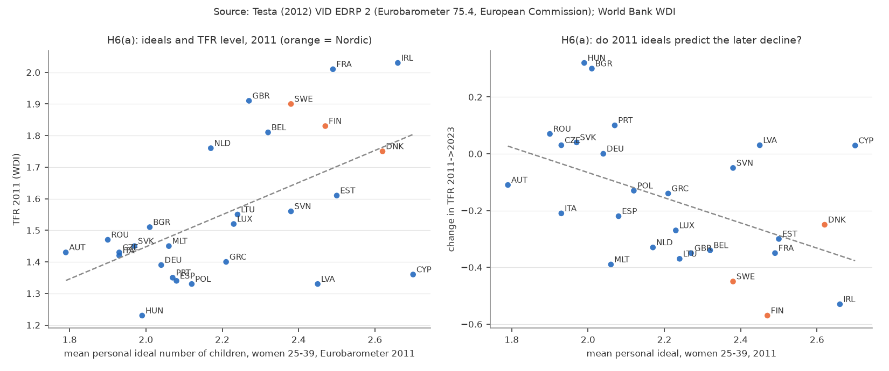
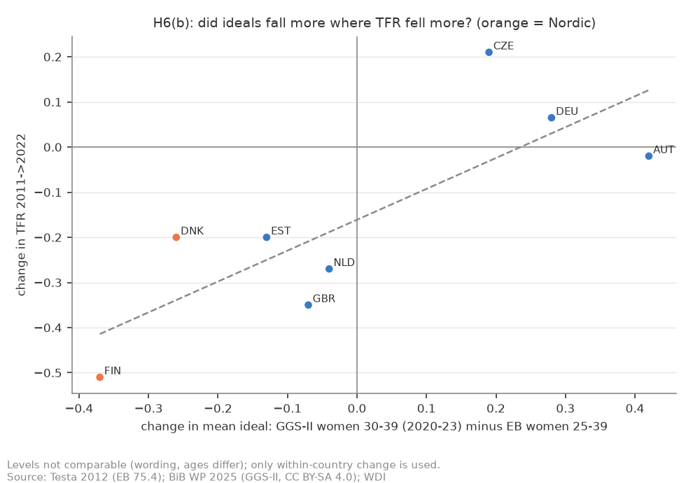
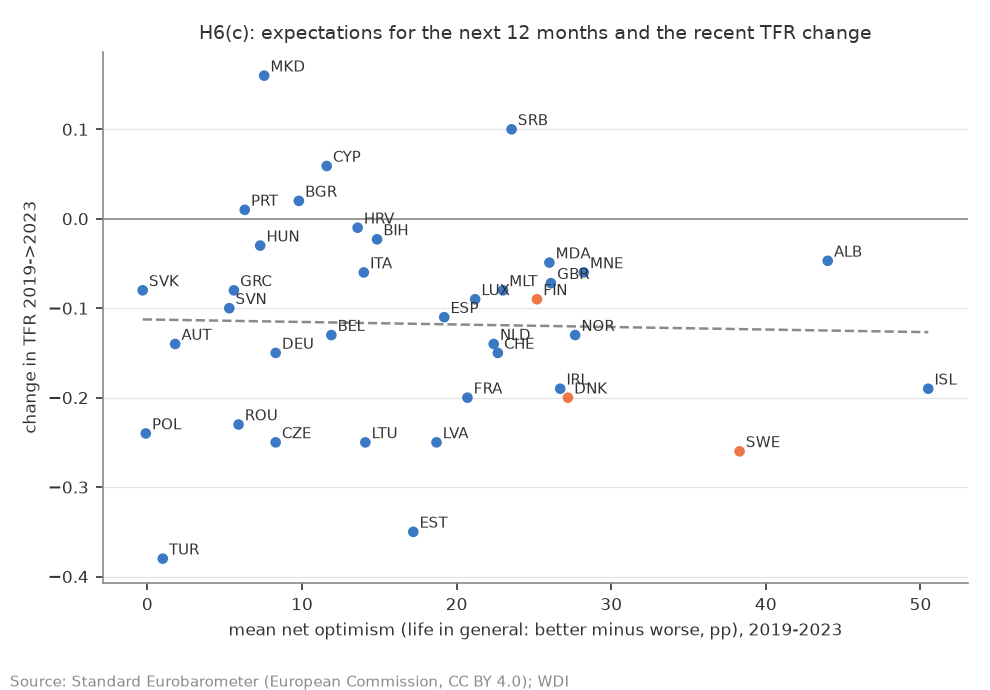

# H6: 意識調査（理想子ども数・将来期待）は北欧の出生率低下を説明するか（2026-10-06, theme: growth-fertility）

## 要約（5 行）
- **問い**: H5 で北欧の 2010 年以降の低下は所得・景気・政策では説明できなかった。文献が残差の説明に挙げる「理想子ども数の低下」「将来への不確実性」を、Eurobarometer と GGS の国別集計で確かめる。マイクロデータはすべて登録制のため、静的 URL で取れる集計表（EB 2011 の Testa 2012 付表、GGS-II 2020–23 の BiB 2025 Table 1、Standard EB 2019– の期待項目）に限る。
- **(a) 2011 年の理想と TFR 水準: 整合的。** EU-27 で女性 25–39 歳の個人理想平均と TFR 2011 の相関は **r = +0.56**（Spearman +0.49）。しかし北欧 3 か国（デンマーク 2.62、フィンランド 2.47、スウェーデン 2.38）の理想は EU 中央値 2.21 より高く、**2011 年の理想ではその後の北欧の低下は予測できない**。むしろ 2011 年に理想が高かった国ほど 2011→2023 の低下が大きい（r = −0.48）。
- **(b) 理想の変化 2011 → 2020 年代: 事前基準では判定不能（探索的な記述のみ）。** 両方にある 8 か国で、フィンランド（−0.37）とデンマーク（−0.26）は理想の低下幅が **1 位・2 位**で、Δideal と ΔTFR の順位相関は +0.69（n = 8、1 か国を除くと 0.54〜0.75）。事前登録でノルウェーを重なり国に含めたのは誤り（EU 外で EB 2011 に無い）で、基準「北欧 3 か国」は評価できず、スウェーデン・ノルウェーの理想の変化は観測できない。質問文・年齢窓が違うため水準は比べられず、変化の順位だけを使う。
- **(c) 将来期待（不確実性の代理）: 不支持。** Standard EB 2019–2023 の「生活全般の今後 12 か月の期待」の国平均と ΔTFR(2019→2023) の相関は **ρ ≈ 0**（n = 38）。国の経済への期待は COVID 期を除くと ρ = +0.33 と事前基準をわずかに超えるが、主項目ではない。スウェーデンは期待が EU 加盟国で最も高い（全 38 か国では 3 位）まま TFR が −0.26 落ちた。
- すべて国レベルの相関（n = 8〜38）で因果ではない。「理想が下がったから出生率が下がった」とは言えず、理想の低下自体が低下した出生の合理化（事後の適応）でもありうる。

## 問いと仮説
`design/themes/growth-fertility.md` の H6（2026-10-06 追加）。H5 の結果を見た後に立てた仮説だが、推定量・判定基準はデータを見る前に固定した。事前登録の誤り: (b) の重なり国リストに NO・HR を含めたが、両国は 2011 年の EU-27 に含まれず EB 75.4 に無い。したがって (b) の判定（北欧 3 か国）は評価できず、観測できる FI・DK について記述する。

## データ
| データ | 出典 | 定義・単位 | 期間・国 | 備考 |
|---|---|---|---|---|
| 理想子ども数 2011 | Testa, M.R. (2012) *Family sizes in Europe: evidence from the 2011 Eurobarometer survey*, VID European Demographic Research Paper 2, Appendix（データ: Eurobarometer 75.4、欧州委員会） | 国 × 性 × 年齢（15–24/25–39/40–54/55+/計）の個人理想・一般理想・実際・追加意図の平均と分布（理想 0 の割合など、%） | 2011、EU-27 | PDF から転記。4 セルが抽出不能で欠損（イタリア男性 15–24 の分布、マルタの 3 セル）。PDF はライセンス未明示のため再配布しない |
| 理想子ども数 2020 年代 | BiB Working Paper (2025) *Intended, ideal and actual fertility in 11 European countries*, Table 1（データ: GGS-II） | 女性 18–49 の国 × 年齢（18–29/30–39/40–49/計）の実際・意図（合計）・理想の平均 | 2020–2023、11 か国（AT CZ DE DK EE FI HR MD NL NO UK） | CC BY-SA 4.0。EB とは質問文・母集団（EB は 15 歳以上男女）が異なる |
| 今後 12 か月の期待 | Standard Eurobarometer STD91（2019 春）〜STD105（2026 春）Volume A（data.europa.eu、COM_REUSE = CC BY 4.0 相当） | 国 × 波 × 4 項目（生活全般・家計・国の経済・雇用）の「良くなる／悪くなる／同じ」の割合（%）。net optimism = 良くなる − 悪くなる | 2019–2026、EU27 ＋ 候補国等（波により 28–37 か国） | 2019 年以前は xlsx が無い。分析窓は 2019–2023 |
| TFR | WDI `SP.DYN.TFRT.IN` | 既存 mart | | |

mart: `data/marts/eu_fertility_ideals.parquet`（3,120 行）、`eu_expectations.parquet`（2,124 行）。取得 2026-10-06。LLM 構造化は使っていない。

## 方法
識別戦略: **なし**。国レベルの相関（Pearson、Spearman、OLS 傾きと古典的 SE）。
- (a) EB 2011 の女性 25–39 個人理想平均 × TFR 2011、× ΔTFR(2011→2023)。判定: r > 0.3 で整合的。北欧の理想が EU-27 中央値より高ければ「2011 年の理想ではその後の低下を予測できない」。
- (b) Δideal = GGS-II 女性 30–39 の理想 − EB 2011 女性 25–39 の理想（年齢窓のずれ、質問文の違いは水準の比較を無効にするが、国に共通のバイアスなら変化の順位は比較できると仮定）。Δideal × ΔTFR(2011→2022)。判定: 北欧 3 か国の Δideal がすべて負かつ下位半分で整合的（評価不能、上記）。
- (c) 国 × 波の net optimism（生活全般）を 2019–2023 で平均し、ΔTFR(2019→2023) と Spearman。判定: ρ > 0.3 で整合的。頑健性: 家計・国の経済・雇用、COVID 期（2020–21 年調査）除外。

## 結果
### (a) 理想が高い国ほど 2011 年の TFR は高いが、北欧は理想が高いまま落ちた

*図 1: 左: 女性 25–39 の個人理想平均 × TFR 2011（EU-27）。右: 同じ理想 × TFR の 2011→2023 変化。橙 = 北欧（EB に含まれるのは DK FI SE）。*

| 指標（EB 2011） | × TFR 2011: r / ρ / 傾き [95% CI] | × ΔTFR 2011→23: r / ρ / 傾き |
|---|---|---|
| 個人理想、女性 25–39（主） | +0.56 / +0.49 / +0.51 [+0.20, +0.82] | −0.48 / −0.54 / −0.44 [−0.78, −0.11] |
| 一般理想、女性 25–39 | +0.60 / +0.55 / +0.62 | −0.46 / −0.43 / −0.49 |
| 個人理想、女性 全年齢 | +0.51 / +0.48 / +0.49 | −0.51 / −0.57 / −0.50 |
| 理想 0 の割合、女性 25–39 | +0.02 / +0.01 | −0.17 / −0.24 |

理想子ども数が 1 人多い国は TFR が約 0.5 高い。北欧 3 か国の理想（2.38〜2.62）は EU 中央値（2.21）より高く、2011 年時点では「理想が高く、TFR も高い」国だった。**判定 (a): 整合的**（r > 0.3、北欧は中央値より上）。ただし 2011 年に理想が高かった国ほどその後の低下が大きい（r = −0.48）。これは「理想の高い国＝TFR の高い国で、2010 年代の低下幅が大きかった」という観察と整合的で（平均への回帰の可能性があるが検証していない）、「理想が高ければ出生率を保てる」とは言えない。「理想 0」の割合は TFR 水準とも変化とも無関係。

### (b) フィンランドとデンマークは、理想の低下幅が 8 か国で最大

*図 2: 横軸 Δideal（GGS-II 女性 30–39、2020–23 − EB 女性 25–39、2011）、縦軸 ΔTFR 2011→2022。8 か国。*

| 国 | 理想 2011（EB F 25–39） | 理想 2020 年代（GGS F 30–39） | Δideal | 順位 | ΔTFR 2011→22 |
|---|---|---|---|---|---|
| FIN | 2.47 | 2.10 | **−0.37** | 1 | −0.51 |
| DNK | 2.62 | 2.36 | **−0.26** | 2 | −0.20 |
| EST | 2.50 | 2.37 | −0.13 | 3 | −0.20 |
| GBR | 2.27 | 2.20 | −0.07 | 4 | −0.35 |
| NLD | 2.17 | 2.13 | −0.04 | 5 | −0.27 |
| CZE | 1.93 | 2.12 | +0.19 | 6 | +0.21 |
| DEU | 2.04 | 2.32 | +0.28 | 7 | +0.07 |
| AUT | 1.79 | 2.21 | +0.42 | 8 | −0.02 |

Δideal と ΔTFR の相関は r = +0.80、ρ = +0.69、傾き +0.68 [+0.17, +1.20]（n = 8）。1 か国ずつ除いた leave-one-out の ρ は +0.54（FIN 除外）〜 +0.75 で、FIN に最も依存する。理想が下がった国で TFR も下がり、理想が上がった中欧 3 か国（CZ DE AT）では TFR が横ばいか上昇した。全年齢同士（EB 計 vs GGS 計）でも FIN 1 位・NLD 2 位・DNK 3 位で同じ構図。**判定 (b): 事前基準は評価不能**（NO が EB に無い）。以下は探索的な記述: 観測できる FI・DK は 8 か国の中で「理想が最も下がった国」である。SE・NO については何も言えない。

注意: 水準は比較できない（EB は「あなた個人にとって理想の子ども数」を 15 歳以上男女に、GGS は女性 18–49 に聞く。年齢窓も 25–39 vs 30–39）。Δideal は「両時点で同じ方向のバイアス」という検証不能な仮定の下での変化。n = 8 の相関は 1 か国で大きく動く（上の leave-one-out）。

事前登録の補助記述（北欧 3 か国 vs 他）: GGS-II の意図–実際ギャップ（18–29 歳の意図合計 − 40–49 歳の実際）は次のとおり（11 か国すべて）。

| 国 | 意図 18–29 | 実際 40–49 | ギャップ |
|---|---|---|---|
| **FIN** | 1.82 | 1.81 | **0.01** |
| CZE | 1.94 | 1.87 | 0.07 |
| EST | 2.11 | 2.01 | 0.10 |
| **NOR** | 2.17 | 1.94 | 0.23 |
| AUT | 1.97 | 1.70 | 0.27 |
| **DNK** | 2.10 | 1.83 | 0.27 |
| NLD | 2.07 | 1.74 | 0.33 |
| HRV | 2.18 | 1.77 | 0.41 |
| DEU | 1.98 | 1.55 | 0.43 |
| GBR | 2.11 | 1.67 | 0.44 |
| MDA | 2.47 | 1.97 | 0.50 |

北欧 3 か国はフィンランド 0.01（最小）、ノルウェー 0.23、デンマーク 0.27 と、ギャップで見れば中位〜最小で、他国より小さい側にある（他 8 か国の中央値 0.37）。**フィンランドに限って**、若い女性の意図（1.82）は 11 か国で最も低く、上の世代の実際の子ども数とほぼ同じ水準にある。これは「産みたいのに産めない」より「意図そのものが低い」ことを示す記述で、Golovina et al. (2024) の「理想の低下」と整合的（因果ではない）。デンマーク（意図 2.10）・ノルウェー（2.17）の意図はフィンランドより高く、同じ記述は当てはまらない。

### (c) 「今後 12 か月の期待」は 2019 年以降の TFR 変化と無関係

*図 3: 横軸 2019–2023 の「生活全般が良くなる − 悪くなる」（pp）の国平均、縦軸 ΔTFR 2019→2023。38 か国。橙 = FI SE DK。国平均の波数は国で異なる（EU 加盟国はおおむね 10 波、ノルウェー 6 波、アイスランド 4 波）。*

| 項目 | 全波（2019–23）: r / ρ | COVID 期（2020–21 調査）除外: r / ρ |
|---|---|---|
| 生活全般（主） | −0.03 / **−0.01** | −0.01 / +0.03 |
| 家計 | +0.12 / +0.05 | +0.19 / +0.14 |
| 国の経済 | +0.20 / +0.22 | +0.30 / **+0.33** |
| 雇用 | +0.09 / +0.14 | +0.20 / +0.24 |

**判定 (c): 不支持**（主項目 ρ ≈ 0）。生活全般への楽観は北欧（スウェーデン +38、デンマーク +27、フィンランド +25）、アイスランド（+50）、アルバニアで高く、中東欧・南欧で低いが、TFR の変化とは対応しない。スウェーデンは楽観度が EU で最上位でありながら −0.26 と大きく落ちた。「国の経済」への期待は COVID 期を除くと ρ = +0.33 で弱い正の関連があるが、事前登録の主項目ではなく、頑健性として記す。2019 年以前の波は xlsx が無く、2010 年代前半の低下開始期を覆えない。

## 頑健性（事前リスト、全部）
上の各表に含めた。(a) 一般理想・全年齢・理想 0 の割合（性 T・全年齢は EB 付表に該当行が無く計算不能）。(b) 全年齢同士。(c) 家計・国の経済に加え「雇用」も出した（事前登録の頑健性には「項目の入れ替え」とだけあり、雇用は明記していない。mart の 4 項目は登録時に固定）× COVID 期除外。(b) の leave-one-out は事後に追加した補助（レビュー指摘）。

## 解釈
- 理想子ども数は、国の間の TFR 水準と結びついている（a）。北欧 3 か国（DK FI SE）は 2011 年に理想が高く、「理想が低いから出生率が低い」国ではなかった（a）。2011 → 2020 年代の理想の変化を観測できるのはフィンランドとデンマークだけで、両国は 8 か国の中で理想の低下幅が最も大きい（b、探索的）。フィンランドでは若い女性の意図が 11 か国で最も低く、上の世代の実際の子ども数と一致している。これは文献（Golovina et al. 2024; Savelieva et al. 2022）の「理想・意図の低下」と整合的だが、フィンランド 1 国の記述であり、デンマーク・ノルウェーには当てはまらない。
- 「不確実性」の代理として使った期待項目は TFR 変化と無関係だった（c）。不確実性が効いていないとは言えないが、「来年良くなるか」という平均的な楽観度では捉えられない。文献が言う不確実性は「将来の語り」や雇用の安定性など、より特定の次元を指している。
- したがって本テーマの結論は変わらない: 集計データで言えるのは「北欧の低下は所得・景気・政策・期待では説明されない」ことと、「フィンランド（とデンマーク）では理想の低下が出生の低下と並行して起きている」ことまで。スウェーデン・ノルウェーの理想の変化は観測できない。理想の低下が原因か、低下した出生の事後的な合理化か（理想は実際の子ども数に引きずられる）は、国レベルの 2 時点データでは区別できない。

## 限界・言えないこと
- **因果ではない。** 国レベルの相関、n = 8〜38。理想・意図は規範的回答で、行動との乖離が大きい（ideal–actual gap）。理想の変化は出生の変化の結果でもありうる。
- **時点が 2 つしかない。** 欧州横断の理想子ども数は 2011 年（EB）で止まり、2020 年代は GGS-II の 11 か国のみ。南欧は GGS-II に無い。
- **質問文・母集団の違い。** EB（15 歳以上男女、個人理想）と GGS（女性 18–49、理想）の水準は比べられない。変化の順位比較は「共通バイアス」の仮定に依存する。
- **事前登録の誤り。** (b) の重なり国に NO・HR を含めたが EB 2011 に無く、基準は評価不能。事後に基準を変えず、記述に留めた。
- **期待項目は 2019 年以降のみ。** 北欧の低下の主要期間（2010–2019）を覆えない。net optimism は不確実性の分散ではなく期待の平均。
- **PDF 転記の欠損。** EB 付表の 4 セルが抽出できず欠損（補完なし）。
- **多重比較。** (a)(c) で複数指標・項目を出している。判定は事前の主指標のみ。

## 再現手順
```bash
make sync
uv run socioscope run growth-fertility fetch && uv run socioscope run growth-fertility stage && uv run socioscope run growth-fertility mart
uv run python themes/growth-fertility/src/theme_growth_fertility/analysis/a20261006_h6_fertility_ideals.py \
  > themes/growth-fertility/reports/2026-10-06-h6-fertility-ideals.stdout.txt
uv run pytest themes/growth-fertility/tests/test_analysis_h6.py
```
2 回実行で図 3 枚の sha256 と標準出力が一致することを確認済み（stdout は polars の全行出力）。

## 出典
- Testa, M.R. (2012). *Family sizes in Europe: evidence from the 2011 Eurobarometer survey*. VID European Demographic Research Paper 2. https://www.oeaw.ac.at/fileadmin/subsites/Institute/VID/PDF/Publications/EDRP/edrp_2012_02.pdf （データ: Eurobarometer 75.4, European Commission; 数値を出典明記で転記。PDF は再配布しない）
- Bundesinstitut für Bevölkerungsforschung (2025). *Intended, ideal and actual fertility in 11 European countries: Evidence on fertility gaps in different age groups from the Generations and Gender Survey*. BiB Working Paper. CC BY-SA 4.0.（データ: GGS-II, Generations and Gender Programme）
- European Commission, Standard Eurobarometer 91–105, Volume A（data.europa.eu、COM_REUSE / Decision 2011/833/EU）。
- World Bank, World Development Indicators（取得 2026-10-05）: CC BY 4.0。

## チェックリスト回答
- **A-1** H6 は推定量・判定基準つきで事前登録。登録の誤り（NO・HR が EB に無い）を本文で明記し、基準を事後に変えていない。
- **A-2** 推定量は相関係数と OLS 傾き、順位比較。
- **B-1** 出典・取得日・mart 行数・転記元の表を記載。
- **B-2** EB 付表の欠損 4 セル、GGS の国の偏り、EB 期待項目の 2019 年以降限定、質問文の違いを列挙。補完なし。
- **B-3** 年齢窓（25–39 vs 30–39）の選択理由（最も近い窓）と全年齢の頑健性を記載。
- **C-1** 識別戦略: なし。「相関」「整合的」「並行して起きている」で書いた。
- **C-2** 因果の仮定は置いていない。
- **C-3** 逆の因果（理想の事後適応）、規範的回答、共通バイアスの仮定を「限界」に列挙。
- **C-4** 国レベルの相関を個人に読み替えないこと、n が小さいことを明記。
- **D-1** 古典的 SE。n が小さいので CI は広い。
- **D-2** 事前リストの頑健性を全部表にした。
- **D-3** (b) が評価不能、(c) が不支持であることをそのまま書いた。(b) の記述はフィンランド・デンマークに限定し、北欧全体に広げていない。
- **E-1** 「効果」は使っていない。
- **E-2** 図は軸・単位・出典・n を記載。
- **E-3** 「限界・言えないこと」節あり。
- **E-4** 再現コマンドと決定性の確認を記載。LLM 構造化なし。
