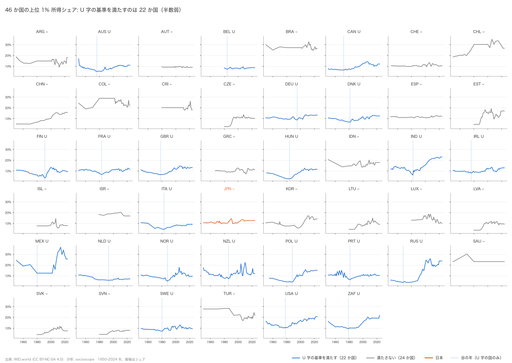

# 「金持ちはますます金持ちに」は本当か — 46 か国・75 年のデータで数えてみた（2026-10-05, theme: wealth-population-distribution）

> 本稿は、このテーマで書いた 4 本の分析レポート（H1・H1b・H1c・H2）を、統計の前提知識がない読者向けに 1 本にまとめた総括です。数値はすべて元レポートの出力（`*.stdout.txt`）か、同じデータから再計算した本稿のスクリプト（`analysis/s20261005_summary.py`）に由来し、文中の「（H1 レポート）」などで出所を示します。新しい分析はしていません。

## リード（3 行で結論）
1. **「1980 年ごろを底にして、富の偏りが U 字型に再び拡大している国が多数派」という有名な仮説は、46 か国で数えると多数派ではなかった**（資産の上位 1% シェアで 46 か国中 12 か国）（H1 レポート）。
2. **ただし「1980 年以降に上位 1% シェアが上がった」という弱い形なら多数派**（資産 35/46、所得 37/46）。日本も上がっているが、上がり幅は他国の真ん中より小さい（H1 レポート）。
3. **資産のデータは推計部分が大きく、「U 字かどうか」は本当は判定しきれない**。税制や社会支出で上昇幅の差を説明しようとしても、はっきりした関連は見つからなかった（H1b・H1c・H2 レポート）。

## この記事で扱う問い
「資本主義が進むにつれて、富（所得や資産）の偏りはどんどん極端になっているのか。それとも意外とそうでもないのか。国ごとに違うのか。日本はどこにいるのか」。これがテーマ全体の問いです（`design/themes/wealth-population-distribution.md`）。

本稿で答えるのは、そのうち次の 3 つです。
- 上位 1%（および 10%）のシェアは、戦後の低下のあと 1980 年ごろから再上昇する「U 字」を描く国が多数派か（仮説 H1）。
- 上昇の程度の国ごとの差は、税制や福祉で説明できるか（仮説 H2）。
- 日本の所得集中の上昇は緩やかか（仮説 H3 の前半）。

## 用語をやさしく
**上位 1% シェア**: 国の大人全員を所得（または資産）の多い順に並べ、上から 1% の人たちが全体の何 % を持っているか、という割合です。図 1 は日本の 2024 年の値で、100 人のうち所得トップの 1 人が所得全体の 12.7% を、下半分の 50 人が合わせて 18.2% を受け取っていることを示します。


*図 1: 左は 100 人の大人、右は所得全体を 100 のパイに分けたもの。オレンジ 1 人分が右では 13 マスを占める。*

**所得と資産の違い**: 所得は 1 年間に入ってくるお金（給料・事業収入・利子配当など、税引前）、資産はある時点で持っている財産（預金・株・不動産など）から借金を引いたものです。資産のほうが偏りは大きく、推計も難しい。本稿では「所得」「資産」をそれぞれ別に見ます。

**U 字型**: 時間を横軸にとったとき、高い → 下がる → 再び上がる、という形。トマ・ピケティらの研究で「20 世紀前半に下がった富の集中が 1980 年ごろから再上昇している」と広く知られるようになった形です。

**相関と因果**: 「社会支出が増えた国ほど上位 1% シェアも上がっていた」のように 2 つが一緒に動くことを**相関**（関連）といいます。片方がもう片方を**引き起こした**という**因果**とは別で、本稿の分析はすべて関連の確認までです。因果を主張する分析はしていません。

## データ（WID とは、46 か国、どこまで信頼できるか）
データは **WID.world（World Inequality Database）** という、世界の研究者が国ごとの所得・資産分布を推計して公開しているデータベースです（ライセンス CC BY-NC-SA 4.0）。対象は OECD 加盟 38 か国と、非加盟の G20 8 か国（アルゼンチン、ブラジル、中国、インド、インドネシア、ロシア、サウジアラビア、南アフリカ）の **46 か国**、分析期間は **1950–2024 年**です（H1 レポート）。

信頼性については、本稿の後半（結果 4）で詳しく述べますが、先に要点だけ。WID の数値は「観測値」ではなく、税務統計・家計調査・国民経済計算などをつなぎ合わせた**推計値**です。特に資産は、国によって元資料も方法も違い、1980 年より前は 10 年刻みの点しかない国が多く、18 か国は 1980 年以降しかありません（H1 レポート）。本稿は欠損を埋めたり補間したりせず、あるデータだけで数えています。


*図 2: 代表的な 8 か国の上位 1% 所得シェア、1900–2024 年。灰色の帯が H1 の「谷」の想定期間。アメリカ・インドは再上昇が大きく、フランス・スウェーデンは小さい。*


*図 3: 同じく上位 1% 資産シェア。欧州の戦前の値（50–70%）からの低下が大きく、1980 年以降の回復は国により差がある。1950–70 年は 10 年刻みの点を直線で結んでいる。*

## 仮説（H1〜H3 を平易に、事前登録したこと）
分析を始める前に、設計文書に次の 3 つの仮説を書いておきました。これを「事前登録」といい、結果を見てから仮説や基準を都合よく変えないための約束です。
- **H1**: 上位 1%/10% の資産シェアは、1980 年前後を谷とした U 字型に上昇している国が多数派である。
- **H2**: ただし上昇の程度は国によって大きく異なり、制度（税制・福祉）で説明できる部分がある。
- **H3**: 日本は所得集中の上昇が緩やかだが、資産（特に金融資産）の世代間・階層間の偏りは拡大している。

H3 の後半（金融資産の世代間・階層間）は、使えるデータが無く、今回は扱っていません。

## 分析の進め方（基準を先に決めて数える）
U 字かどうかは、見た目で判断すると人によって答えが変わります。そこで、結果を見る前に「U 字」の判定基準を数式として固定し、46 か国に機械的に当てはめて数えました（H1 レポート）。


*図 4: 手順の流れ。⑤の「疑って再計算」が H1b・H1c レポートにあたる。*

基準は次のとおりです。各国の系列について、(a) 1950–2024 年のあいだで値が最も低かった年（谷）が 1965–1995 年にあり、(b) 最初の年から谷までの下がり幅が 1 ポイント以上、(c) 谷から最後の年までの上がり幅も 1 ポイント以上、の 3 つを満たせば「U 字」。そして U 字の国が 46 か国の半数を超えるかを、**95% 信頼区間**（同じ調べ方を繰り返したとき、本当の割合がこの範囲に入るだろうと見込める幅）で確認します。あわせて、「1980 年から最新年にかけて上がったか」という弱い基準も、補助指標として事前に決めてありました。

## 結果 1: U 字は多数派ではなかった
事前の基準で数えると、**上位 1% 資産シェアで U 字は 46 か国中 12 か国（26%、信頼区間 16–40%）、上位 10% 資産で 11 か国（24%）**でした。所得では **上位 1% で 22 か国（48%、34–62%）、上位 10% で 21 か国（46%）**と半数近くですが、「多数派」とは言えません。仮説 H1 は、このデータ・この基準では支持されませんでした（H1 レポート）。


*図 5: 46 か国の上位 1% 資産シェア。青が U 字の基準を満たす 12 か国、灰色は満たさない国、オレンジは日本。点線は谷の年。*


*図 6: 同じく上位 1% 所得シェア。U 字は 22 か国。日本（JPN）は谷までの下がり幅が小さく、基準を満たさない。*

U 字にならない国には 3 つのタイプがあります（H1 レポート）。(i) データが 1980 年から始まるため「谷までの下降」をそもそも観測できない国（オーストリア、スイス、チェコなど 18 か国の資産系列）、(ii) ずっと下がり続けて谷が 2000 年以降にある国（アルゼンチン、ブラジル、オランダ、トルコなど）、(iii) ずっと上がり続けて下降が無い国（中国、ロシア）。谷の時期を見ると（図 7）、谷がある国では 1980 年代に集中しており（中央値は資産 1985 年、所得 1983 年）、「1980 年前後が底」という H1 の時期の部分はおおむね当てはまります。


*図 7: 各国の「最も低かった年」の分布。1980 年代の山と、2010 年以降（下がり続けた国）の山がある。*

事前登録には無い探索的な集計として、1960 年以前からデータがある国に限ると、U 字は資産で 27 か国中 12（44%）、所得で 33 か国中 21（64%）に上がります。つまり U 字が少数派になる一因は観測期間の短さです。ただしこの分け方は後から決めたもので、長期データがある国はもともとピケティらの研究対象国（フランス、イギリス、アメリカなど）に偏っています（H1 レポート、探索的）。

## 結果 2: ただし 1980 年以降の上昇は多数派
弱いほうの基準「1980 年 → 最新年で上がったか」では、**資産上位 1% で 35/46（76%、信頼区間 62–86%）、所得上位 1% で 37/46（80%、67–89%）**と、はっきり多数派です。上がり幅の中央値は資産 +3.4 ポイント、所得 +3.5 ポイント（H1 レポート）。


*図 8: 濃い青が「U 字」、薄い青が「1980 年以降に上昇」。ひげは 95% 信頼区間。薄い青は 4 系列とも 50% の線を区間ごと上回る。*


*図 9: 国ごとの 1980 → 2024 年の変化。右に行くほど上昇。ロシア・インド・中国・アメリカが大きく、トルコ・オランダ・コロンビアなどは低下。日本はオレンジ。*

まとめると、「戦後の低下 → 1980 年ごろの底 → 再上昇」というきれいな U 字は少数派ですが、「1980 年以降は上がった」という部分だけなら 4 分の 3 以上の国に当てはまります。ロシア（資産 +30 ポイント）やインド（+28 ポイント）のように急上昇した国と、オランダ（−11 ポイント）のように下がった国が同居しており、国ごとの差が非常に大きいことも分かります（H1 レポートの国別表）。

## 結果 3: 日本の位置
日本の上位 1% 所得シェアは 1976 年の底（9.8%）から 2024 年の 12.7% へ上がりましたが、1980 年比では **+2.2 ポイント**で、他国の中央値（+3.5 ポイント）より小さい。46 か国中の順位（1 位 = 最も偏りが大きい）は **1980 年 13 位 → 2024 年 22 位**と下がりました。上位 1% 資産シェアも +1.9 ポイント（他国中央値 +3.8）で、順位は 23 位 → 29 位です（H1 レポート）。


*図 10: オレンジが日本、黒が 46 か国の中央値、薄い線が他国。上位 1% は中央値に近く、上位 10% 所得は 1990 年代後半から中央値を上回る。*


*図 11: 日本の順位の推移（46 か国すべてに値がある 1980 年以降）。上位 1% は所得・資産とも順位を下げた。*

「日本は所得集中の上昇が緩やか」という H3 の前半は、**上位 1% については整合的**です。ただし**上位 10% 所得シェアは例外**で、1980 年比 +8.1 ポイントと他国中央値（+5.3）より大きく上昇しています（順位 13 位 → 15 位）。つまり日本は「トップ 1% の突出」より「上位 1 割とそれ以外の差」が広がったように見えます（H1 レポート）。

注意点が 2 つ。日本の所得シェアは 2017–2024 年の 8 年間が同じ値で、資産も 2013 年以降ほぼ一定です。WID 側で更新が止まっているか、最後の値を繰り越している可能性が高く、「2024 年の値」は実質 2016 年ごろの値です（H1 レポート）。また、これは国どうしの比較であって、日本国内の個人や世帯のあいだで何が起きたかを直接示すものではありません。

## 結果 4: 「データの質」を見直すと何が変わるか
ここが本稿で最も伝えたい点です。WID の各年の値が「観測」なのか「推計」なのかを、WID が公開している説明文と品質スコアから調べ直しました（H1b・H1c レポート）。


*図 12: 上段は WID の説明文から機械的に分類した「構築方法」、下段は WID の 0–5 の品質スコア。資産（左）は観測年がゼロで、1980 年以降は 7 割以上が最低スコア。*

分かったことは次のとおりです。
- **資産の上位 1% シェアには、WID が年別に「観測」と明示した年が 1 つもありません**（46 か国 2,281 国×年のうち観測 0、推計・外挿 148、残り 93.5% は記述なし）。観測年だけで U 字を判定しようとすると、全 46 か国が判定不能になります（H1b レポート）。
- 所得については 26 か国に年別の説明があり、国×年の 23.7% が観測、32.8% が推計、36.4% が不明。観測と明示された年は早くても 1980 年なので、観測年だけでは「谷までの下降」が原理的に見えず、U 字は 15 か国中 1 か国（フィンランド）になります。一方「1980 年以降の上昇」は観測年だけでも **15 か国中 14（93%）**で、こちらの結論は揺らぎません（H1b レポート）。
- 品質スコア（0–5、高いほど一次データに近い）で層別すると、資産は国×年の **70% がスコア 0** で、低品質の年を外しただけで判定できる国が 46 → 8 か国に減ります。残った 8 か国では U 字が 5 か国（63%、信頼区間 31–86%）と過半ですが、国数が少なく、長期の遺産税資料がある欧米諸国に偏っています。所得ではスコアの低い年を外すと U 字は 48% → 57〜63% に上がりますが、やはり過半とは言い切れません。「1980 年以降の上昇」は高品質の年に限るほど強く出て、最も厳しい条件では **21 か国中 21**でした（H1c レポート）。
- 日本の資産系列は全年がスコア 0 で、どの条件でも判定できません。所得は、品質スコアでは 1980 年以前が高く、説明文では 1980 年以前が推計とされており、2 つの情報が食い違います（H1c レポート）。

要するに、**「資産の U 字は少数派」という結果 1 は、データの質を考慮すると「判定できない」に近い**。一方で「1980 年以降に上がった」という結果 2 は、観測年・高品質年に絞っても変わりませんでした。

## 結果 5: 税制・社会支出で説明できるか（H2）
上昇幅の国ごとの差が制度で説明できるかを、OECD 加盟 38 か国について、OECD の制度データ（最高所得税率・公的社会支出の対 GDP 比・総税収の対 GDP 比）と WID を結合して調べました。やり方は「1980 年（または 2000 年）から 2022 年までの変化どうしの関連を見る」という単純なものです（H2 レポート）。


*図 13: 左は社会支出の変化（1980→2022、23 か国）、右は最高所得税率の変化（2000→2022、36 か国）と、上位 1% 所得シェアの変化。破線は回帰直線。点のばらつきが大きい。*


*図 14: 各説明変数の係数と 95% 信頼区間。区間が 0 の線をまたいでいれば「関連があるとは言えない」。*

結果は次のとおりです（H2 レポート）。
- 1980 → 2022 年の変化（23 か国）では、社会支出の増加が大きい国ほど上位 1% 所得シェアの上昇が大きく（+0.49 ポイント/ポイント、p = 0.019）、税収の増加が大きい国ほど小さい（−0.43、p = 0.014）という関連が見えました。ただし説明できる国間のばらつきは 24% にとどまり、**起点を 1990 年に変えると関連は消えます**（p = 0.42 / 0.34）。
- 最高所得税率を含められる 2000 → 2022 年（36 か国）では、どの制度変数も有意な関連を示しませんでした（最高税率は −0.12、p = 0.12）。説明できるばらつきは所得 13%、資産 7%（調整済みでは 5% / −2%）。
- 国と年の固定効果を入れたパネル分析（年ごとの変動を使う方法）でも、20 個の係数のうち p < 0.05 は 1 つだけでした。
- 日本は 2000 → 2022 年に最高税率 +5.9 ポイント（50% → 55.9%）、社会支出 +9.8 ポイント、税収 +9.2 ポイントと「格差抑制的」な方向に大きく動いた国ですが、上位 1% 所得シェアは +1.5 ポイント上がっており、中央値（+0.49）より大きい。

**結論: 「制度で説明できる部分がある」という H2 の後半は、この変数・この期間・この国数では支持されませんでした**。ただしこれは「税制は効かない」という意味ではありません。国数が少なく（23〜36）、小さな関連を検出する力が無いこと、最高税率のデータが 2000 年以降しか無く 1980 年前後の大きな税制転換を含められないこと、そして何より、政策は格差に反応して変わるので（逆の因果）、この種の分析では因果の向きが決められないことが理由です（H2 レポート）。

## 結果 6: 超富裕層と分布全体（H4、2026-10-06 追加）
「上位 1% が上がった」とき、その上昇は上位 1% の中のさらに上（上位 0.1%）に集中したのか。そして上位 1% 以外の層はどう動いたのか。この 2 つを、新しく取り込んだ WID の細かい分位データ（上位 0.1%・0.01% のシェア、127 区間の分布、P10・P50・P90 の閾値）で調べました（H4 レポート。仮説と判定基準は 2026-10-05 に分析前に登録）。


*図 15: 左から上位 1% シェア、上位 0.1% シェア、「上位 1% の中で上位 0.1% が占める割合」。日本（オレンジ）は上位 0.1% が 1980 年の 2.3% から 2024 年の 1.9% へ下がり、46 か国の中央値（2.3% → 4.7%）と逆向き。*

- **所得では「上位 1% の上昇の半分以上が上位 0.1% によるもの」という国は半数止まり**。上位 1% シェアが上がった 37 か国のうち、事前に決めた基準（上位 0.1% の上昇 ≥ 上位 1% の上昇 × 0.5）を満たすのは **18 か国（49%、信頼区間 33〜64%）**で、多数派とは言えません。ただし「上位 1% に占める上位 0.1% の割合」が上がった国は **46 か国中 35（76%）**で、集中の向き自体は共通です（H4 レポート）。
- **資産では多数派**: 上位 1% 資産シェアが上がった 35 か国のうち **30 か国（86%、71〜94%）**が基準を満たします。品質スコアの低い年を外しても 22 か国中 18（82%）（H4 レポート）。
- **日本の上位 1% の上昇は、上位 0.1% ではなく「上位 1% の下のほう」で起きた**。所得の上位 1% は +2.2 ポイント上がったのに上位 0.1% は **−0.3 ポイント**、上位 1% に占める上位 0.1% の割合は 0.215 → 0.153 に下がりました（46 か国中 43 位、他国の中央値は +0.075）。「日本はトップ内集中が弱い」という事前の見立てと整合的で、しかも向きが逆です。資産でも割合の上昇（+0.024）は中央値（+0.075）より小さい（H4 レポート）。


*図 16: 所得全体を「上位 1%」「次の 9%」「中間 40%」「下位 50%」の 4 層に分けたシェア。日本は 1980 → 2024 年で次の 9% が 25% → 31% と増え、中間 40% が 44% → 38% に減った。アメリカは上位 1% が 10% → 21%。*

- **日本の格差拡大は「上位 10%〜中間層」の差として現れる**。日本の上位 10% シェアは +8.1 ポイント上がりましたが、その内訳は上位 1% が +2.2、残りの p90–p99 層が **+6.0**。中間 40% は **−5.8 ポイント**（46 か国で 10 番目に大きい低下）、下位 50% は −2.4 ポイント（中央値 −2.2 とほぼ同じ）（H4 レポート）。
- ただし「上位 10% の上昇 ＞ 上位 1% の上昇、かつ下位 50% の低下」というパターン自体は **46 か国中 32（70%、55〜81%）**に当てはまり、日本固有ではありません。46 か国の中央値では上位 10% の上昇（+5.3）の大半を上位 1%（+3.5）が占めるのに対し、日本では p90–p99 層が 74% を占める、という「配分」が日本の特徴です（H4 レポート）。


*図 17: WID の分布から台形近似で計算した所得の Gini（左）と、上位 1 割の人の所得が真ん中の人の何倍かを示す P90/P50（右）。日本の Gini は 1990 年代後半に中央値を追い越したが、P90/P50 は中央値より低く横ばい。*

- 分布全体の指標では、日本の Gini の変化（+0.061、46 か国中 22 位）と P90/P50 の変化（+0.157、26 位）は中央値並み（+0.058、+0.179）。P50/P10（真ん中の人と下位 1 割の人の差）は日本では −0.08 と縮小しています（H4 レポート）。
- 注意点が 3 つ。上位 0.1% や 0.01% は WID がパレート分布で補間した推計値で、各国の税務統計の上位カバレッジに左右されます。ここでの Gini は WID の 127 区間から計算した税引前・成人ベースの値で、厚労省や世界銀行の（世帯・可処分所得の）Gini とは水準を比較できません。P50/P10 は WID の P10 が事実上 0 の国（中南米など）で発散するため、主指標にしていません（H4 レポート）。

## 言えること・言えないこと
**言えること**
- 事前に決めた基準では、「U 字型」は 46 か国の多数派ではない（資産 26%、所得 48%）。
- 「1980 年以降に上位 1% シェアが上がった」は 4 分の 3 以上の国に当てはまり、データの質で絞っても変わらない。
- 上位 1% の上昇が上位 0.1% に集中した国は、資産では多数派（86%）、所得では半数（49%）。日本の所得の上位 0.1% は下がっており、上昇は上位 1% の下のほう（p99–p99.9）と、上位 10% のうち上位 1% を除く層（p90–p99）で起きた。中間 40% の低下は 46 か国で 10 番目に大きい。
- 国ごとの上昇幅の差は非常に大きい（−11 から +30 ポイント）。
- 日本の上位 1% は所得・資産とも上昇が他国より緩やかで順位を下げたが、上位 10% 所得シェアは他国より大きく上がった。

**言えないこと**
- **因果**: 税制や社会支出が格差を「動かした」とも「動かさなかった」とも言えない。H2 は関連を見ただけで、関連自体も弱く不安定だった。
- **資産の U 字の有無**: 資産データの観測年が WID の説明文から確認できず、品質スコアで絞ると判定できる国が 5〜8 か国しか残らない。「U 字は少数派」は「判定不能」と読むべき。
- **46 か国以外**: OECD と G20 の国だけで、途上国・小国は含まない。H2 はさらに OECD 38 か国だけ。
- **個人・世帯レベル**: すべて国単位の集計値の話で、「日本で誰が得をしたか」は分からない。日本の国内統計（国民生活基礎調査・全国家計構造調査）との照合もまだしていない。
- **統計的な目安の限界**: 信頼区間や p 値は「46 か国が互いに独立」とみなした目安で、実際には各国の推計方法や世界共通のショックが相関するため、区間は本来もっと広い。
- **定義の違い**: 資産の定義（遺産税資料・調査・富裕層リストの組合せ）は国と年代で異なり、方法変更による段差が「谷」や「上昇」として検出されている可能性がある。

## 今後
- 日本の国内統計（国民生活基礎調査・全国家計構造調査・国税庁統計）を取り込み、WID の日本の値（特に 2017 年以降の繰り越し）を照合する。
- H3 後半（金融資産の世代間・階層間の偏り）に使えるデータを探す。
- WID の資産系列の元資料（Bajard et al. 2021 など）を読み、国ごとの推計方法で層別する。
- 1980 年前後の税制転換を含められる制度データ（robots.txt の制約で未取得の 1981–1999 年の最高税率など）の代替を探す。

## 付録
### 再現方法
```bash
make sync && uv run socioscope run wealth-population-distribution fetch && uv run socioscope run wealth-population-distribution stage && uv run socioscope run wealth-population-distribution mart
uv run python themes/wealth-population-distribution/src/theme_wealth_population_distribution/analysis/s20261005_summary.py > themes/wealth-population-distribution/reports/2026-10-05-summary-wealth-population-distribution.stdout.txt
uv run pytest themes/wealth-population-distribution   # tests/test_summary.py ほか
```
図は `reports/figures/summary/` に 17 枚（s15–s17 は 2026-10-06 の H4 追加分。s01–s14 は追加前と sha256 が一致）。スクリプトは乱数・現在時刻を使わず、2 回実行で PNG の sha256 と標準出力が一致することを確認しました。使用テーブル: `marts/wealth_population_panel`（10,396 行、H4 列を含む 23 列）、`staged/wid/top_shares`（25,040 行）、`staged/wid/data_points`（6,261 行）、`marts/wealth_institutions_panel`（1,748 行）。LLM による構造化は使っていません。

### 出典とライセンス
- **WID.world（World Inequality Database）**: CC BY-NC-SA 4.0。本記事と図はその派生物であり、同じ条件（出典表示・**非商用**・同一ライセンスでの再配布）に従います。取得日 2026-10-04、取得 URL と sha256 は `data/raw/manifest.jsonl`。
- **OECD**（Tax Database Table I.7、SOCX、Revenue Statistics、SDMX REST）: OECD Terms & Conditions（2024-07-01 改定）。出典表記「OECD (2026), <dataset>, https://sdmx.oecd.org (accessed on 2026-10-04)」。WID と結合した `marts/wealth_institutions_panel` は WID の非商用条件を引き継ぎます。
- **e-Stat（政府統計の総合窓口）**: 本テーマでは未使用。

### 元レポート一覧
- H1: `2026-10-04-h1-ushape.md` — U 字判定の主結果、日本の位置、頑健性。
- H1b: `2026-10-04-h1b-observed-only.md` — 観測年のみでの再判定、品質スコアの向きの確認。
- H1c: `2026-10-05-h1c-quality-corrected.md` — 品質スコアの向きを正した感度分析、品質ヒートマップ。
- H2: `2026-10-04-h2-institutions.md` — 制度変数との関連（長期差分・固定効果パネル）。
- H4: `2026-10-05-h4-superrich-dispersion.md` — 上位 0.1%/0.01% へのトップ内集中、Gini・中位 40%・P90/P50・P50/P10 の変化、日本 vs 中央値。

## チェックリスト回答
- **A** 本稿は事前登録済み H1・H2・H3（前半）の総括で、新しい指標や仮説は追加していない。H1 の「系列開始年による分割」は元レポート同様「探索的」と明記した。推定量は各元レポートと同じ（記述的分類の割合、記述的関連）。
- **B** 出典・定義・取得日・ライセンスは付録に記載し、元レポートの数値と一致（`stdout.txt` 同士で照合）。欠損・繰り越し・定義差を「言えないこと」に列挙。補完なし。
- **C** 識別戦略なし（記述・関連のみ）。「因果」は「言えないこと」としてのみ使用。国レベルの話を個人・世帯に読み替えない旨を明記。
- **D** 標準誤差は H2 レポートどおり（HC3・国クラスタ）。元レポートの全変種を本稿の「結果 4」「結果 5」で要約し、都合の悪い結果（A1 の関連が 1990 年起点で消える、資産は判定不能）を本文に書いた。
- **E** 「関連」「整合的」のみ使用。図は軸・単位・出典・n（国数）を記載、対数軸なし。「言えないこと」節あり。再現コマンドとテーブル行数を記載。LLM 列なし。
